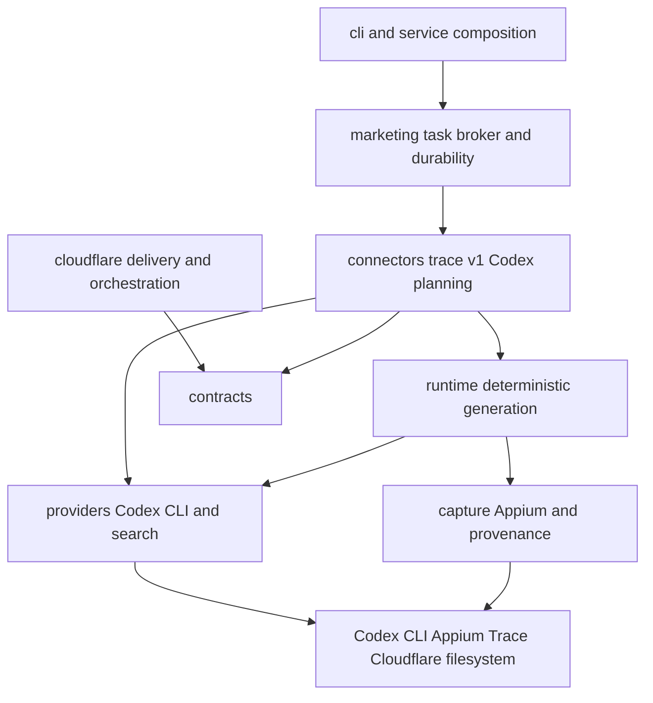

# Code Architecture and Package Structure

Status: Active
Last reviewed: 2026-08-27

## Purpose

This document defines current production ownership and dependency direction. Runtime topology lives
in [system.md](./system.md); operator commands live in [README](../../README.md).

## Dependency direction

Delivery code translates input and composes dependencies. Typed contracts and owner packages decide
state and validation. External behavior stays behind explicit adapters. Production Mac planning does
not depend on `agent/`, `auth/`, the custom Responses provider, Textual, FastAPI, or browser state.

## Current production ownership

| Package | Owns | Must not own |
| --- | --- | --- |
| `marketing/` | Cloudflare task/callback contracts, D1 broker client and remote execution barrier, machine credential file, durable local inbox/outbox, doctor, LaunchAgent, hosted capture routing, validated plan/background callback projection | Codex auth, prompt history, Appium implementation, plaintext admin or Queue secrets |
| `connectors/trace/v1/codex_runtime.py` | Trace prompt construction, reference validation/attachment, structured-plan validation handoff, request-scoped plan/result state, unknown-side-effect barrier, production runner composition | Codex authentication, hosted account state, direct Appium commands |
| `providers/codex_cli.py` | Official `codex exec` argv, stdin, schema/output temporary files, timeout/error sanitization, executable resolution | Trace domain rules, auth copying, conversation persistence, model-tool dispatch |
| `contracts/` | Versioned marketing context, `WallpaperPlan`, run result and capture provenance models | Filesystem, subprocess, HTTP or database access |
| `planning/` and `connectors/trace/v1/scene_plan.py` | Deterministic request/time-zone/event/reference validation and executable scene recipe | Ambient Mac time-zone choices or model calls |
| `runtime/` | Background-to-native-wallpaper orchestration and legacy TraceRun replay | CLI output, hosted state, model planning |
| `capture/` | Simulator/Appium readiness, Trace editor interaction, export collection and provenance validation | Candidate policy or model planning |
| `search/` | Approved image search and normalized background artifacts/provenance | Model execution or review transitions |
| `service/worker.py` | Production runner selection and legacy automation worker composition | Provider implementation details |
| `cli/marketing.py` | Typer parsing, operator output and dependency composition | Durable transition policy or secret persistence |
| `cloudflare/` | Public assets/API, account/context/candidate state, Workers AI candidates, review-event provenance, stage/target feedback rules, Workflow waits, D1 worker registry/leases/execution barriers, callbacks and R2 | Mac Codex credentials, Appium execution, or automatic mutation of canonical profiles |

Legacy packages such as `agent/`, `auth/`, `web/`, `automation/`, `tools/`, and the custom Responses
provider remain in source for non-production compatibility paths. They are not installed as
`trace-agent`/`trace-ads` commands and must not be reintroduced into the Mac worker composition.

## Composition roots

| Entry point | Composition responsibility |
| --- | --- |
| `cli/marketing.py` | Enrollment, readiness, worker broker, foreground and LaunchAgent lifecycle |
| `service/worker.py` | Select `build_codex_trace_runner` for production image work |
| `connectors/trace/v1/codex_runtime.py` | Codex CLI planner, durable request state, image search and native runner |
| `capture/factory.py` | Native capture adapter selected from the task's dynamically resolved device |
| `cloudflare/src/index.js` | Hosted API/assets, Workflow, D1, Queue compatibility and R2 |
| `cloudflare/src/hosted-workspace.js` | Account/context/profile/candidate logic and Workers AI candidate generation |
| `cloudflare/src/mac-workers.js` | Worker enrollment, token hashes, health, leases, non-reassignable execution barriers, atomic callback-and-result reservations, explicit revoke release and callbacks |

Concrete external dependencies must be constructed at these roots, not through module-level
singletons or import side effects.

## Codex CLI adapter rules

- Resolve `TRACE_CODEX_BIN` first, then the current process PATH.
- Do not read, write, copy, print, or inject Codex credentials.
- Do not pass an `env` override to the subprocess; same-user normal Codex resolution is authoritative.
- Always use `exec`, `--ephemeral`, `--sandbox read-only`, `--output-schema`, and stdin.
- Temporary schema and raw output files must be deleted with the task-local temporary directory.
- Return typed JSON or a sanitized stable error; stderr must not become worker logs or callbacks.
- Attach only digest-verified reference files rooted below the configured artifact root.
- Model selection is inherited from the user's Codex configuration unless `TRACE_CODEX_MODEL` is set.

## Trace runtime rules

- The immutable input digest is admitted before planning. Reusing a request ID with changed input
  fails closed.
- Only a schema-valid `WallpaperPlan` is persisted.
- `recipe_for_wallpaper_plan` remains the domain authority for request, time-zone, event and reference
  invariants.
- Confirm the worker-scoped D1 execution barrier immediately before Appium, then write the local
  execution marker. If the remote barrier fails, do not enter Appium.
- A marker without a terminal result means `unknown_side_effect`; never automatically repeat it.
- A completed result is replayable and must keep its native provenance and digest unchanged.
- The Cloudflare callback and R2 boundary remains authoritative for hosted review state.
- `marketing/native_capture.py` owns the strict projection of request-scoped plan and background
  provenance into callbacks; Cloudflare owns attempt linkage, feedback evidence, rule promotion, and
  rule enablement.

## File placement

- Provider process/protocol mapping belongs in `providers/`.
- Trace-specific prompts, validation composition and task state belong in `connectors/trace/v1/`.
- Appium/XCUITest operations and export verification belong in `capture/`.
- Cross-boundary Pydantic models belong in `contracts/`.
- Worker identity, credentials, leases, inbox/outbox and launchd belong in `marketing/`.
- Typer callbacks only parse input, compose dependencies and render results.
- Hosted business state belongs in `cloudflare/`, not in the Mac filesystem.

## Removed public surface

`pyproject.toml` no longer exports `trace-agent` or `trace-ads`. Do not add compatibility aliases that
silently route back to the custom model harness. A future source cleanup may delete legacy packages
after their remaining non-production consumers are migrated, but production replacement is already
defined by entry-point removal plus the `build_codex_trace_runner` composition.
