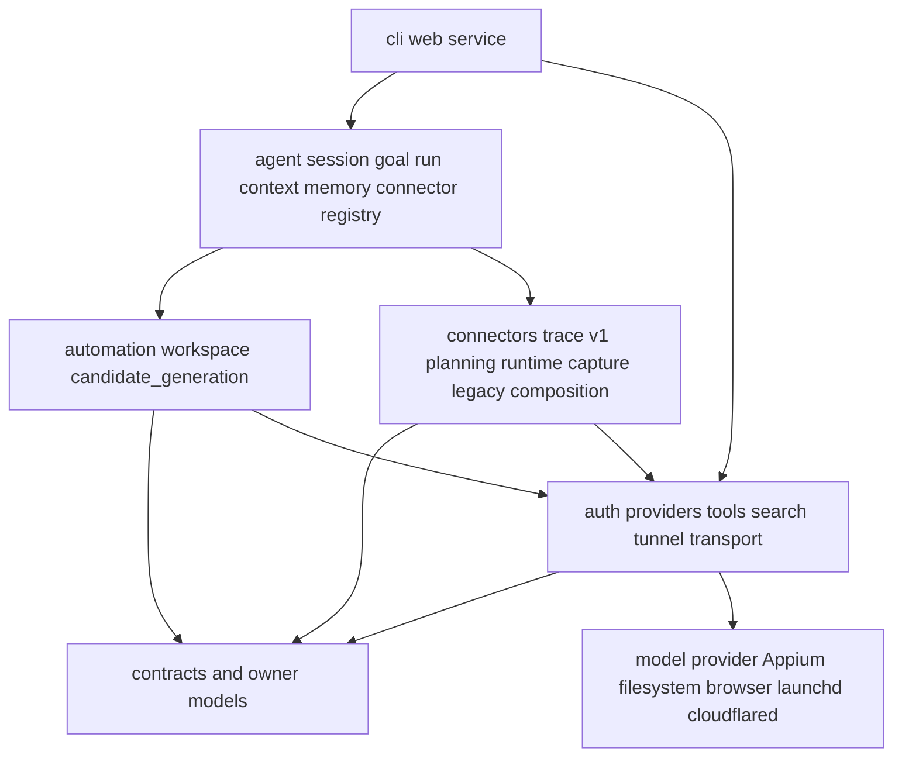

# Code Architecture and Package Structure

Status: Draft
Last reviewed: 2026-08-26

## Purpose

This document defines package ownership, dependency direction, composition roots, and code-placement
rules under `src/ads_booster/`. See [System Architecture](./system.md) for process composition and
runtime flows, and [README](../../README.md) for user commands and environment variables.

Do not document layers or packages that do not exist as if they were current architecture. Update
this document in the same change when package ownership or dependency direction changes.

## High-level dependency direction

The repository does not enforce a separate framework-level domain layer. It separates application
behavior, external adapters, and delivery/composition responsibilities.



The direction is:

1. `cli/`, `web/`, and `service/` translate user input and compose concrete dependencies.
2. `agent/` owns domain-neutral goals, durable runs, lifecycle, connector registration, scoped
   tool snapshots, structured bootstrap context, and completion validation.
3. `connectors/trace/v1/` owns the first domain pack and may compose `planning/`, `runtime/`,
   `capture/`, `composition/`, and marketing/workspace owners without leaking those types into Agent.
4. `automation/`, `candidate_generation/`, and `workspace/` own supporting application
   behavior and domain state transitions while their production paths migrate behind connectors.
5. `auth/`, `providers/`, `search/`, `tools/`, `tunnel/`, and
   `transport/` implement external or technical boundaries.
6. `contracts/` and owner-package models define typed data across boundaries.

Application packages must not depend on concrete UI or infrastructure objects such as Typer,
FastAPI, Textual widgets, or Appium drivers. Accept required behavior through protocols and connect
implementations at composition roots.

## Directory structure

```text
src/ads_booster/
├── agent/          # model/tool loop, goal/run lifecycle, connector registry, context, memory and sessions
├── auth/           # OAuth flow and credential persistence
├── automation/     # durable campaigns, queue, producer, worker and review lifecycle
├── candidate_generation/  # context snapshots and Agent candidate/image workflows
├── capture/        # Appium/XCUITest capture and artifact validation
├── cli/            # installed Typer entry points and composition roots
├── composition/    # legacy deterministic offline image-layer validation and composition
├── config/         # environment-backed runtime settings
├── connectors/     # versioned domain capability packs; Trace v1 is the first connector
├── contracts/      # versioned cross-boundary Pydantic contracts
├── marketing/      # Cloudflare task bridge, durable inbox/outbox, and local loop proof
├── planning/       # marketing context to scene recipe
├── providers/      # model transport, catalog and image generation adapters
├── search/         # text/image search contracts and external provider adapters
├── runtime/        # GenerateOne and TraceRun orchestration, journal and replay
├── service/        # service bootstrap, worker hosting, launchd and status
├── tools/          # model-visible tools, registry and approval boundaries
├── transport/      # shared HTTP and JSON transport primitives
├── tunnel/         # optional public-tunnel process boundary
└── web/            # FastAPI routes and static workspace shell
```

## Package ownership

| Package | Owns | Must not own |
| --- | --- | --- |
| `agent/` | Conversation history, context projection/compaction, model/tool loop, durable goal/run lifecycle, connector registry, scoped tool policy, observations, approval resume, and SQLite run state | Trace, Appium, marketing-specific types, or provider HTTP details |
| `auth/` | OAuth login/refresh and protected credential storage | Agent conversation policy or Web member authentication |
| `automation/` | Campaign state, variation production, queue idempotency, due claims, leases, worker-result validation, and review transitions | HTTP routes or artifact-generation implementations |
| `candidate_generation/` | Context-document loading, candidate drafting, and adaptation of approved candidate snapshots into Agent Trace runs | HTTP routes, native capture mechanics, wallpaper rendering, or candidate review transitions |
| `capture/` | Appium endpoints/sessions, Simulator/Appium readiness, Photos import, Trace wallpaper-editor interaction, full-wallpaper collection, and opaque provenance validation | Model planning or legacy offline composition policy |
| `cli/` | Typer input validation, exit codes, and dependency composition | State machines or business transitions |
| `composition/` | Legacy offline layer validation, transparency/path constraints, system-UI normalization, and deterministic PNG composition | Appium navigation, provider calls, or primary wallpaper generation |
| `config/` | Conversion of environment variables into typed runtime settings | Secret persistence or product state |
| `connectors/` | Versioned domain manifests, semantic tool surfaces, domain context validation, artifact acceptance, review policy, and domain composition | Agent run lifecycle, generic session persistence, or UI routing |
| `contracts/` | Versioned capture, composition, generation, run, `WallpaperPlan` time-zone/event contracts, and model-tool descriptors | File, network, or database access |
| `marketing/` | Cloudflare task/callback contracts, worker inbox/outboxes, bridge orchestration, task-handler ports, and local account-loop proof | Credential values, HTTP routes, or channel-specific policy |
| `planning/` | Typed execution recipe carrying the validated `WallpaperPlan`; validates timed source items against plan-zone local `HH:MM` and clean titles | Creative card, event, layout, style, background, or ambient time-zone decisions |
| `providers/` | Provider request/response mapping, model catalog, and image-generation adapters | UI state or workspace persistence |
| `search/` | Text/image search contracts, provider selection, and external adapters | Model-visible dispatch or workspace state |
| `runtime/` | Primary GenerateOne wallpaper orchestration plus legacy TraceRun journals, replay, locks, and artifact validation | CLI output or HTTP routing |
| `service/` | Loopback listener, workspace bootstrap, automation-worker hosting, launchd, and service status | Web schemas or queue transitions |
| `tools/` | Executable tools, registry, approval, workspace paths, and bounded output | Provider loop or TraceRun state transitions |
| `transport/` | Shared HTTP client and JSON transport types | Provider-specific meaning |
| `tunnel/` | cloudflared process and emitted public-URL boundary | The full local-service lifecycle |
| `web/` | FastAPI auth/member-invite/context/asset/campaign/candidate/chat/generation/queue/session routes, TUI-compatible chat command adapter, HTTP error mapping, and static shell | Durable transitions or provider details |
| `workspace/` | Workspace/member identity, code hashes/versions, shared context, asset metadata, and private sessions | Automation queue or model calls |

## Composition root

Compose concrete dependencies at these entry points.

| Entry point | Composition responsibility |
| --- | --- |
| `cli/agent.py` | OAuth, model client, tool registry, tool context, context runtime, memory/session store, TUI/REPL |
| `agent/factory.py` | Shared `ToolContext` and `AgentSession` composition for CLI and Web |
| `cli/generate.py` | context bundle, image generator, capture adapter, `GenerateOneRunner` options |
| `capture/factory.py` | Native capture-adapter selection by device kind |
| `cli/trace_run.py` | legacy run store, component capture port, compose port, and CLI error mapping |
| `web/app.py` | workspace/queue stores, session codec, chat factory, candidate generator, focused routers, static shell |
| `candidate_generation/factory.py` | Per-run HTTP client, OAuth store, context directory, native device resolver, and Agent runner composition for candidate production and image review |
| `connectors/trace/v1/composition.py` | Trace v1 connector admission, Agent run composition, image search, wallpaper capture adapter, and native generation runner |
| `service/runtime.py` | listener, FastAPI app, production generation runner, automation worker, tunnel shutdown |
| `service/worker.py` | queue scheduler, `GenerateOneWorker`, service-owned artifact roots and provider/capture adapters |
| `cli/marketing.py` | local simulation, external pull-bridge, and opt-in candidate/native-capture dependency composition |
| `cloudflare/src/index.js` | hosted control API, public workspace assets/API, Workers AI, Workflow, Durable Object, D1, Queue, and R2 composition |

Do not start new dependencies through global singletons or import side effects. Construct them at
composition time and give an explicit lifespan or context manager ownership of shutdown.

`marketing/` owns the Cloudflare Queue task contract, durable worker inbox/outboxes, bridge orchestration,
task-handler port, optional candidate-journey adapter, hosted native-capture routing, and local end-to-end control-plane proof. The
candidate adapter may invoke the provider-neutral ports in `candidate_generation/` and the existing
workspace review store; Cloudflare response shapes do not enter either package. Channel-specific
production handlers depend inward on the marketing contract rather than putting their credentials
or response shapes into `automation/` or `workspace/`.

`cloudflare/` is a separate deployment composition root. Its Worker owns HTTP authorization and D1
registry APIs. `hosted-workspace.js` owns the intentionally public account/context/candidate APIs,
logical account scoping, daily slot scheduling, context snapshots, structured feedback aggregation,
Workers AI schema, review transitions, and Queue dispatch contract. `index.js` owns callback
authorization, hosted capture correlation/digest checks, and the R2 native PNG write. The build
script copies the existing browser shell, validates the context manifest and profile data, and emits
one generated Worker module from the canonical packaged source. `MarketingWorkflow` owns durable orchestration;
`MarketingAccountAgent` owns one account's private memory. Pure run transition rules stay in
`cloudflare/src/state-machine.js` so they can be tested outside the Workers runtime.

## Code placement rules

### Provider features

- Put provider-specific request, response, and error mapping in `providers/`.
- Reuse `transport/` for shared HTTP behavior.
- Put a provider-neutral port in the package that owns the calling behavior.
- Expose model/provider selection through composable settings in `config/settings.py`.

### Search providers

- Put model-visible text/image search execution adapters in `tools/`.
- Put search contracts and external adapters such as DDGS and Brave under `search/text/` or
  `search/image/`.
- Keep text and image result models separate because URL, thumbnail, and source-page semantics differ.

### Model tools

- Put execution and descriptors in `tools/`.
- Keep the shared `ToolDescriptor` wire contract in `contracts/tools.py`; each tool creates values.
- Register each tool once in `tools/registry.py`.
- Define approval for mutating behavior.
- Restrict file and command paths to the selected workspace.
- Keep local-image decoding and Responses image-content construction in `tools/image_view.py`;
  require approval before pixels from either workspace-relative or explicit absolute paths leave the
  host.
- Do not hard-code tool names separately in providers or the TUI.

### Candidate generation

- Keep context-document loading and Agent candidate/image workflow composition in
  `candidate_generation/`.
- Trace candidate schema, semantic tool, context projection, completion validation, and production
  composition belong to `connectors/trace/v1/`; there is no candidate-specific prose parser or retry loop.
- Accept the provider through `CandidateModelSource` and the store through the connector's
  `CandidateCreator` protocol; compose them with `AgentRunStore` in
  `candidate_generation/factory.py`.
- Keep the Web layer limited to authentication, typed-error-to-status mapping, and response shaping.
- Candidate generation and wallpaper creation both execute through Agent with restricted Trace
  connector tool snapshots. Native editor capture and opaque-export validation remain in `capture/`
  and `runtime/`; legacy composition remains isolated in `composition/`.
- Candidate journey transitions stay in `workspace/`; `CandidateWorkflow` coordinates the linked
  Agent run without editing database columns itself.

### Web APIs

- Add one focused router module under `web/`.
- Put request/response models in `web/schemas.py` or a focused owner schema module.
- Reuse `agent/tui_commands.py` when a Web command has a TUI equivalent; do not create a second
  command vocabulary in the browser.
- Implement durable behavior in the owning `workspace/` or `automation/` package.
- Keep `web/app.py` limited to router composition.

### Workspace data

- `workspace/` owns workspace, member, context, asset, and private-session state; Web admin identity is anchored to the owner ID in `service.json`.
- `automation/` owns campaign lifecycle, variation numbering, scheduling, leases, runs, and review state.
- Do not put HTTP cookie or response shapes in database models.
- Let store methods own SQLite transactions and optimistic revisions.

### Generation stages

- Define versioned input and result contracts first.
- Put orchestration in `runtime/`.
- Run external behavior through adapters behind protocols.
- When adding a TraceRun capability, update transitions, replay, journal, idempotency, and artifact
  validation together.

### Service features

- `service/` owns process, listener, launchd, and background-worker lifecycles.
- Do not start workers through a FastAPI import side effect.
- Keep `create_app()` composable and testable without a worker.
- Attach production workers explicitly in `service/runtime.py`.

### Hosted marketing loop

- Keep the cross-runtime task and callback schema versioned in `marketing/models.py` and mirror it at
  the Worker boundary.
- Add a worker task kind through `TaskExecutor`/`TaskHandler`; do not branch on channel credentials in
  the inbox store.
- Keep queue acknowledgement after durable inbox insertion and callback delivery after durable
  outbox insertion.
- Let `marketing/inbox.py` own run/candidate review linkage and the approval outbox; the Web review
  routes continue to own only candidate state transitions.
- Let `marketing/service.py` own portable non-secret bridge config and environment/external-command
  credential resolution. Never put Queue or Worker tokens in config, task payloads, or logs.
- Encode Queue HTTP-pull envelopes as JSON text, keep task completion event types unique per task,
  and normalize transport exceptions at the Cloudflare client boundary.
- Keep account registry data in D1 and account-private learned memory in the named Durable Object.
- Let D1's partial unique index own the one-active-run-per-account invariant; API and Cron checks are
  explanatory fast paths, not the concurrency authority.
- Treat a new account, locale, schedule, instruction revision, or credential reference as data.
- Require code review for a new adapter, task kind, state edge, or retry rule.
- Keep login-free hosted workspace routes under `/api/*`; never weaken `/v1/*` control-plane or
  callback authorization to expose the UI.
- Treat hosted `account_id` as a logical data scope, never as proof of caller authorization. Public
  account settings, profiles, candidates, and feedback must all use the same selected scope.
- Keep the starter context canonical under `ads_booster/assets/context/` and generate the Worker
  module from it during the Cloudflare build instead of maintaining a second copy.
- Keep `ORIGIN.md` as the source and verification record for every packaged context document.
- Keep archive documents byte-identical, including frontmatter, and keep repository-owned operating
  rules in `core/PIPELINE-SCOPE.md`, `references/KR/INDEX.md`, and `markets/*.md` rather than editing
  archive documents.
- Keep `references/KR/INDEX.md` (the scene index used by `profile.reference_ids`) distinct from
  `references/KR/RESEARCH-INDEX.md` (the collected-record screening table).
- Keep country document/profile membership in the context manifest. D1 may add account-scoped
  profiles, but a profile cannot generate for a country without reviewed packaged documents.
- Keep whole-corpus injection out of the generation prompt. Reference bodies are selected by id and
  bounded; a document set that must always be injected belongs in `documents` and under the build's
  byte budget.
- Store the selected profile snapshot on every hosted candidate; later profile edits must not change
  the candidate's generation provenance.
- Keep the four-candidate morning/evening batch rule and repeated-feedback threshold in the hosted
  workspace owner; UI text and Cron scheduling consume that contract rather than duplicating it.
- Accept hosted capture output only through the worker-token callback, verify its task/candidate
  scope and digest, and label the R2 PNG source as `native_appium`.
- Keep Simulator discovery and Appium execution in `marketing/native_capture.py` plus `capture/`;
  Worker code must not invent native provenance or bind a team member's fixed device UDID.

## Cross-package rules

- Do not repeat one business rule across CLI, TUI, and Web routes.
- Delivery layers translate typed results from the owning service, store, or runtime.
- Do not move helpers into catch-all modules such as `utils.py` or `common.py` without a real shared
  owner.
- Keep a type in its owning package when only one package uses it. Move only stable cross-boundary
  contracts into `contracts/`.
- Convert external exceptions into typed errors or results at the owner boundary.
- Do not put secrets, access codes, or credentials in descriptors, exceptions, or ordinary logs.
- Let the owning store, journal, or lease enforce concurrency rather than repeating checks in callers.

## Test placement

Name files under `tests/` after the production package and user boundary they protect. See
[Testing and Verification](../development/testing.md) for scope selection.

- Protect pure planning, contracts, and state transitions with fast unit tests.
- Test SQLite stores with real temporary databases and transaction/revision boundaries.
- Execute Typer commands and exit codes for CLI tests.
- Exercise real FastAPI routes, auth scope, and conflict responses for Web tests.
- Use isolated state roots for service lifecycle, worker, health, and shutdown tests.
- Validate artifact paths, digests, provenance, and output files for capture/composition tests.
- Put bridge, account isolation, and local loop tests in `tests/marketing/`; put pure Worker state
  tests in `cloudflare/test/`.

Use mocks at external provider and Appium boundaries. A test that only inspects calls inside a mock
does not prove the owning boundary.

## Document maintenance

Update this document in the same change when:

- a package is added, removed, moved, or renamed;
- package responsibility or ownership changes;
- allowed dependency direction changes;
- a composition root changes;
- a type or contract changes owner; or
- a code-placement rule or exception is introduced.

Also update `docs/architecture/system.md` when process composition, runtime flow, persisted state, or
an external-system boundary changes.
