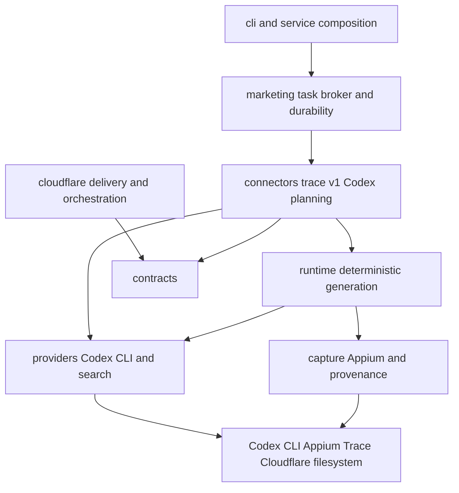

# Code Architecture and Package Structure

Status: Active
Last reviewed: 2026-08-27

## Purpose

This document defines current production ownership and dependency direction. Runtime topology lives
in [system.md](./system.md); operator commands live in [README](../../README.md).

## Dependency direction

Delivery code translates input and composes dependencies. Typed contracts and owner packages decide
state and validation. External behavior stays behind explicit adapters. Production Mac planning does
not depend on `agent/`, `auth/`, the custom Responses provider, Textual, FastAPI, or browser state.

## Current production ownership

| Package | Owns | Must not own |
| --- | --- | --- |
| `agent/` | Conversation history, context projection/compaction, model/tool loop, durable goal/run lifecycle, connector registry, scoped tool policy, observations, approval resume, and SQLite run state | Trace, Appium, marketing-specific types, or provider HTTP details |
| `auth/` | OAuth login/refresh and protected credential storage | Agent conversation policy or Web member authentication |
| `automation/` | Campaign state, variation production, queue idempotency, due claims, leases, worker-result validation, and review transitions | HTTP routes or artifact-generation implementations |
| `candidate_generation/` | Context-document loading, the generation instruction and its strict-JSON contract, coverage-based domain assignment, AI background judging and selection, local fallback composition, and adaptation of approved candidate snapshots into Agent Trace runs | HTTP routes, native capture mechanics, wallpaper rendering, or candidate review transitions |
| `capture/` | Appium endpoints/sessions, Simulator/Appium readiness, Photos import, Trace wallpaper-editor interaction, full-wallpaper collection, and opaque provenance validation | Model planning or legacy offline composition policy |
| `cli/` | Typer input validation, exit codes, and dependency composition | State machines or business transitions |
| `composition/` | Legacy offline layer validation, transparency/path constraints, system-UI normalization, and deterministic PNG composition | Appium navigation, provider calls, or primary wallpaper generation |
| `config/` | Conversion of environment variables into typed runtime settings | Secret persistence or product state |
| `connectors/` | Versioned domain manifests, semantic tool surfaces, domain context validation, artifact acceptance, review policy, and domain composition | Agent run lifecycle, generic session persistence, or UI routing |
| `contracts/` | Versioned capture, composition, generation, run, `WallpaperPlan` time-zone/event contracts, and model-tool descriptors | File, network, or database access |
| `marketing/` | Cloudflare task/callback contracts, D1 broker client and remote execution barrier, machine credential file, durable local inbox/outbox, doctor, LaunchAgent, hosted capture routing | Codex auth, prompt history, Appium implementation, plaintext admin or Queue secrets |
| `planning/` | Typed execution recipe carrying the validated `WallpaperPlan`; validates timed source items against plan-zone local `HH:MM` and clean titles | Creative card, event, layout, style, background, or ambient time-zone decisions |
| `providers/` | Provider request/response mapping, model catalog, and image-generation adapters | UI state or workspace persistence |
| `search/` | Text/image search contracts, provider selection, and external adapters | Model-visible dispatch or workspace state |
| `runtime/` | Primary GenerateOne wallpaper orchestration plus legacy TraceRun journals, replay, locks, and artifact validation | CLI output or HTTP routing |
| `service/` | Loopback listener, workspace bootstrap, automation-worker hosting, launchd, and service status | Web schemas or queue transitions |
| `tools/` | Executable tools, registry, approval, workspace paths, and bounded output | Provider loop or TraceRun state transitions |
| `transport/` | Shared HTTP client and JSON transport types | Provider-specific meaning |
| `tunnel/` | cloudflared process and emitted public-URL boundary | The full local-service lifecycle |
| `web/` | FastAPI auth/member-invite/context/asset/campaign/candidate/chat/generation/queue/session routes, TUI-compatible chat command adapter, HTTP error mapping, and static shell | Durable transitions or provider details |
| `workspace/` | Workspace/member identity, code hashes/versions, shared context, asset metadata, and private sessions | Automation queue or model calls |

Legacy packages such as `agent/`, `auth/`, `web/`, `automation/`, `tools/`, and the custom Responses
provider remain in source for non-production compatibility paths. They are not installed as
`trace-agent`/`trace-ads` commands and must not be reintroduced into the Mac worker composition.

## Composition roots

| Entry point | Composition responsibility |
| --- | --- |
| `cli/agent.py` | OAuth, model client, tool registry, tool context, context runtime, memory/session store, TUI/REPL |
| `agent/factory.py` | Shared `ToolContext` and `AgentSession` composition for CLI and Web |
| `cli/generate.py` | context bundle, image generator, capture adapter, `GenerateOneRunner` options |
| `capture/factory.py` | Native capture adapter selected from the task's dynamically resolved device |
| `cli/trace_run.py` | legacy run store, component capture port, compose port, and CLI error mapping |
| `web/app.py` | workspace/queue stores, session codec, chat factory, candidate generator, focused routers, static shell |
| `candidate_generation/factory.py` | Per-run HTTP client, OAuth store, context directory, native device resolver, and both generator and both image-composition compositions |
| `candidate_generation/background_factory.py` | Per-run image-search provider, judge client, and the persona one judged background fetch is told about |
| `connectors/trace/v1/composition.py` | Trace v1 connector admission, Agent run composition, per-bundle background fetcher, wallpaper capture adapter, and native generation runner |
| `service/runtime.py` | listener, FastAPI app, production generation runner, automation worker, tunnel shutdown |
| `service/worker.py` | Select `build_codex_trace_runner` for production image work |
| `cli/marketing.py` | Enrollment, readiness, worker broker, foreground and LaunchAgent lifecycle |
| `cloudflare/src/index.js` | Hosted API/assets, Workflow, D1, Queue compatibility and R2 |
| `connectors/trace/v1/codex_runtime.py` | Codex CLI planner, durable request state, image search and native runner |
| `cloudflare/src/hosted-workspace.js` | Account/context/profile/candidate logic and Workers AI candidate generation |
| `cloudflare/src/mac-workers.js` | Worker enrollment, token hashes, health, leases, non-reassignable execution barriers, atomic callback-and-result reservations, explicit revoke release and callbacks |

Concrete external dependencies must be constructed at these roots, not through module-level
singletons or import side effects.

## Codex CLI adapter rules

- Resolve `TRACE_CODEX_BIN` first, then the current process PATH.
- Do not read, write, copy, print, or inject Codex credentials.
- Do not pass an `env` override to the subprocess; same-user normal Codex resolution is authoritative.
- Always use `exec`, `--ephemeral`, `--sandbox read-only`, `--output-schema`, and stdin.
- Temporary schema and raw output files must be deleted with the task-local temporary directory.
- Return typed JSON or a sanitized stable error; stderr must not become worker logs or callbacks.
- Attach only digest-verified reference files rooted below the configured artifact root.
- Model selection is inherited from the user's Codex configuration unless `TRACE_CODEX_MODEL` is set.

## Trace runtime rules

- The immutable input digest is admitted before planning. Reusing a request ID with changed input
  fails closed.
- Only a schema-valid `WallpaperPlan` is persisted.
- `recipe_for_wallpaper_plan` remains the domain authority for request, time-zone, event and reference
  invariants.
- Confirm the worker-scoped D1 execution barrier immediately before Appium, then write the local
  execution marker. If the remote barrier fails, do not enter Appium.
- A marker without a terminal result means `unknown_side_effect`; never automatically repeat it.
- A completed result is replayable and must keep its native provenance and digest unchanged.
- The Cloudflare callback and R2 boundary remains authoritative for hosted review state.

## File placement

- Provider process/protocol mapping belongs in `providers/`.
- Trace-specific prompts, validation composition and task state belong in `connectors/trace/v1/`.
- Appium/XCUITest operations and export verification belong in `capture/`.
- Cross-boundary Pydantic models belong in `contracts/`.
- Worker identity, credentials, leases, inbox/outbox and launchd belong in `marketing/`.
- Typer callbacks only parse input, compose dependencies and render results.
- Hosted business state belongs in `cloudflare/`, not in the Mac filesystem.

## Removed public surface

### Model tools

- Put execution and descriptors in `tools/`.
- Keep the shared `ToolDescriptor` wire contract in `contracts/tools.py`; each tool creates values.
- Register each tool once in `tools/registry.py`.
- Define approval for mutating behavior.
- Restrict file and command paths to the selected workspace.
- Keep local-image decoding and Responses image-content construction in `tools/image_view.py`;
  require approval before pixels from either workspace-relative or explicit absolute paths leave the
  host.
- Do not hard-code tool names separately in providers or the TUI.

### Candidate generation

- Keep context-document loading, the generation instruction, and image workflow composition in
  `candidate_generation/`.
- Two generators live side by side and neither owns the other. `script_generator.py` is the
  single-call engine the Web route runs: it holds the instruction, the domain assignment, and the
  strict-JSON contract with its one retry, and it is where the team's Korean rules live.
  `agent_generator.py` is the Agent-kernel path; its candidate schema, semantic tool, context
  projection, and completion validation belong to `connectors/trace/v1/`.
- Accept the provider through `CandidateModelSource` and the store through a narrow writer protocol;
  compose both in `candidate_generation/factory.py`.
- Keep the Web layer limited to authentication, typed-error-to-status mapping, and response shaping.
- Wallpaper creation executes through Agent with restricted Trace connector tool snapshots. Native
  editor capture and opaque-export validation remain in `capture/` and `runtime/`; the deterministic
  layer merge remains isolated in `composition/`.

### Background selection and composition paths

- Keep open-web collection, its physical checks, and its host filters in `search/image/`; keep the
  editorial decision — gate, grade, tie-break, query ladder — in `candidate_generation/`.
- Reach the Trace runner through the existing `BackgroundFetcher` protocol. A fetcher that needs to
  know the persona is built per bundle by a factory, not injected once per process.
- Let the run's `inputs/background-source.json` be the handoff between a fetcher inside the runner
  and the candidate store; the fetcher has no route to the store.
- Keep the local fallback composition in `candidate_generation/local_image_runner.py` and its
  capture port in `runtime/`. A composition that did not drive a device declares
  `source: offline_fixture`, and the path that ran is recorded on the candidate rather than inferred
  from what is present.
- Candidate journey transitions stay in `workspace/`; `CandidateWorkflow` coordinates the linked
  Agent run without editing database columns itself.

### Web APIs

- Add one focused router module under `web/`.
- Put request/response models in `web/schemas.py` or a focused owner schema module.
- Reuse `agent/tui_commands.py` when a Web command has a TUI equivalent; do not create a second
  command vocabulary in the browser.
- Implement durable behavior in the owning `workspace/` or `automation/` package.
- Keep `web/app.py` limited to router composition.

### Workspace data

- `workspace/` owns workspace, member, context, asset, and private-session state; Web admin identity is anchored to the owner ID in `service.json`.
- `automation/` owns campaign lifecycle, variation numbering, scheduling, leases, runs, and review state.
- Do not put HTTP cookie or response shapes in database models.
- Let store methods own SQLite transactions and optimistic revisions.

### Generation stages

- Define versioned input and result contracts first.
- Put orchestration in `runtime/`.
- Run external behavior through adapters behind protocols.
- When adding a TraceRun capability, update transitions, replay, journal, idempotency, and artifact
  validation together.

### Service features

- `service/` owns process, listener, launchd, and background-worker lifecycles.
- Do not start workers through a FastAPI import side effect.
- Keep `create_app()` composable and testable without a worker.
- Attach production workers explicitly in `service/runtime.py`.

### Hosted marketing loop

- Keep the cross-runtime task and callback schema versioned in `marketing/models.py` and mirror it at
  the Worker boundary.
- Add a worker task kind through `TaskExecutor`/`TaskHandler`; do not branch on channel credentials in
  the inbox store.
- Keep queue acknowledgement after durable inbox insertion and callback delivery after durable
  outbox insertion.
- Let `marketing/inbox.py` own run/candidate review linkage and the approval outbox; the Web review
  routes continue to own only candidate state transitions.
- Let `marketing/service.py` own portable non-secret bridge config and environment/external-command
  credential resolution. Never put Queue or Worker tokens in config, task payloads, or logs.
- Encode Queue HTTP-pull envelopes as JSON text, keep task completion event types unique per task,
  and normalize transport exceptions at the Cloudflare client boundary.
- Keep account registry data in D1 and account-private learned memory in the named Durable Object.
- Let D1's partial unique index own the one-active-run-per-account invariant; API and Cron checks are
  explanatory fast paths, not the concurrency authority.
- Treat a new account, locale, schedule, instruction revision, or credential reference as data.
- Require code review for a new adapter, task kind, state edge, or retry rule.
- Keep login-free hosted workspace routes under `/api/*`; never weaken `/v1/*` control-plane or
  callback authorization to expose the UI.
- Treat hosted `account_id` as a logical data scope, never as proof of caller authorization. Public
  account settings, profiles, candidates, and feedback must all use the same selected scope.
- Keep the starter context canonical under `ads_booster/assets/context/` and generate the Worker
  module from it during the Cloudflare build instead of maintaining a second copy.
- Keep `ORIGIN.md` as the source and verification record for every packaged context document.
- Keep archive documents byte-identical, including frontmatter, and keep repository-owned operating
  rules in `core/PIPELINE-SCOPE.md`, `references/KR/INDEX.md`, and `markets/*.md` rather than editing
  archive documents.
- Keep `references/KR/INDEX.md` (the scene index used by `profile.reference_ids`) distinct from
  `references/KR/RESEARCH-INDEX.md` (the collected-record screening table).
- Keep country document/profile membership in the context manifest. D1 may add account-scoped
  profiles, but a profile cannot generate for a country without reviewed packaged documents.
- Keep whole-corpus injection out of the generation prompt. Reference bodies are selected by id and
  bounded; a document set that must always be injected belongs in `documents` and under the build's
  byte budget.
- Store the selected profile snapshot on every hosted candidate; later profile edits must not change
  the candidate's generation provenance.
- Keep the four-candidate morning/evening batch rule and repeated-feedback threshold in the hosted
  workspace owner; UI text and Cron scheduling consume that contract rather than duplicating it.
- Accept hosted capture output only through the worker-token callback, verify its task/candidate
  scope and digest, and label the R2 PNG source as `native_appium`.
- Keep Simulator discovery and Appium execution in `marketing/native_capture.py` plus `capture/`;
  Worker code must not invent native provenance or bind a team member's fixed device UDID.

## Cross-package rules

- Do not repeat one business rule across CLI, TUI, and Web routes.
- Delivery layers translate typed results from the owning service, store, or runtime.
- Do not move helpers into catch-all modules such as `utils.py` or `common.py` without a real shared
  owner.
- Keep a type in its owning package when only one package uses it. Move only stable cross-boundary
  contracts into `contracts/`.
- Convert external exceptions into typed errors or results at the owner boundary.
- Do not put secrets, access codes, or credentials in descriptors, exceptions, or ordinary logs.
- Let the owning store, journal, or lease enforce concurrency rather than repeating checks in callers.

## Test placement

Name files under `tests/` after the production package and user boundary they protect. See
[Testing and Verification](../development/testing.md) for scope selection.

- Protect pure planning, contracts, and state transitions with fast unit tests.
- Test SQLite stores with real temporary databases and transaction/revision boundaries.
- Execute Typer commands and exit codes for CLI tests.
- Exercise real FastAPI routes, auth scope, and conflict responses for Web tests.
- Use isolated state roots for service lifecycle, worker, health, and shutdown tests.
- Validate artifact paths, digests, provenance, and output files for capture/composition tests.
- Put bridge, account isolation, and local loop tests in `tests/marketing/`; put pure Worker state
  tests in `cloudflare/test/`.

Use mocks at external provider and Appium boundaries. A test that only inspects calls inside a mock
does not prove the owning boundary.

## Document maintenance

Update this document in the same change when:

- a package is added, removed, moved, or renamed;
- package responsibility or ownership changes;
- allowed dependency direction changes;
- a composition root changes;
- a type or contract changes owner; or
- a code-placement rule or exception is introduced.

Also update `docs/architecture/system.md` when process composition, runtime flow, persisted state, or
an external-system boundary changes.

`pyproject.toml` no longer exports `trace-agent` or `trace-ads`. Do not add compatibility aliases that
silently route back to the custom model harness. A future source cleanup may delete legacy packages
after their remaining non-production consumers are migrated, but production replacement is already
defined by entry-point removal plus the `build_codex_trace_runner` composition.
