# System Architecture

Status: Active
Last reviewed: 2026-09-07

## Canonical product direction and transition

The target product is one always-on, on-premises Marketing Agent Service. It is the canonical owner
of Agent Runs and the observe, plan, approve, execute, verify, evaluate, and replan loop. Cloudflare,
Codex, Mac/Appium, Threads, research, creative generation, and Web/Slack/KakaoTalk are adapters.

PR #99 is a transition, so the two truths must not be confused:

- **Current production:** the hosted Cloudflare/D1 flow described below still owns existing hosted
  campaign and publication facts and remains operational.
- **Implemented transition foundation:** `contracts/agent_run.py`, `contracts/tool_capability.py`,
  `marketing/agent_core/`, and `marketing/agent_service/` define a provider-neutral run domain,
  planner-visible registry, append-only local run repository, and the first Appium-independent
  decision loop. The loopback API includes exact effect approval and a Run-oriented browser
  projection; `/runs/<run-id>` is the shared result-link surface for browser and channel adapters.
  A reasoning-provider failure is sanitized into retryable HTTP `503`, while the admitted Run stays
  durable so an identical request can resume it after provider recovery.
- **Implemented server authentication boundary:** the canonical agent can bind on an on-premises or
  cloud server only when OAuth 2.0 token introspection is configured. The ingress terminates HTTPS;
  introspected audience, subject, and workspace claim scope every request. Static bearer auth is
  restricted to loopback development. Macs remain separately enrolled Appium workers.
- **Implemented hosted registration seam:** the hosted agent can list and install server-owned tool
  catalog entries. Installation creates a non-executable reference; Threads becomes active only from
  its verified OAuth callback. Arbitrary caller-supplied adapters or effect policy are rejected.
- **Implemented compatibility wiring:** the server registry refreshes configured tool readiness at
  each planning boundary. Installed research runs locally; hosted catalog registration and the full
  feature-launch pipeline are HTTPS tools; Slack delivery and Notion daily storage are direct
  adapters. The hosted workflow remains the effect owner for candidate, Appium, review, Threads,
  outcome, and learning during cutover.
- **Not implemented yet:** Cloudflare projection-only cutover, direct Mac enrollment against the
  on-premises API, KakaoTalk delivery, and deletion of hosted canonical campaign ownership. Fake
  Slack/Notion roundtrips are not live platform evidence.

The binding contract and migration gates are in
[`on-prem-marketing-agent-service.md`](../contracts/on-prem-marketing-agent-service.md). Until those
gates pass, the hosted flow below is current behavior but not the final architecture.

`GET /api/marketing-agent/tools` projects the server-owned install catalog and account state.
`POST /api/marketing-agent/tools/install` lets the agent register a known capability without a
migration or arbitrary descriptor upload. Registration is fail-closed as `registered_reference`.
The Threads OAuth callback alone promotes `publish.threads` to `active`; auto-publish, review,
idempotency, and readback barriers still apply independently. The hosted `deliver.slack` catalog row
remains a reference; the canonical service instead owns a direct Slack adapter when its bot token and
channel are configured. Live Slack delivery remains unverified until an operator runs a real canary.
`GET /v1/skills` on the canonical service projects versioned executable procedures and
`POST /v1/skills/<id>/runs` creates their canonical Run. A skill is ready only
when every required tool is enabled and active; `research.daily_slack` and
`threads.validated_format_replication` therefore expose their missing integration blockers directly.
The daily scheduler creates one stable Run per tenant, skill, and local date. Its configured service
principal may approve only exact `deliver.slack` and `store.notion.daily` invocations; image and
publication approval remain human checkpoints in the hosted workflow.

## Browser and Slack admission (candidate implementation)

The installed service accepts one configured tenant; OAuth identities for other tenants cannot use
that instance's shared integration credentials. Browser /auth/login uses authorization code with
PKCE and a one-use, browser-bound state; /auth/callback exchanges the code at pinned HTTPS
endpoints without redirects and introspects the access token. Provider tokens remain in bounded,
expiring server memory. Secure HttpOnly cookies plus same-origin/CSRF checks authorize browser
mutations. Restart invalidates browser sessions, not Run history.

The browser submits durable /v1/jobs and polls status, so long reasoning turns do not hold the
Tunnel HTTP request open. A single service execution lock serializes web, scheduler, and channel
mutations. This is a single-process service, not active-active execution.

The /channels/slack/commands route verifies real Slack form bytes/signatures and timestamp, app,
team, configured shared channel and operator-bound user before writing durable command admission.
It acknowledges without reasoning, and a background worker invokes the same canonical service.
The operator file binds Slack users to stable member identities, with separate reviewer grants.
Exact invocation hashes and input revisions reject stale mutations. Removing a configured user
revokes new and queued command access after restart.

Slack response notifications have a persisted dispatch marker; unknown delivery is not repeated.
Interrupted create jobs can reconcile through canonical Run replay; uncertain input/approval jobs
remain blocked for status readback. Notifications are channel responses to user commands, not
planner-granted publishing authority. The daily Slack-only skill grants only its declared Slack
delivery invocations and never hosted publication or capture.

The [server packet](../operations/agent-server/README.md) defines deployment and live acceptance.
No live OAuth/Slack/Tunnel or Linux systemd success is implied by local tests.

## Server-owned knowledge context

The on-premises `MarketingAgentService` is the integration owner for team knowledge. The knowledge
domain owns its own absolute `knowledge_root` and SQLite catalog, while the existing Agent Service
database remains the owner of Runs, Slack admission, and Run bindings. `KnowledgeSettings.from_env`
requires all three values together: `TRACE_MARKETING_KNOWLEDGE_ROOT`,
`TRACE_MARKETING_KNOWLEDGE_CONTROL_ROOT`, and `TRACE_MARKETING_KNOWLEDGE_POLICY`. All paths must be
absolute. With all three absent the feature is disabled; a partial set raises a configuration error.
The service user owns root/control directories at mode `0700`; policy and `control_root/identity.json`
are private mode `0600` files.

When enabled, `cli/marketing.py` builds `InstalledKnowledgeRuntime` beside the canonical service.
It registers the local actor, creates the SQLite knowledge repository, canonical ingress, ingestion,
retrieval and tool host, Codex curation provider, owner lock, bounded job runner, index worker, and
memory-view dispatcher. `CurationBatchRuntime` defaults to collecting compatible routine jobs until
60 seconds after their first event, without extending the deadline for later arrivals. It claims
urgent work immediately and runs one shared bounded model round at a time for every active job.
Each later round receives the actual guarded tool observations from earlier rounds; terminal
job decisions become receipts bound to their original event and revision. Explicit flush updates
the indexed and serialized batch state in one transaction. Cancelled unfinished jobs re-enter
collection with a deterministic generation derived from persisted terminal batch history; earlier
receipts remain intact. Startup recovers abandoned running batches only after acquiring the exclusive
owner lock; completed per-event receipts remain terminal and unfinished jobs return to collection.
Private batches reload their registered actor and current private grants from the catalog rather
than inheriting the local administrator's identity or workspace grants. Revoked private jobs and
unclaimed batches fail durably without preventing later authorized work. The runtime starts as a daemon loop with the service and stops before the
service releases its owner lock. Standalone
knowledge CLI ownership is separate from the service owner and must not share a live root. The
registered local-admin surface covers `init`, `doctor`,
`ingest`, `run`, `search`, `get`, `context`, `schedule`, `backup`, `restore`, `retract`, `purge`,
`questions`, plus memory, brand, and task subgroups. Every operation takes the absolute `--root`,
`--control-root`, and `--policy` paths; `run` and `memory consolidate` take optional `--model` and
bounded `--once`/`--until-idle` controls. Installed commands and fresh-install behavior require their
own verification.

Ingress remains authenticated at the existing service/channel boundary. The installed API and Slack
adapters share the canonical ingress and its authority bridge. Before admission, the bridge maps the
authenticated actor to stored member, session and read/write grants at the current policy epoch,
preserving revoked memberships, closed sessions and reader roles. Outbox replay and context
preparation recheck the stored authority. Active task lookup includes member and session identity.
A shared Slack thread maps to workspace scope. A Slack DM maps to member plus conversation scope and
is projected through a
read-only capability set. The DM projection permits knowledge search/get, memory get/explain, and
source read; it excludes knowledge or memory writes, scheduling, purge, and external delivery. The
canonical ingress stores the binding, conversation event, and durable outbox before dispatch. Edited,
deleted, or correcting events create a pending fence; context preparation blocks the affected Run
until the new source state is admitted. A dispatch that durably records a classified item failure
returns progress without acknowledging or automatically retrying that item, so later ingress and
maintenance continue. Unknown receipt outcomes and persistence errors still propagate.
Source fetching admits only 2xx or 304 after redirect handling. HTTP 408/429 and server errors are
retryable; other unsuccessful statuses fail before their body can enter extraction or curation.

`source_read` returns verified segment `evidence_ref` and `quote_sha256` values for reuse in guarded
memory and Wiki writes; an arbitrary text range carries its quote hash without inventing a segment
identity. Curation uses the extracted text and character offsets. Its optional
`authenticated_user_event` contains evidence and authority references only for a canonical matching
user message with no quoted spans; imported documents and other conversation roles do not gain
user-instruction authority.

Before reasoning, the service adapter assembles a bounded context receipt from current revisions,
constraints, grants, and task/brand binding. It stores the selected immutable revision references and
rechecks that receipt immediately before tool dispatch. Hosted generation receives only a strict,
digest-bound `trace.knowledge-context.v1` transfer with selected editorial blocks and evidence
excerpts. The hosted broker validates tenant/account/task/run/action binding before dispatch and the
callback must return the matching transfer, digest, and receipt. Missing or mismatched required
context fails closed; it does not silently fall back to legacy context. Generation checks the same
required worker capability used for leasing before consuming its cooldown or publishing a task.
An identical callback retry returns duplicate success only after current authority, context receipt,
callback identity and result equality are checked again; altered or revoked callbacks remain rejected.
Cached validation acceptance is reused only after current authentication, binding, expiry, grant,
head and tombstone checks pass. Required constraints retain their constraint role in the transfer.

Deletion records a manifest and chained erase-ledger entry in the control root before blocking live
reads. Tombstones and reverse dependencies cover source, Wiki, memory, claims, context receipts, and
transfer replicas. A remote replica is tracked separately and remains pending until its purge receipt
is verified. CLI purge resolves its target from the applied retraction receipt, retaining request
identity on replay. Restore validates the manifest and file digests, applies the current erase ledger
including mixed-memory redactions, and rebuilds search in a private staging root before activation.
No external deletion or deployment success is implied by this source wiring.

## Runtime boundary

Cloudflare owns hosted candidates, D1 leases/callback acceptance, R2 storage, review state, Threads
OAuth/token encryption, next-slot publication, and engagement polling. An enrolled Mac owns local
durability, admission, one official Codex CLI process, Appium side effects, and native export
validation. A fresh managed `trace-marketing` install and deployed workspace are product evidence; a
checkout is development evidence only.

```mermaid
flowchart LR
  Candidate[Hosted candidate] --> Lease[D1 lease]
  Lease --> Inbox[SQLite inbox]
  Inbox --> Prepare[Context background readiness]
  Prepare --> EventLog[Sanitized task events]
  Prepare --> Admit[Local admission]
  Admit --> Barrier[D1 execution barrier]
  Barrier --> EventLog
  Barrier --> Calendar[EventKit seed and verify]
  Calendar --> Codex[One codex exec]
  Codex --> Export[Trace PNG and manifest]
  Export --> Validate[Independent validation and Calendar cleanup]
  Validate --> Callback[Durable callback]
  Callback --> EventLog
  Callback --> Store[R2 and D1]
  EventLog --> WorkspaceLog[Workspace execution timeline]
  Store --> Review[Human review]
  Review --> Decision[Threads schedule or OFF cancellation]
  Decision --> Publish[Cloudflare publish barrier and readback]
  Publish --> Poll[Metrics and top-level replies]
```



## Request-time capture

1. The workspace may create a `hosted_workspace_generation_v1` task for automatic candidate drafts.
   A compatible Mac executes exactly one schema-constrained official Codex CLI turn and returns its
   result through the same durable callback path; it has no Agent loop or plan object.
2. The workspace creates a `hosted_workspace_capture_v1` task from an approved candidate.
3. A ready Mac claims the D1 lease and inserts the task in its local inbox before remote ack.
   Cloudflare and the worker append bounded, idempotent lifecycle events for that task. Each event
   contains only task/worker identity, task kind, a fixed event type, timestamp, and optional
   machine-readable failure code.
4. Safe capture preparation resolves a Simulator, validates country locale/time zone, searches
   allowlisted stock domains for tall wallpaper photos, deterministically selects the usable
   portrait closest to the lock-screen aspect ratio, binds its provenance and digest, creates a
   mode-0700 request root, and checks readiness. These failures have not started Appium.
5. Local SQLite records the immutable admission digest/nonce. The worker then records the D1
   barrier. If it cannot, it does not start native work.
6. After the barrier, the worker writes digest-bound Calendar requests into the Trace App Group and
   launches the DEBUG Trace EventKit helper. The helper creates or reuses only the
   `trace-<request-id>` schedule calendar and the `trace-<request-id>-todos` capture calendar. The
   latter projects the request's undated to-dos into all-day rows used only by the right-hand image
   panel, so capture never writes to Trace's shared internal to-do list. The helper re-reads each
   calendar's exact titles and times, then returns its identifier and count. Every temporary event
   carries the request digest as its ownership marker. A title collision without that marker is
   rejected, and a failure after EventKit commit rolls the new calendar back before returning
   failure. These helper launches add `-traceMarketingCalendarAutomation`; neither is the final
   editor process.
7. The worker writes `trace.codex-appium-job.v2` and runs one ephemeral official `codex exec` with
   user/project configuration disabled and the `trace-appium` permission profile. Commands can use
   the request workspace and the allowlisted loopback Appium endpoint, but cannot read home secrets
   or reach external hosts. The contract supplies context, prepared background, device/UDID, Trace
   bundle, endpoint, locale/time zone, digest/nonce, and both request-owned calendar namespaces.
   The final bound Trace launch opens the wallpaper editor directly. Codex owns editor observation,
   layout, component settings, preview inspection, and Save. It does not enter Trace Orb/Quick Setup,
   open Shortcuts or Calendar, or create, edit, or delete Calendar data. It clears each component's
   existing selections and binds the schedule, weekly strip, and to-do panel only to their assigned
   request-owned calendar. The worker owns deterministic data preparation, Simulator preparation,
   collection, and cleanup.
   Before Save, Codex publishes its active wallpaper-editor state. The worker independently checks
   the Trace editor identifier, every requested title, and the live Trace process arguments in the
   same Appium session. A bundle-only terminate/activate cycle loses the immutable export binding,
   so the worker rejects that Ready marker before Save and permits one replacement Trace session.
   Codex recreates the final Trace editor with the exact original launch arguments, restores the UI
   state, and submits a new Ready marker. The worker retains the Ready-verified Trace PID, clears any
   earlier App Group export, and at the saved marker rechecks that same process's full launch
   arguments without rebuilding the post-Save UI hierarchy. It acknowledges Save only after those
   boundaries. A second rejected Ready ends the turn without Save. Collection therefore cannot wait
   on or accept an export from an unbound process.
8. When Save is accepted, Trace renders the configured background and Trace content into its bound
   `trace_wallpaper` PNG. The worker independently requires that intermediate PNG and manifest
   SHA-256, request digest, nonce, bundle, UDID, dimensions, native export binding, and
   `native_appium` provenance to agree. It then starts one separate official `codex exec` turn with
   `image_generation` enabled. The turn receives a packaged default iPhone date/time reference plus
   the localized date and time, and writes one transparent date-and-clock UI PNG. It must preserve
   the reference's neutral color, typography, hierarchy, spacing, and placement; no persona colors,
   background, phone frame, status bar, widget, notification, or editor chrome is accepted. The
   worker rescales that layer to the Trace canvas, composites it over the Trace PNG, and records the
   source PNG SHA-256, ImageGen prompt SHA-256, UI-layer SHA-256, final SHA-256, request digest,
   nonce, and UDID in
   `trace.imagen-ios-ui.v1`. The returned image is explicitly `imagen_ios_ui`: it is a
   generated copy of the default iPhone UI, not an iOS system wallpaper render. After collection or a
   terminal capture failure, the
   worker asks the helper to delete both recorded request-owned calendars whose identifiers,
   namespaces, digest markers, and events all match. Cleanup has an independent bounded budget; one
   cleanup attempt does not prevent the other, and a cleanup failure remains attached to the primary
   capture failure.
9. It commits a callback to the outbox. Callback delivery retries without rerunning Codex; Cloudflare
   stores accepted output in R2/D1, appends `callback_applied`, and opens human image review.

## Workspace execution diagnostics

The public workspace reads recent worker task events only inside the selected account scope. The
timeline is a debug projection, not an execution authority: D1 lease, local admission, execution
barrier, callback reservation, callback result, and review state remain canonical. The worker emits
preparation and execution outcome events through a bounded local daemon queue. A saturated or
unavailable monitoring endpoint can drop diagnostics but cannot block or repeat a task. Cloudflare
records its own barrier and callback transitions.

Events use a closed vocabulary and a unique task/type key, expire after fourteen days, and are
returned with a bounded newest-first limit. They never contain a worker token, control-plane token,
enrollment code, prompt, provider output, callback body, local path, or arbitrary exception message.
The local mode-0600 launchd stdout/stderr files remain the machine-level fallback for details outside
that safe contract.

## Hosted feedback loop

Caption and image review events are durable D1 evidence. A rule is promoted only from rating 1–2
rejections by three distinct candidate IDs in the same account, context-profile scope, stage, and
tag. An unprofiled event stays in the explicit `unprofiled` scope. A control-plane override can
disable a promoted rule without deleting its evidence.

Before generation or capture, Cloudflare freezes a `trace.feedback-context.v1` envelope and its
canonical SHA-256 into the task. Caption tasks carry promoted caption rules. Image tasks carry
promoted image rules plus, only for the same candidate retry, the exact preceding image rejection
event, capture task, reviewed artifact digest, tags, and private note. The note is untrusted task
data: it is never promoted or copied into another candidate's task.

Workers advertise `feedback_context_v1`; D1 does not lease new feedback-aware work to older
workers. The broker evaluates any task's versioned `required_capability` against the worker's full
advertised capability map; `outcome_reassessment_v1` uses the same rolling-upgrade gate rather than
assuming that every marketing-judgment worker understands every subtype. A successful callback must return the selected envelope digest as
`feedback_application_sha256`, otherwise Cloudflare refuses it. This receipt proves that the
worker consumed the selected context boundary, not that the model semantically obeyed it. Human
review remains the semantic and visual gate. Candidate/image schemas, native PNG/manifest
validation, R2 storage, review states, and the no-auto-publishing boundary are unchanged.

The v2 contract fixes non-secret input and completion bindings, not selectors or UI procedures.

## Marketing-agent foundation

### Local dynamic evidence research

`trace-marketing agent research` is a separate local composition root for the provider-neutral
runtime. It does not enter the hosted worker router or any existing capture/publication path. One
immutable input snapshot pins the feature packet, caller-supplied customer-context projection, market
objective, required evidence scopes, and budget. The official Codex CLI receives only a safe planning
projection and chooses one available observe action; the host derives all IDs, capability bindings,
and invocation receipts.

```text
immutable request -> safe planner projection -> official Codex decision
-> registry-bound observe hand -> immutable local receipt -> re-plan
-> completed Evidence Brief | inconclusive | awaiting reconciliation
```

Product truth reads only the frozen packet, customer intelligence reads only the caller-supplied
planning projection, and market evidence uses the existing quarantined Codex web-research contract.
The local runner does not prove that customer projection was approved and does not fetch/hash market
source bytes, so generated market proposals remain `insufficient`; their complete proposal artifact
is retained privately for later verification. Every hand
stores a mode-0600 immutable result under a mode-0700 state root. The runtime persists its canonical
decision and bound invocation before dispatch, so restart replays the ledger instead of asking the
model to reproduce an earlier choice. Only `observe` capabilities exist in this registry. Appium,
candidate materialization, Threads publication, messaging, CRM mutation, and spend remain outside
this composition root.

### Dynamic research to hosted campaign handoff

`trace-marketing agent launch` is the first canonical bridge from that local reasoning loop into the
existing hosted feedback loop. It currently accepts only a closed-gate shadow packet and requires
both product-truth and market-evidence scopes. Product truth must be bound to the exact packet;
optional customer intelligence must be sufficient. A successful but locally unverified market
proposal produces a terminal `ResearchContinuation` instead of a false Evidence Brief. Only this
specific continuation may ask the hosted market-research owner to fetch and hash source bytes.

```text
dynamic research terminal trace
-> host-derived ResearchContinuation + immutable lineage
-> persist bound control-plane invocation + execution-start
-> POST shadow campaign once
-> hosted byte verification -> strategy -> approvals -> existing execution/outcome/learning loop
                         \
                          ambiguous response -> GET-only reconciliation
```

The model proposes research decisions and observations; it cannot choose the endpoint, request body,
idempotency key, effect class, or workflow transition. The caller supplies the agent-run ID and the
host binds the same value as the campaign ID. D1 migration `0032` stores the
agent-run ID and research input/trace/continuation digests as an all-or-none immutable lineage. The
market callback rebinds that lineage before it can queue strategy, and campaign status returns the
authenticated account ID, lineage, and latest evaluation and learning-candidate IDs. The local
preflight rejects a handoff above the hosted 64 KiB request limit before model or network work, and
the create route rejects a researched account that differs from the authenticated account. Appium,
image generation, candidate
materialization, approval, Threads publication, evaluation, reassessment, and learning remain their
existing independently tested tools. A missing customer signal, failed provider call, altered packet,
altered local ledger, or mismatched hosted status produces no new POST.

The hosted product now owns this first transition as a durable service run as well. An authenticated
client submits the exact Feature Launch request once; D1 binds its canonical digest to an
account-scoped run and a capability-gated broker task. The task's broker `run_id` is deliberately
different from the product `agent_run_id`, because later campaign tasks retain their existing
campaign-derived run IDs.

```text
web / future Slack or Kakao client
-> POST immutable FeatureLaunchRunRequest
-> host-derived observe-only capability snapshot + D1 MarketingAgentRun
-> feature_launch_run_v5 broker capability + hosted_marketing_agent_run_v5 initial task
-> installed Mac: snapshot-backed registry + pinned official Codex
-> canonical redacted invocation/receipt/observation envelope
-> host-rederived snapshot and proof-digest/source/cost verification + frozen quarantined market proposal
-> host-derived eligible no-effect intents -> Codex selects stop | needs input | propose shadow
-> immutable run step -> stop | needs-input -> governed customer snapshot + child task + second decision
                      \-> existing createShadowCampaign owner
-> exact proposed-URL byte verification -> strategy/review/execution loop
```

The worker task contains no control-plane credential and cannot call the campaign API. Its
capability list is not a worker-authored string set: the host derives configuration bounds, schema
digest, worst-case cost, and approval policy for every requested observe action and freezes the
canonical snapshot on both the product run and task. The worker builds the runtime registry from
that exact snapshot. Its result carries the worker-reported dynamic invocation order as a canonical,
redacted envelope; the callback re-derives the snapshot from the stored request and recomputes
descriptor, invocation, call, decision, hand-result, receipt, and observation digests. It accepts the
result only when scope coverage, action binding, source projection, unique lineage digests,
per-action fixed cost, total cost, tool-call count, and planner protocol all match. Accepted succeeded or inconclusive observations
are appended to the `0037` run receipt ledger before the run reaches its terminal projection.
Planner prompt/context/schema hashes and the private session-trace hash are still authenticated
worker claims: Cloudflare neither reconstructs the private planner turn nor replays the full local
trace, so this is not provider execution attestation and cannot admit effect capabilities.
After research validation, the worker performs a separate structured next-intent judgment over a
host-mirrored eligible subset. Cloudflare reconstructs the intent descriptors, input context,
planner prompt, and decision binding. Migration `0038` freezes the intent snapshot and decision on
the run and appends a parent-ready state/decision/result-hashed step. Migration `0039` adds the
append-only run-to-task chain, per-child receipts, head/active-task projection, cumulative bounds,
and account-scoped resume identity. `request_more_evidence` is admissible only for missing customer
intelligence and may resume once with an already governed marketing-context snapshot. The endpoint
compare-and-swaps the exact first-step head, creates a sequence-two child task, and the fresh
observation changes the second model turn. That turn can only stop or
`propose_shadow_strategy`; only the latter may call the existing campaign owner. This is one bounded
feedback iteration, not an arbitrary multi-turn or outcome-driven loop. Account-scoped status
exposes the safe intent and loop projection, not model-authored rationale retained in the protected
record.
`GET /api/marketing-agent/runs/:id/journey` projects the longer product journey without mutating that
terminal launch state. A bounded, cycle-safe breadth-first read expands only the current same-account
frontier and stops at 100 nodes or 16 edges of depth. Migration `0041` indexes assisted-origin and
activated-successor parent lookup plus per-campaign evaluation and learning hydration. Traversal
uses two constant-parameter, index-forced, row-limited reads per depth and hydrates at most 99 IDs
per query, staying inside D1's 100-bound-parameter ceiling. Tenant-wide campaign history is never
materialized merely to return a bounded response. The projection follows the root campaign's immutable agent-run lineage,
same-account assisted origins, and activated successor receipts, then joins the existing evaluation,
reassessment, next-experiment, and learning owners. It stores no duplicate
membership or activity ledger and exposes no model rationale, customer source, artifact URI, or
credential. A queued run reports `launch_pending`; a terminal run whose root provenance is missing
reports `root_missing` rather than pretending that the journey is empty. An already accepted evaluation is committed together with its capability-gated
reassessment task even when no compatible downstream worker is online; the task waits in the
existing broker instead of making downstream liveness decide whether upstream outcome truth exists.
For `propose_shadow_strategy`, migration `0040` separates worker completion from campaign
materialization. The validated callback atomically appends receipts and the immutable decision step,
stores a server-owned `delegation_pending` outbox record, advances the run head, and completes the
worker task without creating a campaign. An immediate best-effort reconciliation and the ordinary
Cloudflare scheduler both invoke the existing idempotent `createShadowCampaign` owner, then
compare-and-swap the outbox and run to finalized/delegated. If the process stops after campaign
creation but before that final D1 batch, a later scheduler pass binds the existing campaign and task
and completes the run without the original worker. A failed reconciliation stores only a bounded
failure code, capped attempt count, and next-attempt timestamp; exponential backoff makes that row
temporarily ineligible so older permanent failures cannot starve later delegations. Stop and
needs-input paths never create this outbox.
The full
market proposal is bound to the redacted market finding digest and continuation; the next research
leaf consumes that frozen proposal without a second model search, while Cloudflare independently
fetches the exact proposed URLs and binds their byte receipts before strategy. A callback without the
exact request, account, configured model, input/result/proposal digests, source-bound product finding,
and quarantined market continuation creates no campaign. Exact intake and callback retries
are idempotent; changed reuse is rejected. Run status is stored separately from campaign state and
returns only lifecycle, digests, typed failure, and next-resource links. The current global
control-plane token is sufficient only for internal dogfood; individual member/service-principal
RBAC and automatic product-source connectors remain unimplemented.

The hosted workspace exposes a separate marketing-agent presentation client. It does not execute the
local Codex runtime itself: it builds an account- and origin-bound request for product-evidence JSON,
submits that exact JSON to the hosted run API, polls run/campaign progress, and reads exact review
packets. Campaign/run list and detail, review queue, packet, and approval requests require
control-plane authority and the selected hosted account header. The browser keeps that authority only
in memory and clears it when the account or panel changes. Model-written packet content is rendered
as untrusted text. Approval consumes the server-projected action after rechecking method, same-origin
API prefix, target ID, and target digest. Candidate, Appium, and Threads effects remain behind their
existing screens and owners.

Creative planning reads the account's active adapter subset at strategy approval time. The model sees
only formats whose complete required capability set is active; optional missing tools do not block
independent formats, and no executable combination stops before a creative task is queued. The task
freezes the selected descriptor bindings, and later activation of a different tool does not change or
invalidate that in-flight plan.

New strategy work uses a separate `agent_v1` hosted campaign epoch. D1 owns immutable feature
packets, account-scoped campaign projections, ordered run events, context receipts, strategy briefs,
pre-registered experiments, approval grants, and tool-action intent. It does not dual-write these
records into the legacy `MarketingWorkflow` / `MarketingAccountAgent` memory path.

The hosted workspace now accepts a normalized, immutable source packet and creates a no-effect
shadow campaign. D1 queues a `marketing_judgment` broker task only for a Mac that advertises that
task kind. The Mac freezes feature, knowledge, capability, prompt, and output-schema digests, runs
one private schema-constrained official Codex CLI turn, and returns a control/challenger strategy.
Cloudflare independently verifies the task/output scope, digests, supported claim IDs, reference
quarantine, control activation, and attribution semantics before atomically storing the receipt,
brief, registered experiment, projection update, and ordered event.

Quarantined reference research has an additional server-owned provenance boundary. The research
worker proposes public HTTPS URLs and observations but cannot issue a trusted source receipt.
Cloudflare follows only bounded, revalidated public-HTTPS redirects, accepts a bounded textual,
JSON, or PDF response, requires two distinct requested and final hosts, and hashes the fetched bytes.
`0030` stores the verification bundle and one immutable receipt per source. The subsequent strategy
task carries both snapshot and receipts, and its callback re-reads both from D1 before accepting a
brief. These receipts prove fetched-byte lineage only; observation truth, summary faithfulness,
source credibility, and semantic freshness remain quarantined and `unknown`.

Every live `new_launch` strategy proposal also contains
`trace.marketing-decision-dossier.v1`. It makes the selected ICP (or explicit `research_needed`),
positioning proof claims, complete dispositions for frozen product, customer, and market evidence,
and one bounded next step inspectable in the same human review packet. Customer-signal freshness and
confidence are re-derived from the frozen context. Product and quarantined-market freshness remain
`unknown` until a separate trusted freshness owner exists. The hosted callback rejects unsupported
ICPs or proof claims, hidden counterevidence, rewritten source results, and unsafe new-launch next
steps. After a hosted experiment callback independently derives and stores a dossier-bearing
strategy's result, the same atomic batch queues exactly one `outcome_reassessment` task. A
pre-dossier stored strategy is still evaluated but does not gain a synthetic dossier during rollout.
The reassessment's frozen input contains the prior
strategy brief, derived evaluation, their digests, and the still-supported claim IDs. A deterministic
router labels the observed state as `experiment_result`, `performance_regression`, or `tool_failure`;
the Codex turn decides the hypothesis-by-hypothesis response rather than selecting its own situation.
The callback re-reads the evaluation and strategy from D1, rejects changed evidence metadata,
invented ICPs or claims, and incomplete hypothesis coverage, then stores a separate append-only
`trace.marketing-reassessment.v1` proposal. It never supersedes the active strategy or creates a tool
action. Market events and tool failures outside the evaluated publication path still have no live
situation source. Dossiers and reassessments are no-effect records, not publication or budget authority.

If the reassessment's evidence-bound decision admits another experiment, the same callback appends a
`trace.next-experiment-request.v1` outbox record in the reassessment transaction. It does not require
an online worker. The scheduler later queues `next_experiment_v1` only when a compatible broker
worker is available. The model must cover every reassessment evidence ID and every contradictory or
insufficient evidence ID, and can emit only candidate content plus assumptions and unresolved
questions. Python derives the no-effect draft and review admission; Cloudflare re-reads and re-hashes
the packet, strategy, registration, evaluation, reassessment, knowledge, optional marketing context,
and local research lineage before storing them. The host copies the prior control, primary outcome,
and held constants, rejects a proposal that mutates a held constant using the same fixed
NFKC/case-fold/trim contract in Python and Cloudflare, and restricts claims to the
selected parent hypotheses. Source strings enter the model prompt through an explicit untrusted,
non-authoritative boundary. Full reasoning is exposed only by the control-plane-authorized exact
draft review packet, which keeps host-verified evaluation and evidence dispositions separate from
model-proposed interpretations. Draft approval is a no-effect review receipt: it atomically appends
an immutable `trace.successor-activation.v1` intent but calls no candidate, Appium, Threads,
publication, or spend owner. A scheduler waits for `shadow_strategy_v1`, then re-reads and re-hashes
the exact request, draft, approval, packet, strategy, evaluation, reassessment, knowledge, research
lineage, unknown-effect state, and optional context expiry. Only a passing admission creates one
deterministically identified successor shadow campaign plus one strategy task. The task freezes the
approved candidate and host-derived experiment identities. If the evaluated assisted source packet
has an open publication gate, the host derives a new digest-bound packet with the same evidence and
claims but a closed gate for the successor; it never copies live publication authority into shadow.
The Python executor and Cloudflare
callback both enforce the prior control, business outcome, primary outcome, held constants,
challenger claims, and reassessment dossier. Reviewer and approval-grant authority stays only in the
server-side immutable activation/event ledger; it is never projected into the worker task or model
prompt. The callback rechecks that server-side approval lineage plus source state and unknown effects
before accepting the strategy. The successor re-enters the existing strategy-review flow and still
has no tool action. Campaign status exposes only the safe latest activation identity, successor/task
identity, state, and blocker code for operator recovery. This admission checks product lifecycle and
claim support plus customer-context expiry; it does not upgrade quarantined product or market
semantic freshness from `unknown`. That limitation is acceptable only because this stage is a
no-effect shadow strategy followed by another human review.

Source evidence cannot open the publication gate, and a database trigger prevents every shadow
campaign from creating tool actions. This path creates no candidate, capture, publication, metric,
or learning effect. Installed-product evidence and later stages remain governed by
[`docs/plans/threads-marketing-agent.md`](../plans/threads-marketing-agent.md).

After exact human strategy approval, the same broker may run one `creative_plan` judgment. It picks
proof before medium and emits only a MediaPlan plus typed artifact requests; it cannot execute those
requests. Cloudflare freezes active capture/copy adapter descriptors into the task, re-derives their
binding digests, derives the closed set of executable formats, and rejects either a worker proposal
or callback whose format lacks its required capability. The current
`capture.native_png`/`copy.text` set exposes only `native_sequence`; recording, carousel,
designed-static, and text-only execution require their own adapters. New tasks use
`creative_plan_v2`, so older workers cannot silently accept the expanded request contract. Updated
workers also advertise `creative_plan_v1` only to drain already-persisted v1 work; no new v1 task is
created, and the creative callback enters its frozen legacy validator only for a task whose required
capability is exactly v1.
Receipt-scoped binding rows and binding-bearing artifact requests are then written atomically. Exact
creative review is recorded separately. Candidate assignment requires an approved plan, a non-shadow assisted/live campaign,
an open installed-evidence publication gate, exact experiment/treatment lineage, and the existing
control-plane authority. Reviewer authority never enters a worker payload.

Migrations `0019`–`0034` add the execution and observation ledger: immutable artifact manifests,
candidate/post assignments, variant links, versioned product events, direct-response attribution
observations, evaluations, outcome reassessments, next-experiment outbox/drafts, successor activation
outbox, quarantined reference snapshots and source-byte receipts, learning candidates, and approval-bound
principles. Each campaign freezes its approved knowledge snapshot before its first judgment; strategy,
creative planning, and candidate materialization reuse that snapshot, so a later learning approval
improves a future campaign without contaminating an active experiment. An assisted campaign must name a same-account shadow origin, carry an installed-evidence
packet plus exact product-truth approval, and use the same broker for candidate materialization.
Candidate materialization is a bounded Codex judgment: it returns one evidence-bound candidate and
no capture, publish, or arbitrary tool action. Its image input uses the same structured weekly
schedule and todo contract as the main candidate generator; the Cloudflare delivery and marketing
callbacks share one normalizer, so a marketing path cannot silently fall back to a day-zero string
schedule. New tasks require `candidate_materialization_v2`; an older worker cannot lease them, while
the request fails before writing a task or reservation when no compatible worker is online. Callback
validation rechecks the task capability, so only an already-leased capability-less task can finish
with its frozen v1 result during rollout. Existing candidate/image review owns native capture;
the existing `threads/*` owner remains responsible for every publication effect.

Campaign creation is a control-plane operation in both shadow and assisted mode. Before any queue
mutation, the runtime requires authority and verifies an active, recently seen worker advertising
the exact versioned reasoning capability. A worker heartbeat reports capture readiness separately
from Codex reasoning readiness. When Appium is degraded, the broker may lease only a compatible
`marketing_judgment`; capture and ordinary candidate generation remain blocked exactly as before.
`0031_marketing_worker_task_events.sql` preserves existing events and adds that task kind to the
closed timeline schema.

The hosted route creates short-lived variant redirects and accepts versioned, deduplicated product
events only under event-ingest authority. The scheduler queues an evaluation only after the
pre-registered observation window or horizon closes. Direct-response rates remain explicitly
descriptive. The causal-estimation contract is restricted to a two-arm, fixed-sample registration
that chooses the server-randomized complete-block method: Cloudflare creates and immutably records
the allocation seed, materialization records the selected rank and seed digest, manual candidate
assignment cannot bypass that plan, and evaluation recomputes ranks from the server-held seed.
At experiment registration, Cloudflare freezes the account schedule revision and exact Threads
profile/user identity in an immutable exposure-plan receipt, before any allocation rank is exposed.
The paired treatment-minus-control estimator and exact two-sided randomization test become eligible
only after the existing image-review path atomically expands that receipt into the complete
fixed-sample exposure-slot schedule. The ledger binds every assignment, randomized rank,
morning/evening slot, frozen profile/user, account timezone, wall-clock policy, scheduled instant,
seed digest, and tolerance before the first publication decision.
The existing Threads publication row must match that commitment exactly, and actual publication must
fall within the fixed tolerance. Missing, late, canceled, mismatched, or unknown exposure remains
inconclusive rather than being dropped from the sample. Human image approval, the account auto-publish
toggle, publisher barrier, and readback remain the only publication path. Incomplete coverage,
malformed allocation lineage, or guardrail failure also remains fail-closed. Its
callback independently re-derives the full result from the immutable task request, verifies the
frozen registration digest, and stores only that derived result; a worker-provided state, winner, or
coverage cannot promote false learning. A learning synthesis can create only a candidate from
independent evaluated campaigns with one frozen structured applicability selector. An exact human
approval is required before a scoped principle is written, and a future campaign receives it only
when its account, feature packet digest, country, language, mode, and context-snapshot digest exactly
match. The learning callback re-derives that selector from the current D1 evaluation lineage before it
writes a candidate, and the knowledge loader narrows by those selector fields before its bounded
result limit. Legacy or prose-only scope records never auto-apply. Generic recording, composition,
Figma, and generated-media executors remain deferred, so no unsupported artifact capability is
simulated.

The control plane also exposes a bounded, read-only `trace.marketing-review-queue.v1` for pending
strategy, creative, next-experiment, and learning decisions, plus one
`trace.marketing-review-packet.v1` per campaign and one exact
`trace.next-experiment-review-packet.v1` per draft. All reads require control-plane authority and
derive their target ID, SHA-256, campaign state, and current projection revision from D1. The packet
contains feature evidence, receipt digests, current strategy/creative/outcome/learning records, and
the exact existing POST body that can approve or reject that target. It makes no write, task,
approval grant, artifact, or channel action. Customer-source records and context-snapshot contents
are never loaded into this packet; only an already-bound snapshot ID and digest may appear. Cost,
blast-radius, rollback, and external-effect approval are not yet recorded for these no-effect
decisions, so the packet names that limit rather than simulating an authority. Artifact requests and
manifests expose their capability-binding digest; capture manifests may also expose a safe source,
role, and source-artifact digest projection. Neither artifact URI, raw manifest JSON, nor catalog
descriptor is a review-packet field. An effect owner must issue a separately bounded read capability
when an actual asset needs inspection.

Existing Threads publication rows merely snapshot an optional assignment ID; publisher, OAuth,
publish-once, readback, and metrics behavior are unchanged.

`0025` adds the first governed customer-intelligence path. A caller may import only a manual,
normalized `CustomerSignal`; dedicated raw-text and connector-record fields are rejected, while the
human reviewer remains responsible for the normalization itself. The task treats the resulting
summary as bounded context, never as an instruction. The signal begins pending, an authorized human
makes one final approve/reject decision, and a human creates an immutable account-scoped
`MarketingContextSnapshot` from approved signals. Its retention and freshness must cover the
snapshot's full lifetime. Context reads and a context-bound campaign require control-plane authority.
A campaign may bind one still-current snapshot by ID and digest; the broker receives only its safe
planning projection (brand guardrails, audience context, policy IDs, and normalized signal
summaries/caveats). The Mac refuses an expired projection before it opens the provider, and the
research-to-strategy handoff re-derives the projection from D1. It does not receive source references,
source digests, or consent metadata. The strategy receipt stores the same projection, and the hosted
callback rebinds it from D1 before it writes a brief. A later signal, approval, or snapshot cannot
rewrite an already queued campaign. `retention_until` is currently a use and API-visibility deadline;
physical deletion of all immutable audit copies is a later privacy-control-plane contract. This is an
account-scoped reference lane, not a CRM/transcript connector, RAG memory system, role model, or
automatic channel action.

`0024` and `0026` add an account-scoped effect-adapter catalog and a context-receipt-scoped
capability-binding ledger. Existing accounts receive active `capture.native_png`, active
`copy.text`, and reference-only `publish.threads` descriptors; the latter cannot open a new
publishing path. A resolver validates the canonical descriptor against its typed catalog fields and
derives a binding digest server-side. A request and manifest must carry that exact immutable context
binding; later copy or capture action rechecks that the same descriptor remains active. Native/ImageGen
capture verifies that binding before R2 or candidate mutation and records `native_appium` or
`imagen_ios_ui` provenance in the manifest. ImageGen is provenance of `capture.native_png`, not a
second planner capability. Core judgment remains outside this catalog.

The provider-neutral `marketing.runtime` harness is a local, pre-adapter runtime boundary. It
persists append-only session history under a host-local lock. A capability owns its descriptor and
request-schema digests; admission creates a `BoundToolInvocation` that canonically persists the
non-secret request together with its schema-bound `ToolCall`. A backend receives that invocation,
not a digest-only call, and resolves any connector secret from its own capability identity.
`request_persisted_tool` first CASes one pending call and its exact invocation;
`execute_persisted_tool` then CASes an execution-start checkpoint before it can enter a backend. On
load, every cache field is re-derived from the immutable `session_started` header and the closed
runtime-event grammar: session ID, budget, state, spent/reserved cost, pending invocation/grant,
execution claim, idempotency keys, and consumed grants must all agree. Event sequence, canonical
payload digest, UTC/non-decreasing event time, runtime event type, and final-event ordering are
also checked, so a rewritten checkpoint cannot redeliver a claimed effect or enlarge its budget. A
restart-recovered execution checkpoint can only enter reconciliation, never redelivery. The harness
reserves budget, consumes an exact one-use external approval grant, and accepts a receipt only when
its call and grant digests bind to that pending call. Backend exceptions and rejected receipts become
`awaiting_reconciliation`. This harness has no Cloudflare, Appium, Threads, or model-provider import
and is not a hosted worker or an automatic-publication path. Its public effect surface is the
persisted admission/execution sequence; non-durable transition helpers are private unit-test
primitives, so a future hand cannot skip the checkpoints. A read-only `replay_session(events)` export
reconstructs the same checkpoint for an offline trace grader; it confers no execution authority.
Current serialization is explicitly
versioned: v3 writes the ledger header, while verified pre-header v1/v2 terminal traces are read-only
and pre-header pending or non-terminal sessions fail closed rather than being rewritten or re-executed.
General hosted orchestration and outcome optimization remain deferred. The installed local research
composition invokes the official Codex planner and only the three observe hands described below;
tests retain fake backends for deterministic contract coverage.

The first exercise is `feature_launch_operator`: a provider-neutral, observe-only Feature Launch
Experiment Operator. A new launch session first verifies an immutable research evidence brief by
reloading and re-deriving the completed source session, then commits that brief before it persists a
feature goal, strict planner decision, runtime-owned tool receipt, receipt-bound observation,
deterministic process/outcome evaluation, and a terminal result as canonical session events. The brief
must precede the goal and appear exactly once; its digest and selected research observation IDs bind the
proposal, derived call input, launch observation, and evaluation. It exposes
exactly one registry action,
`observe.feature_launch_experiment`; the registry derives a descriptor-bound call from the feature
packet, approved claim IDs, brief-supported claim set, and request-schema digest. A restart replays a
committed decision without calling the planner. Planner context receives only the shared data-only
product projection plus a data-only brief projection, and replay revalidates persisted
observation/evaluation lineage before completion; terminal sessions audit the same trace without a
hand reinvocation. Sufficient evidence still becomes inconclusive if the observation finds
counter-evidence against the proposed falsifier. This is an evaluation vertical, not a new live
research or publication path.

`evidence_research_operator` is the first bounded multi-step research vertical. It lets a strict
planner choose exactly one unobserved, observe-only hand at a time from `product_truth`,
`customer_intelligence`, and `market_evidence`. Each hand must produce a runtime receipt before its
observation can be recorded. The next planning turn receives a bounded semantic summary, caveats,
trust state, scope/status/claim IDs, and a product projection of packet ID, digest, lifecycle, and
claim IDs. The local composition deterministically removes recognizable URLs and known proposal
source/packet-claim literals; the remaining model-authored string is explicitly untrusted data and
cannot grant authority. Opposing evidence therefore changes the next planning context without
changing authority. The registry rechecks the pinned packet, provider/model/protocol, skill snapshot,
canonical
action-to-scope mapping, claim IDs, iteration, and effect class. On replay it reconstructs every
decision/receipt/observation lineage and deterministically regrades every prior evaluation before a
new hand can run; terminal sessions audit the same trace without reinvoking a hand. The loop
completes only after every required scope has sufficient receipt-bound evidence; otherwise its
at-most-three iterations end in an explicit inconclusive result. The installed composition uses an
official Codex planner and real local read hands; an unverified model proposal is forbidden from
closing a scope. This is not a claim-authoring, publication, Cloudflare, or live-market-performance
path.

A completed Evidence Research session can be converted without any new planner, hand, or session-store
side effect into `trace.feature-launch-evidence-brief.v2`. Its provenance pins the completed research
goal, planner provider/model/protocol, registry snapshot, terminal evaluation, and canonical
event-trace digest. The brief retains bounded semantic summaries, caveats, trust state,
receipt/call/request/decision/source digests, and allowed supported claim IDs for each required scope;
it excludes source locations, URLs, raw source text, and research questions. The next Feature Launch run is a
separate session with a distinct budget and registry. This is an immutable hand-off contract, not a
merged multi-skill loop or proof of a live-market outcome.

## Threads publication and observation

Threads has three configuration states. Zero bindings means disabled: health remains successful with
`threads_ready: false`, config omits Threads variables, and both Threads schedulers skip. A complete
set of four public variables and three runtime secrets means ready. Any partial or invalid set fails
closed. Threads auto-publish remains OFF until an operator connects a profile and enables it.

One account may connect multiple encrypted Threads profiles and choose one default. New morning and
evening candidates snapshot that active default; an operator may select another account-owned active
profile only before final image approval. Default changes never retarget existing candidates.

Final image approval atomically freezes the selected profile, candidate revision, caption, image key
and digest, IANA timezone, wall clock, and strictly-next slot. OFF creates a terminal cancellation and
manual slots create no publication. A bounded Cloudflare scheduler claims each due row, validates the
profile, token, scopes, and quota, signs a ten-minute account/publication/digest media capability,
creates a Meta container, then rechecks toggle/profile state at `container_ready -> publishing`.
Only that CAS is the irreversible barrier. Before it, OFF/disconnect cancels with zero publish POSTs;
after it, an ambiguous result is `unknown_side_effect` and never an automatic retry.

Successful publish stores the returned post ID before readback. Only matching authoritative readback
produces `published` and a permalink. Readback failure with a durable post ID retries readback only.
Published rows poll at +15m, +1h, +6h, +24h, then daily through day 30. Metrics and reply cursors are
independent, OFF is not a polling predicate, 401/403 pauses the same profile for reconnect, and
deleted posts become unavailable. Reply bodies and metric snapshots expire after 30 and 365 days.

## Failure, services, and compatibility

A pre-barrier failure is ordinary task failure. Calendar preparation is a post-barrier side effect.
A post-barrier crash or exception is
`unknown_side_effect`; the worker never repeats potentially completed Trace work. Restart recovery
requeues interrupted safe work and leaves post-barrier ambiguity visible. Callback retries are
delivery-only.
Monitoring-event delivery is also best-effort and never advances task state. Missing events during a
control-plane outage do not change the inbox/outbox recovery contract; a worker exits without waiting
for a blocked diagnostic delivery thread.

`trace-marketing worker run` is the foreground worker. The managed labels are
`com.corca.trace-marketing-worker` and `com.corca.trace-marketing-updater`; they run in the same
`gui/<uid>` domain as the Codex login and pin its executable. `~/.trace-agent` remains the default
state home. The updater only reads legacy `codex-runs/<id>/executing` without `result.json` to
defer activation; it preserves that compatibility state across releases.

When a release changes control-plane paths, the release workflow waits for the exact deployed health
SHA before it makes the GitHub Release public. It then writes the strict version to the Cloudflare
control-plane binding. An authenticated heartbeat returns it only to an older worker. The worker
starts the loaded updater once with `launchctl kickstart`; it does not receive release bytes or
bypass attestation, draining, atomic switching, or rollback. The 15-second heartbeat is the
immediate path and repeats the non-forced wake-up while the version is older. The hourly updater
schedule remains the fallback.

`com.corca.trace-agent` and `com.corca.trace-ads` are migration-only old plist labels, not current
service instructions. Native manifest validation does not prove visual semantics. Human review is
mandatory. Only the default-OFF hosted Threads path can publish; the Mac worker, generic `/v1`
simulation path, and every other marketing channel cannot.

## Linux main tracking and Slack-only operation

The Linux operator entrypoint is `install-server.sh` plus `trace-marketing server`. Bootstrap fetches
public main over HTTPS, applies the same exact-SHA CI/protocol admission as updates, installs locked
dependencies and selects current before exposing the CLI. A completed install is preserved on rerun;
a conflicting CLI is rejected. The bootstrap prepares missing system packages and pinned tools.
GitHub checks use anonymous HTTPS, without gh or an account. Root bootstrap drops to a named
unprivileged user; user services use linger. Explicit source installs retain source provenance.
`server setup` validates Slack auth.test and member/approver bindings, writes private configuration,
and generates systemd user units using discovered executable paths. It exports domain-specific Slack
manifests from wheel-packaged assets. Existing configuration and unowned units are never overwritten.
An optional `trace-marketing-tunnel.service` runs an already-created Cloudflare tunnel with a private
token file. DNS and hostname routes remain existing Cloudflare configuration; no account changes are
made. `server start` enables the agent/tunnel/update timer and reports a missing linger setting.
`server status` reads local/public health and unit status; `doctor` reports prerequisites. `update`
requests the existing update service asynchronously. `stop` stops owned units without disabling them.
The former ZIP/wheel packet remains a recovery/development path, not the standard onboarding flow.

`TRACE_MARKETING_SLACK_ONLY=1` is an explicit public-ingress mode for operators without an IdP.
Only health and signed Slack commands/events are exposed, on loopback behind the Tunnel; web UI,
OAuth/session routes and bearer API access return 404. App/team/channel/member binding still applies.
Slack review pages project the full pending invocation and its exact approval hash. No browser
login or company OAuth is required in this mode; Cloudflare email-login integration remains unimplemented.

The systemd user agent and five-minute updater are separate processes. The updater has GitHub read
access and no agent secret EnvironmentFile. It fetches main and verifies the exact SHA's dedicated
on-prem check (`Verify on-prem agent`, GitHub Actions, completed/success). That check includes tool
adapter contracts; unrelated Mac release or review checks do not govern server installation.
It installs a non-editable locked candidate and verifies
its update protocol and installed doctor before requesting maintenance. One MaintenanceGate accounts
for HTTP admission, queue recovery/dispatch/delivery and scheduler work. No new work enters while its
file exists; active work drains without interruption. If it cannot drain in five minutes, the update
is deferred and admission reopens. On quiescence, stop -> offline state backup -> atomic current
symlink switch -> passive startup with SHA health readback -> activation. A failed passive startup
restores code and canonical state before reopening admission. A persisted transaction recovers an
interrupted switch; after activation is committed it never rewinds records. Failed SHAs are quarantined.
State and configuration live outside releases. Backups and failed state are retained for operator
reconciliation. Existing cloudflared services are independent and must not be replaced by this updater.

Mac worker compatibility remains a separate macOS CI job for shared package changes. It builds and
fresh-installs the candidate even when its version is unchanged. Release identity collision checks,
attestation/publication and the Cloudflare Mac update signal apply only to version-changing releases
or an explicit main workflow dispatch. PRs never publish. This separates release authority from
runtime tool delegation; direct Mac enrollment/lifecycle ownership by the on-prem agent is still pending.

## Slack conversation Events boundary

HTTP `/channels/slack/events` verifies raw-body signature, timestamp, app/team, configured members
and allowed channels before durably admitting text. Signed URL verification does not call reasoning.
app_mention starts a thread; ordinary message events only join an admitted thread. Bot/subtype,
unrelated channel chatter and external shared-channel envelopes are ignored. Message identity binds
team/channel/timestamp, preventing duplicate retries from creating new work.

The same maintenance-gated Slack worker drains commands and conversation jobs. Plans are frozen
under the canonical service lock; follow-ups bind to the latest thread Run only when dequeued.
Awaiting-input replies resume that Run at its saved revision. Terminal Runs remain immutable history;
a follow-up creates a new Run with a bounded prior dialogue projection. Full inbox/results stay stored.
Private DM tenant IDs derive from workspace, member, channel and thread; unthreaded messages use the
member's ongoing DM session. Private services share the canonical lock/ledger but expose only
research.search, with no shared-context mutation, hosted-context access or delivery tool authority.

Conversation acknowledgements/results target only the admitted original conversation. Each send has
a durable marker; ambiguous sending state becomes unknown on restart and is never blindly retried.
Authorization is checked again before execution and notification. Saved create plans use canonical
Run idempotency/reconciliation; interrupted input/approval/resume plans are blocked for inspection.
Approval is an explicit reviewer action bound to the exact current invocation hash, never inferred
from free text or inherited dialogue. Closing a thread stops later responses, not in-flight effects.
Slack settings and Ubuntu live acceptance are documented in the server launch guide.

### Portable server onboarding and recovery

The Linux installer supports Ubuntu 22.04/24.04 x86_64/aarch64. It preserves existing tools,
uses pinned official binary checksums for missing tools, enables the service user's linger, and
supports committed source candidates separately from CI-verified public main. The anonymous
GitHub check adapter paginates and fails closed; unchanged main does not consume check API requests.
Staging failures are retryable without stopping the current agent; activation failures remain
quarantined. `last-check.json` records update decisions separately from activation receipts.

The installed server CLI owns a private `setup-pending.json` write journal. Replay is limited to
allowlisted configuration/unit paths and exact previous/desired contents, so interrupted setup can
resume without replacing intervening edits. Completed setup is idempotent. Doctor distinguishes
missing configuration and Codex login from readiness; status includes update provenance. No company
IdP or repository authentication is required for the default public Slack-only server.

## Continuing small work (candidate, 2026-09-07)

Agent Service remains the sole new Run/decision owner. Slack's signed durable inbox admits
text and bounded file references. Ordinary thread follow-ups resume the same safe Run with
cumulative budget; `새 작업 ...` starts independent work. Pending input signals are read
without waiting on the execution lock, then committed to an input wait before the next
plan/fresh dispatch. Started effects retain receipt/reconciliation ownership. Closing
conversation replies and pausing work remain distinct.

Same-event human continuation is idempotent across the admission/input/provider boundaries.
Every replan selects bounded canonical evidence with selected hashes/omission accounting;
raw events remain intact. Current approved memory is separately retrieved by trusted
workspace/product/member/session scope before relevance, with a persisted selection receipt.
Prior user/model text is not a current approval or reusable rule. HTTP memory drafts derive
workspace/author from OAuth identity; adoption currently uses authenticated Slack reviewers.

Creative uploads store real PNG/JPEG bytes below a tenant/digest artifact root, immutable
source/revision/locale/preserve/change metadata and same-Run human input. Pixel decoding is
not visual QA. Source revisions mark only dependent assets stale. Optional Slack image review
binds signed file IDs to tenant/Run before fixed-origin file lookup; actual official Codex
image input yields model assessment and human-review-required status. It never edits images
or verifies native app capabilities. DM tool scope remains public search only.

The optional image tool requires `TRACE_MARKETING_SLACK_IMAGE_REVIEW=1`, a `files:read`-capable
Slack token and a confirmed identity/scope probe. Existing manifests, tokens, login, tunnels,
installers and service units are unchanged. Missing permission never makes startup fail.

Delivery review is a local preparation projection, separate from actual D1 effect facts.
Production/publication/Paid/format/code/public-amendment targets have independent digest/CAS
reviews. `scheduled_prepared` is not a provider reservation or scheduled public post. Every
packet declares external execution disabled; user reports and injected owner readback are
distinct. Existing effect owners and their approvals still govern any future activation.

The installed composition registers `delivery.prepare` as a local no-effect tool. New
ToolInvocations bind the trusted tenant; legacy invocations omit that optional field from
serialization so existing approval digests remain valid. The preparation adapter requires
the tenant and exact Run lookup and rejects caller-supplied scope/approval fields.
HTTP direct and queued approvals require a trusted reviewer policy in addition to OAuth;
queued execution rechecks it. Legacy/unmapped queued approvals become blocked records.
Asset-bearing approval and scheduling use the current creative asset owner to recheck bytes,
revision and ancestors; prepared Paid reservations share one SQLite transaction.
Slack memory defaults to the current work; explicit `기억 공용` in shared channels creates
reviewed product-scoped learning. Private chat cannot widen that scope.

Human effort reports use the same Run identity and workspace/member/session scope. Slack
records phase, locale, reported minutes/revisions and the report time, without deriving an
execution interval. Append-only corrections replace earlier reports in totals. Learning
candidates bind exact report snapshots; memory review and selection validate those sources
on the same SQLite connection before writing approval or selection receipts. Tool receipt
cost units are shown separately and are not currency or human time.

Native export contracts also accept an explicitly supplied background provenance variant.
Existing search provenance serialization is unchanged. This permits truthful source/use-term
metadata for Figma/capture handoff. Remote Mac transport remains separate work.
Device-booting readiness functions are not read-only probes.

Opt-in local Mac composition now exposes `capture.appium` through the canonical registry and
existing approval/runtime admission. Its read-only preflight checks already available local
dependencies; worker `ensure_ready` runs only after admission. The adapter binds the current
Run and source revision/digest, persists a started claim before worker preparation, and verifies
native export provenance plus actual result bytes before registering a derived asset. Replay
revalidates source and cached result; uncertain worker outcomes require reconciliation.
DM capture remains disabled. This is local Mac execution; Linux-to-Mac transport remains
unimplemented. Capture results now also enter the existing Run-to-asset Web projection.

Optional Slack file intake reuses the signed tenant/Run/file binding and bounded downloader.
`creative.file.inspect` observes bytes without model inference; `creative.asset.import` binds
an exact digest and proposed source/use metadata to the existing canonical approval. A current
approval and matching bytes are required before registration. The receipt records human
confirmation, not independent rights/visual/product verification. Registration feeds the
current Run through its tool receipt, avoiding nested continuation/planning. Only registered
assets enter the shared Run-to-asset projection; a crash before linkage can replay local
registration without exposing another asset. DM intake remains disabled.

Deferred tools return an operation/executor binding, not a successful output. Canonical
acknowledgement and runtime events preserve the accepted work across restarts without invoking
the adapter again. The Run waits in `awaiting_tool`, releasing the service execution lock for
other Runs. Cost remains reserved until an exact terminal receipt is validated and persisted.
The completion boundary is internal; no unauthenticated or operator HTTP callback is introduced.
The optional remote capture adapter supplies scoped worker identity, lease/start control and
validated artifact transfer; synchronous adapters retain their existing behavior.
The owner records explicit worker uncertainty separately in `awaiting_reconciliation`, retaining
the reservation until validated readback. Waiting alone does not imply uncertainty or retry.
Human follow-ups remain canonical task input; a pending pause stops subsequent planning after
the admitted result is recorded. A later revision can supersede that pause. Completion retains
the original admitted approval even when its admission window has since expired.

Canonical acknowledgement precedes the runtime acknowledgement; canonical completion precedes
runtime settlement and receipt projection. Recovery repairs those local boundaries without
re-entering the adapter. Legacy serialized sessions are unchanged, but older binaries reject
the newly reserved deferred events. Rollback must preserve the database and use a compatible
reader for Runs containing those events; do not delete pending state to downgrade.

Capture contract construction and native provenance comparison are pure shared functions. The
local caller explicitly supplies its Python executable and nonce. Native request digests retain
their existing visual-request semantics and exclude host execution configuration; a remote
transport must separately bind the full worker profile and job envelope before execution.

The installed CLI now composes a remote coordinator only when
`TRACE_MARKETING_REMOTE_CAPTURE_CONFIG` is supplied. A separate worker token hash authorizes
only `/workers/capture/*`, including in Slack-only mode; Slack, browser and operator tokens
do not grant worker authority. Configuration pins one tenant and Mac profile. Readiness comes
from a bounded, expiring worker heartbeat; it neither starts Appium nor changes server setup.

The canonical SQLite queue is unarmed until its acknowledgement is durable. A worker pulls a
60-second lease, validates the source bytes/profile/job, persists local start intent and obtains
server start permission before `ensure_ready`. Only unstarted work can be re-leased; possible
device effects are never reassigned. Expired approval, changed source or queued human changes
produce `no_effect` before device permission. Expiry fences new execution; a terminal no-effect
cleanup may still settle the exact, unreassigned lease because no start was granted.

Worker uploads are durable before transmission. Server verification checks state/lease before
artifact mutation, then image bytes, native nonce/device/provenance and source currentness.
Current native results become same-Run assets requiring human review. A source changed or lost
during capture produces a terminal failure with source/provenance digests, without a current
asset. Completed queue receipts precede canonical settlement; heartbeat/claim repair interrupted
receipt projection. Exact job status readback releases a worker whose terminal response was lost.
Actual unresolved device execution remains waiting; there is no automatic replay or deletion.
Canonical completion queues a stable event in the existing Slack outbox before settlement is
acknowledged. A crash between those writes repeats only the idempotent projection. Notifications
do not become user input; delivery checks current membership and retains unknown send outcomes.

No remote capture service is activated by this PR. Real Mac export quality, live Slack delivery
of remote results and unattended device reconciliation still require separate acceptance.

### Human-reported marketing outcomes

The canonical service stores attributed performance snapshots alongside a Run, independently
of D1's external execution facts. Signed Slack commands derive workspace/member/session/work
scope from authenticated membership and the conversation; payloads cannot supply authority or
declare metrics verified. Each snapshot retains account, country, publication reference, UTC
window, source digest and author. Missing clicks/installs remain unknown. Corrections are
immutable successors restricted to the author or an authenticated reviewer. Listing returns
the latest bounded set; comparison preserves separate snapshots and mismatched conditions
without aggregation or causal attribution.

Learning candidates freeze their source digests, observation, counterexample and applicability.
Memory review and context selection recheck current sources in the same database transaction;
a correction prevents adoption or selection of the stale candidate. The existing memory
review/approval lifecycle remains mandatory. `GET /v1/runs/{run_id}/performance` is a bounded,
authenticated read projection, with no private-chat promotion or write authority. Collection
from live marketing accounts, attribution to installs and measurement of actual lift remain
separate integrations; reported numbers do not establish them.

### Optional bounded raster production

`TRACE_MARKETING_IMAGE_EDIT_CONFIG` enrolls an explicit official Codex executable/model in
the shared service. No login, server unit, publishing setting or private-chat production
authority is changed. Planning readiness retains its observed timestamp for at most 60
seconds; execution checks readiness again. Missing readiness leaves preparation and human
continuation usable.

An admitted invocation freezes source revision/digest, requested regions or top extension,
locale/text, configuration and exact production approval. The SQLite queue waits for canonical
acknowledgement before recording start. Provider execution runs outside the service lock, so
other work can continue. A durable start without a terminal receipt is uncertain and cannot
trigger regeneration. Known preflight failures settle without effect; verified output failures
retain the generation cost and fail without presenting an asset as successful.

The compositor restores unchanged original pixels and verifies their equality. Asset provenance
retains original/generated/composed digests and whether generated pixels were resized. This
deterministic check does not validate translation, fonts, seams or visual taste; model visual
review and human review remain pending. Same-Run asset linking and the existing Slack outbox
receive the validated result. Pending pause/revision and changed source state retain their
canonical meaning. Edited promotions do not prove actual Trace language or font support.

Managed visual review authorizes exact same-Run asset links before reading source bytes or
cached inference. It rechecks lineage before and after the existing Codex visual helper and
retains an unresolved start record after response loss. Source changes invalidate cached review;
model findings cannot update human approval or native-product facts. Preparation selects this
capability when managed inputs and readiness exist, independently of Slack file permissions.

The Web Run projection lists only linked asset metadata, bounded separately from byte readback.
It loads a selected PNG/JPEG through the authenticated single-asset route and displays origin,
locale, QA and stale state. Metadata listing does not read or verify every image. Delayed asset
and performance responses cannot overwrite another selected Run. Shared Slack summaries link
to the configured Web origin only when public links are enabled; private history is not promoted.

Natural production assent binds the current exact local-artifact invocation only after all
review pages were successfully delivered to that same authenticated user. Its frozen action
retains the invocation digest and current approval membership is checked before dispatch.
Initial broad requests, missing review pages, changed targets and external publication do not
inherit a production grant. The explicit hash approval path remains available.

Unknown edit operations expose a scoped status and explicit reviewer abandonment endpoint.
The API derives authority from current authenticated membership, never the request body.
Abandonment binds the pending operation/invocation, reviewer, note and time to a durable
human-reported terminal failure with reserved cost consumed. External outcome remains unknown;
this is not a no-effect or verified provider failure receipt. Identical requests repair
completion/outbox projection without re-entering generation. The original start ledger and
artifacts remain available. Queued, unrelated or changed operations cannot be abandoned by
that decision. No automatic timeout abandonment is introduced.

### Managed server port

The default agent listener is loopback port 8090. New setup persists `port: 8090` in the
credential-free `~/.config/trace-marketing/server.json` outside the selected release. The process
launcher, updater health/drain/activation and operator status use this same integer setting
(1–65535, default 8090). Cloudflare independently routes the public HTTPS hostname to localhost:8090;
Slack callback URLs retain HTTPS without an internal port suffix. The updater need not load agent
secrets to learn the port. The standalone `service run --port` remains an independent explicit CLI.
Older fixed-8765 managers require an idle/offline reinstall with preserved configuration/state/current
link backup before the new channel can take over; ordinary self-update cannot bridge that change.

### Slack GitHub issue creation

The optional `github.issue.create` integration writes only to `corca-ai/ads-booster`. A private
operator token file is loaded at service startup, outside release state; `server github-setup`
checks repository access and writes it atomically without rewriting Slack setup. Tokens never enter
catalogs, reasoning requests or receipts. The GitHub REST adapter rejects redirects, POSTs only the
approved title/body, GETs the created issue number and verifies its URL and exact text before returning
a minimal receipt. Known HTTP rejections return sanitized failure; uncertain mutation or readback
results use the canonical awaiting-reconciliation boundary with no blind retry.

Slack's existing signature/member/channel scope and exact invocation-hash approval remain mandatory.
The public repository is explicit in the frozen input reviewed by the approver. Private DM policy
still exposes only public search. Both Slack message and slash-command summaries project issue URLs
from matching successful receipt/output digests, independently of model-generated prose. No new
posting scheduler, GitHub shell authority or repository-wide token access is introduced.

### Slack progress and cancellation

Each mention/DM execution owns a durable `slack_progress` row binding the inbox message, Run and
Slack status-message timestamp. A worker-local status thread updates that message every five seconds
with the current execution stage/elapsed time; final outbox delivery updates the same timestamp and
removes buttons. Unknown initial sends are not repeated; final delivery may use a separate message
when no confirmed timestamp exists. Status threads join before final delivery to prevent late overwrites.

The signed form endpoint `/channels/slack/interactions` accepts only the stop action for the recorded
app/team/channel/message, from its author or a shared-channel approver. It persists cancellation
without the execution lock or an outbound Slack call, including during maintenance drain. It admits
no new work. Cancellation flags survive worker restart and affect only their original inbox job.

A thread-scoped control checks before/after reasoning and before tool dispatch. Official Codex
structured jobs terminate and reap their owned process group when cancelled; other processes and
services are untouched. The service appends an explicit STOP step after the execution yields.
Already-started external effects retain normal receipt/readback or awaiting-reconciliation handling,
then subsequent work stops. Canonical history and completed side-effect receipts are preserved.

### Codex image drafts in Slack

The installed composition registers approval-required `creative.image.generate` as a local-artifact
tool. Its dedicated ephemeral Codex turn uses the service user's official login, enables image
generation and disables shell, apps and browser tools. User/project configuration is ignored. The
visual brief cannot select paths or delivery destinations. The adapter reads the CLI JSON thread.started ID and selects the latest PNG from a bounded set of up to four variants in that runtime
thread’s generated_images directory, never from model-provided paths. It validates the bounded PNG
and persists a private copy by SHA-256, recording prompt/invocation provenance in the
canonical receipt/evidence stream. Cancellation uses the shared owned-process control; interrupted
admitted generation retains the runtime's uncertain-effect state without regeneration.

Mention-thread result delivery projects only matching successful receipt/evidence pairs. After
current member/channel authorization it reads the digest-bound file and shares a review draft in that
exact channel/thread through Slack's external upload protocol. `slack_image_deliveries` records
admission before upload, keyed by conversation/run/digest; unknown completion is never reposted.
The bot credential goes only to fixed Slack API endpoints, never to the signed file upload URL.
Private conversations remain public-search-only. Slash/API callers can generate local artifacts,
but automatic image attachment is the mention-thread delivery surface.
### Combined work continuity and team knowledge

The service keeps two complementary context owners: scoped work memory for feedback/learning and
optional TEAM/SOUL/wiki knowledge for attributed cross-conversation facts. Both feed the same
canonical Run; neither can issue approval. Historical prepared knowledge stays in the ledger but
is excluded from generic conversation projection and is selected again under current authority.
Context selection uses the latest canonical follow-up together with the original goal.

Slack intake preserves its immutable source admission. Before executing a queued message, an
additive execution binding links its authenticated actor/message to the actual continuing Run;
queued messages received before the first Run exists cannot invent independent knowledge Runs.
Corrections/deletions fence that execution alias as well as the original source binding.

Image and remote capture queues recheck knowledge immediately before starting. A prestart
change settles without effect; an already-started result retains its actual receipt and cost.
A stale context discovered after runtime admission retains the pending invocation/reservation in
reconciliation, since no schema-safe prestart cancellation contract exists. It never silently
replans over the admitted invocation. Knowledge and image worker lifecycles coexist with the
managed server's persistent8090 port and existing maintenance/shutdown boundaries.

Installed Slack Events admit signed mentions from all members in the configured app/team and any
internal channel where the bot receives mentions. User identity binding is created atomically on
first use without replacing existing grants or revocations. New bindings can create runs but cannot
approve effects. Shared threads remain channel/thread scoped; DMs remain member/session scoped.
Slack Connect events are excluded. Legacy channel/member lists still constrain slash commands, not
installed Events conversations.
