# System Architecture

Status: Active
Last reviewed: 2026-09-02

## Runtime boundary

Cloudflare owns hosted candidates, D1 leases/callback acceptance, R2 storage, review state, Threads
OAuth/token encryption, next-slot publication, and engagement polling. An enrolled Mac owns local
durability, admission, one official Codex CLI process, Appium side effects, and native export
validation. A fresh managed `trace-marketing` install and deployed workspace are product evidence; a
checkout is development evidence only.

```mermaid
flowchart LR
  Candidate[Hosted candidate] --> Lease[D1 lease]
  Lease --> Inbox[SQLite inbox]
  Inbox --> Prepare[Context background readiness]
  Prepare --> Admit[Local admission]
  Admit --> Barrier[D1 execution barrier]
  Barrier --> Calendar[EventKit seed and verify]
  Calendar --> Codex[One codex exec]
  Codex --> Export[Trace PNG and manifest]
  Export --> Validate[Independent validation and Calendar cleanup]
  Validate --> Callback[Durable callback]
  Callback --> Store[R2 and D1]
  Store --> Review[Human review]
  Review --> Decision[Threads schedule or OFF cancellation]
  Decision --> Publish[Cloudflare publish barrier and readback]
  Publish --> Poll[Metrics and top-level replies]
```

## Request-time capture

1. The workspace may create a `hosted_workspace_generation_v1` task for automatic candidate drafts.
   A compatible Mac executes exactly one schema-constrained official Codex CLI turn and returns its
   result through the same durable callback path; it has no Agent loop or plan object.
2. The workspace creates a `hosted_workspace_capture_v1` task from an approved candidate.
3. A ready Mac claims the D1 lease and inserts the task in its local inbox before remote ack.
4. Safe capture preparation resolves a Simulator, validates country locale/time zone, searches
   allowlisted stock domains for tall wallpaper photos, deterministically selects the usable
   portrait closest to the lock-screen aspect ratio, binds its provenance and digest, creates a
   mode-0700 request root, and checks readiness. These failures have not started Appium.
5. Local SQLite records the immutable admission digest/nonce. The worker then records the D1
   barrier. If it cannot, it does not start native work.
6. After the barrier, the worker writes a digest-bound Calendar request into the Trace App Group and
   launches the DEBUG Trace EventKit helper. The helper creates or reuses only the
   `trace-<request-id>` calendar, writes the requested events, re-reads their exact titles and times,
   and returns its calendar identifier and count. Every temporary event carries the request digest
   as its ownership marker. A title collision without that marker is rejected, and a failure after
   EventKit commit rolls the new calendar back before returning failure. This helper launch adds
   `-traceMarketingCalendarAutomation`; it is not the final editor process.
7. The worker writes `trace.codex-appium-job.v2` and runs one ephemeral official `codex exec` with
   user/project configuration disabled and the `trace-appium` permission profile. Commands can use
   the request workspace and the allowlisted loopback Appium endpoint, but cannot read home secrets
   or reach external hosts. The contract supplies context, prepared background, device/UDID, Trace
   bundle, endpoint, locale/time zone, digest/nonce, and `trace-<request-id>` calendar namespace.
   The final bound Trace launch opens the wallpaper editor directly. Codex owns editor observation,
   layout, component settings, preview inspection, and Save. It does not enter Trace Orb/Quick Setup,
   open Shortcuts or Calendar, or create, edit, or delete Calendar data. The worker owns deterministic
   data preparation, Simulator preparation, collection, and cleanup.
   Before Save, Codex publishes its active wallpaper-editor state. The worker independently checks
   the Trace editor identifier, every requested title, and the live Trace process arguments in the
   same Appium session. A bundle-only terminate/activate cycle loses the immutable export binding,
   so the worker rejects that Ready marker before Save and permits one replacement Trace session.
   Codex recreates the final Trace editor with the exact original launch arguments, restores the UI
   state, and submits a new Ready marker. The worker checks the binding again at the
   saved marker, clears any earlier App Group export, and acknowledges Save only after those
   boundaries. A second rejected Ready ends the turn without Save. Collection therefore cannot wait
   on or accept an export from an unbound process.
8. When Save is accepted, Trace renders the configured background and Trace content into its bound
   `trace_wallpaper` PNG. The worker independently requires that intermediate PNG and manifest
   SHA-256, request digest, nonce, bundle, UDID, dimensions, native export binding, and
   `native_appium` provenance to agree. It then starts one separate official `codex exec` turn with
   `image_generation` enabled. The turn receives a packaged default iPhone date/time reference plus
   the localized date and time, and writes one transparent date-and-clock UI PNG. It must preserve
   the reference's neutral color, typography, hierarchy, spacing, and placement; no persona colors,
   background, phone frame, status bar, widget, notification, or editor chrome is accepted. The
   worker rescales that layer to the Trace canvas, composites it over the Trace PNG, and records the
   source PNG SHA-256, ImageGen prompt SHA-256, UI-layer SHA-256, final SHA-256, request digest,
   nonce, and UDID in
   `trace.imagen-ios-ui.v1`. The returned image is explicitly `imagen_ios_ui`: it is a
   generated copy of the default iPhone UI, not an iOS system wallpaper render. After collection or a
   terminal capture failure, the
   worker asks the helper to delete only the recorded request-owned calendar whose identifier,
   namespace, digest marker, and events all match. Cleanup has an independent bounded budget; a
   cleanup failure remains attached to the primary capture failure.
9. It commits a callback to the outbox. Callback delivery retries without rerunning Codex; Cloudflare
   stores accepted output in R2/D1 and opens human image review.

## Hosted feedback loop

Caption and image review events are durable D1 evidence. A rule is promoted only from rating 1–2
rejections by three distinct candidate IDs in the same account, context-profile scope, stage, and
tag. An unprofiled event stays in the explicit `unprofiled` scope. A control-plane override can
disable a promoted rule without deleting its evidence.

Before generation or capture, Cloudflare freezes a `trace.feedback-context.v1` envelope and its
canonical SHA-256 into the task. Caption tasks carry promoted caption rules. Image tasks carry
promoted image rules plus, only for the same candidate retry, the exact preceding image rejection
event, capture task, reviewed artifact digest, tags, and private note. The note is untrusted task
data: it is never promoted or copied into another candidate's task.

Workers advertise `feedback_context_v1`; D1 does not lease new feedback-aware work to older
workers. A successful callback must return the selected envelope digest as
`feedback_application_sha256`, otherwise Cloudflare refuses it. This receipt proves that the
worker consumed the selected context boundary, not that the model semantically obeyed it. Human
review remains the semantic and visual gate. Candidate/image schemas, native PNG/manifest
validation, R2 storage, review states, and the no-auto-publishing boundary are unchanged.

The v2 contract fixes non-secret input and completion bindings, not selectors or UI procedures.

## Marketing-agent foundation

New strategy work uses a separate `agent_v1` hosted campaign epoch. D1 owns immutable feature
packets, account-scoped campaign projections, ordered run events, context receipts, strategy briefs,
pre-registered experiments, approval grants, and tool-action intent. It does not dual-write these
records into the legacy `MarketingWorkflow` / `MarketingAccountAgent` memory path.

The hosted workspace now accepts a normalized, immutable source packet and creates a no-effect
shadow campaign. D1 queues a `marketing_judgment` broker task only for a Mac that advertises that
task kind. The Mac freezes feature, knowledge, capability, prompt, and output-schema digests, runs
one private schema-constrained official Codex CLI turn, and returns a control/challenger strategy.
Cloudflare independently verifies the task/output scope, digests, supported claim IDs, reference
quarantine, control activation, and attribution semantics before atomically storing the receipt,
brief, registered experiment, projection update, and ordered event.

Source evidence cannot open the publication gate, and a database trigger prevents every shadow
campaign from creating tool actions. This path creates no candidate, capture, publication, metric,
or learning effect. Installed-product evidence and later stages remain governed by
[`docs/plans/threads-marketing-agent.md`](../plans/threads-marketing-agent.md).

After exact human strategy approval, the same broker may run one `creative_plan` judgment. It picks
proof before medium and emits only a MediaPlan plus typed artifact requests; it cannot execute those
requests. Cloudflare freezes active capture/copy adapter descriptors into the task, re-derives their
binding digests, and rejects a callback if that catalog changed; receipt-scoped binding rows and
binding-bearing artifact requests are then written atomically. Exact creative review is recorded
separately. Candidate assignment requires an approved plan, a non-shadow assisted/live campaign,
an open installed-evidence publication gate, exact experiment/treatment lineage, and the existing
control-plane authority. Reviewer authority never enters a worker payload.

Migrations `0018`–`0025` add the execution and observation ledger: immutable artifact manifests,
candidate/post assignments, variant links, versioned product events, direct-response attribution
observations, evaluations, quarantined reference snapshots, learning candidates, and approval-bound
principles. Each campaign freezes its approved knowledge snapshot before its first judgment; strategy,
creative planning, and candidate materialization reuse that snapshot, so a later learning approval
improves a future campaign without contaminating an active experiment. An assisted campaign must name a same-account shadow origin, carry an installed-evidence
packet plus exact product-truth approval, and use the same broker for candidate materialization.
Candidate materialization is a bounded Codex judgment: it returns one evidence-bound candidate and
no capture, publish, or arbitrary tool action. Existing candidate/image review owns native capture;
the existing `threads/*` owner remains responsible for every publication effect.

The hosted route creates short-lived variant redirects and accepts versioned, deduplicated product
events only under event-ingest authority. The scheduler queues an evaluation only after the
pre-registered observation window or horizon closes; the deterministic evaluator distinguishes
direct-response lineage from a causal estimate, incomplete coverage, and guardrail failure. Its
callback independently re-derives the full result from the immutable task request, verifies the
frozen registration digest, and stores only that derived result; a worker-provided state, winner, or
coverage cannot promote false learning. A learning synthesis can create only a candidate from
independent evaluated campaigns with one frozen structured applicability selector. An exact human
approval is required before a scoped principle is written, and a future campaign receives it only
when its account, feature packet digest, country, language, mode, and context-snapshot digest exactly
match. The learning callback re-derives that selector from the current D1 evaluation lineage before it
writes a candidate, and the knowledge loader narrows by those selector fields before its bounded
result limit. Legacy or prose-only scope records never auto-apply. Generic recording, composition,
Figma, and generated-media executors remain deferred, so no unsupported artifact capability is
simulated.

The control plane also exposes a bounded, read-only `trace.marketing-review-queue.v1` for pending
strategy, creative, and learning decisions, plus one
`trace.marketing-review-packet.v1` per campaign. Both reads require control-plane authority and
derive their target ID, SHA-256, campaign state, and current projection revision from D1. The packet
contains feature evidence, receipt digests, current strategy/creative/outcome/learning records, and
the exact existing POST body that can approve or reject that target. It makes no write, task,
approval grant, artifact, or channel action. Customer-source records and context-snapshot contents
are never loaded into this packet; only an already-bound snapshot ID and digest may appear. Cost,
blast-radius, rollback, and external-effect approval are not yet recorded for these no-effect
decisions, so the packet names that limit rather than simulating an authority. Artifact requests and
manifests expose their capability-binding digest; capture manifests may also expose a safe source,
role, and source-artifact digest projection. Neither artifact URI, raw manifest JSON, nor catalog
descriptor is a review-packet field. An effect owner must issue a separately bounded read capability
when an actual asset needs inspection.

Existing Threads publication rows merely snapshot an optional assignment ID; publisher, OAuth,
publish-once, readback, and metrics behavior are unchanged.

`0024` adds the first governed customer-intelligence path. A caller may import only a manual,
normalized `CustomerSignal`; dedicated raw-text and connector-record fields are rejected, while the
human reviewer remains responsible for the normalization itself. The task treats the resulting
summary as bounded context, never as an instruction. The signal begins pending, an authorized human
makes one final approve/reject decision, and a human creates an immutable account-scoped
`MarketingContextSnapshot` from approved signals. Its retention and freshness must cover the
snapshot's full lifetime. Context reads and a context-bound campaign require control-plane authority.
A campaign may bind one still-current snapshot by ID and digest; the broker receives only its safe
planning projection (brand guardrails, audience context, policy IDs, and normalized signal
summaries/caveats). The Mac refuses an expired projection before it opens the provider, and the
research-to-strategy handoff re-derives the projection from D1. It does not receive source references,
source digests, or consent metadata. The strategy receipt stores the same projection, and the hosted
callback rebinds it from D1 before it writes a brief. A later signal, approval, or snapshot cannot
rewrite an already queued campaign. `retention_until` is currently a use and API-visibility deadline;
physical deletion of all immutable audit copies is a later privacy-control-plane contract. This is an
account-scoped reference lane, not a CRM/transcript connector, RAG memory system, role model, or
automatic channel action.

`0023` and `0025` add an account-scoped effect-adapter catalog and a context-receipt-scoped
capability-binding ledger. Existing accounts receive active `capture.native_png`, active
`copy.text`, and reference-only `publish.threads` descriptors; the latter cannot open a new
publishing path. A resolver validates the canonical descriptor against its typed catalog fields and
derives a binding digest server-side. A request and manifest must carry that exact immutable context
binding; later copy or capture action rechecks that the same descriptor remains active. Native/ImageGen
capture verifies that binding before R2 or candidate mutation and records `native_appium` or
`imagen_ios_ui` provenance in the manifest. ImageGen is provenance of `capture.native_png`, not a
second planner capability. Core judgment remains outside this catalog.

The provider-neutral `marketing.runtime` harness is a local, pre-adapter runtime boundary. It
persists append-only session history under a host-local lock. A capability owns its descriptor and
request-schema digests; admission creates a `BoundToolInvocation` that canonically persists the
non-secret request together with its schema-bound `ToolCall`. A backend receives that invocation,
not a digest-only call, and resolves any connector secret from its own capability identity.
`request_persisted_tool` first CASes one pending call and its exact invocation;
`execute_persisted_tool` then CASes an execution-start checkpoint before it can enter a backend. On
load, every cache field is re-derived from the immutable `session_started` header and the closed
runtime-event grammar: session ID, budget, state, spent/reserved cost, pending invocation/grant,
execution claim, idempotency keys, and consumed grants must all agree. Event sequence, canonical
payload digest, UTC/non-decreasing event time, runtime event type, and final-event ordering are
also checked, so a rewritten checkpoint cannot redeliver a claimed effect or enlarge its budget. A
restart-recovered execution checkpoint can only enter reconciliation, never redelivery. The harness
reserves budget, consumes an exact one-use external approval grant, and accepts a receipt only when
its call and grant digests bind to that pending call. Backend exceptions and rejected receipts become
`awaiting_reconciliation`. This harness has no Cloudflare, Appium, Threads, or model-provider import
and is not a hosted worker or an automatic-publication path. Its public effect surface is the
persisted admission/execution sequence; non-durable transition helpers are private unit-test
primitives, so a future hand cannot skip the checkpoints. A read-only `replay_session(events)` export
reconstructs the same checkpoint for an offline trace grader; it confers no execution authority.
Current serialization is explicitly
versioned: v3 writes the ledger header, while verified pre-header v1/v2 terminal traces are read-only
and pre-header pending or non-terminal sessions fail closed rather than being rewritten or re-executed.
General live planning, skill routing, and outcome evaluation remain deferred; no live tool can
invoke them yet. The local fake-backend verticals below only establish replay, receipt, and bounded
evaluation contracts.

The first exercise is `feature_launch_operator`: a provider-neutral, observe-only Feature Launch
Experiment Operator. A new launch session first verifies an immutable research evidence brief by
reloading and re-deriving the completed source session, then commits that brief before it persists a
feature goal, strict planner decision, runtime-owned tool receipt, receipt-bound observation,
deterministic process/outcome evaluation, and a terminal result as canonical session events. The brief
must precede the goal and appear exactly once; its digest and selected research observation IDs bind the
proposal, derived call input, launch observation, and evaluation. It exposes
exactly one registry action,
`observe.feature_launch_experiment`; the registry derives a descriptor-bound call from the feature
packet, approved claim IDs, brief-supported claim set, and request-schema digest. A restart replays a
committed decision without calling the planner. Planner context receives only the shared data-only
product projection plus a data-only brief projection, and replay revalidates persisted
observation/evaluation lineage before completion; terminal sessions audit the same trace without a
hand reinvocation. Sufficient evidence still becomes inconclusive if the observation finds
counter-evidence against the proposed falsifier. This is an evaluation vertical, not a new live
research or publication path.

`evidence_research_operator` is the first bounded multi-step research vertical. It lets a strict
planner choose exactly one unobserved, observe-only hand at a time from `product_truth`,
`customer_intelligence`, and `market_evidence`. Each hand must produce a runtime receipt before its
observation can be recorded. The next planning turn receives only a whitelisted scope/status/claim-ID
summary and a product projection of packet ID, digest, lifecycle, and claim IDs—never raw source,
claim text, or instructions. The registry rechecks the pinned packet, skill snapshot, canonical
action-to-scope mapping, claim IDs, iteration, and effect class. On replay it reconstructs every
decision/receipt/observation lineage and deterministically regrades every prior evaluation before a
new hand can run; terminal sessions audit the same trace without reinvoking a hand. The loop
completes only after every required scope has sufficient receipt-bound evidence; otherwise its
at-most-three iterations end in an explicit inconclusive result. This is research preparation over
fake hands, not a claim-authoring, publication, Cloudflare, or live-market-performance path.

A completed Evidence Research session can be converted without any new planner, hand, or session-store
side effect into `trace.feature-launch-evidence-brief.v1`. Its provenance pins the completed research
goal, registry snapshot, terminal evaluation, and canonical event-trace digest. The brief retains only
receipt/call/request/decision/source digests and allowed supported claim IDs for each required scope;
it excludes source locations, source text, and research questions. The next Feature Launch run is a
separate session with a distinct budget and registry. This is an immutable hand-off contract, not a
merged multi-skill loop or proof of a live-market outcome.

## Threads publication and observation

Threads has three configuration states. Zero bindings means disabled: health remains successful with
`threads_ready: false`, config omits Threads variables, and both Threads schedulers skip. A complete
set of four public variables and three runtime secrets means ready. Any partial or invalid set fails
closed. Threads auto-publish remains OFF until an operator connects a profile and enables it.

One account may connect multiple encrypted Threads profiles and choose one default. New morning and
evening candidates snapshot that active default; an operator may select another account-owned active
profile only before final image approval. Default changes never retarget existing candidates.

Final image approval atomically freezes the selected profile, candidate revision, caption, image key
and digest, IANA timezone, wall clock, and strictly-next slot. OFF creates a terminal cancellation and
manual slots create no publication. A bounded Cloudflare scheduler claims each due row, validates the
profile, token, scopes, and quota, signs a ten-minute account/publication/digest media capability,
creates a Meta container, then rechecks toggle/profile state at `container_ready -> publishing`.
Only that CAS is the irreversible barrier. Before it, OFF/disconnect cancels with zero publish POSTs;
after it, an ambiguous result is `unknown_side_effect` and never an automatic retry.

Successful publish stores the returned post ID before readback. Only matching authoritative readback
produces `published` and a permalink. Readback failure with a durable post ID retries readback only.
Published rows poll at +15m, +1h, +6h, +24h, then daily through day 30. Metrics and reply cursors are
independent, OFF is not a polling predicate, 401/403 pauses the same profile for reconnect, and
deleted posts become unavailable. Reply bodies and metric snapshots expire after 30 and 365 days.

## Failure, services, and compatibility

A pre-barrier failure is ordinary task failure. Calendar preparation is a post-barrier side effect.
A post-barrier crash or exception is
`unknown_side_effect`; the worker never repeats potentially completed Trace work. Restart recovery
requeues interrupted safe work and leaves post-barrier ambiguity visible. Callback retries are
delivery-only.

`trace-marketing worker run` is the foreground worker. The managed labels are
`com.corca.trace-marketing-worker` and `com.corca.trace-marketing-updater`; they run in the same
`gui/<uid>` domain as the Codex login and pin its executable. `~/.trace-agent` remains the default
state home. The updater only reads legacy `codex-runs/<id>/executing` without `result.json` to
defer activation; it preserves that compatibility state across releases.

When a release changes control-plane paths, the release workflow waits for the exact deployed health
SHA before it makes the GitHub Release public. It then writes the strict version to the Cloudflare
control-plane binding. An authenticated heartbeat returns it only to an older worker. The worker
starts the loaded updater once with `launchctl kickstart`; it does not receive release bytes or
bypass attestation, draining, atomic switching, or rollback. The 15-second heartbeat is the
immediate path and repeats the non-forced wake-up while the version is older. The hourly updater
schedule remains the fallback.

`com.corca.trace-agent` and `com.corca.trace-ads` are migration-only old plist labels, not current
service instructions. Native manifest validation does not prove visual semantics. Human review is
mandatory. Only the default-OFF hosted Threads path can publish; the Mac worker, generic `/v1`
simulation path, and every other marketing channel cannot.
