# System Architecture

Status: Active
Last reviewed: 2026-08-31

## Runtime boundary

Cloudflare owns hosted candidates, D1 leases/callback acceptance, R2 storage, review state, Threads
OAuth/token encryption, next-slot publication, and engagement polling. An enrolled Mac owns local
durability, admission, one official Codex CLI process, Appium side effects, and native export
validation. A fresh managed `trace-marketing` install and deployed workspace are product evidence; a
checkout is development evidence only.

```mermaid
flowchart LR
  Candidate[Hosted candidate] --> Lease[D1 lease]
  Lease --> Inbox[SQLite inbox]
  Inbox --> Prepare[Context background readiness]
  Prepare --> EventLog[Sanitized task events]
  Prepare --> Admit[Local admission]
  Admit --> Barrier[D1 execution barrier]
  Barrier --> EventLog
  Barrier --> Calendar[EventKit seed and verify]
  Calendar --> Codex[One codex exec]
  Codex --> Export[Trace PNG and manifest]
  Export --> Validate[Independent validation and Calendar cleanup]
  Validate --> Callback[Durable callback]
  Callback --> EventLog
  Callback --> Store[R2 and D1]
  EventLog --> WorkspaceLog[Workspace execution timeline]
  Store --> Review[Human review]
  Review --> Decision[Threads schedule or OFF cancellation]
  Decision --> Publish[Cloudflare publish barrier and readback]
  Publish --> Poll[Metrics and top-level replies]
```

## Request-time capture

1. The workspace may create a `hosted_workspace_generation_v1` task for automatic candidate drafts.
   A compatible Mac executes exactly one schema-constrained official Codex CLI turn and returns its
   result through the same durable callback path; it has no Agent loop or plan object.
2. The workspace creates a `hosted_workspace_capture_v1` task from an approved candidate.
3. A ready Mac claims the D1 lease and inserts the task in its local inbox before remote ack.
   Cloudflare and the worker append bounded, idempotent lifecycle events for that task. Each event
   contains only task/worker identity, task kind, a fixed event type, timestamp, and optional
   machine-readable failure code.
4. Safe capture preparation resolves a Simulator, validates country locale/time zone, searches
   allowlisted stock domains for tall wallpaper photos, deterministically selects the usable
   portrait closest to the lock-screen aspect ratio, binds its provenance and digest, creates a
   mode-0700 request root, and checks readiness. These failures have not started Appium.
5. Local SQLite records the immutable admission digest/nonce. The worker then records the D1
   barrier. If it cannot, it does not start native work.
6. After the barrier, the worker writes digest-bound Calendar requests into the Trace App Group and
   launches the DEBUG Trace EventKit helper. The helper creates or reuses only the
   `trace-<request-id>` schedule calendar and the `trace-<request-id>-todos` capture calendar. The
   latter projects the request's undated to-dos into all-day rows used only by the right-hand image
   panel, so capture never writes to Trace's shared internal to-do list. The helper re-reads each
   calendar's exact titles and times, then returns its identifier and count. Every temporary event
   carries the request digest as its ownership marker. A title collision without that marker is
   rejected, and a failure after EventKit commit rolls the new calendar back before returning
   failure. These helper launches add `-traceMarketingCalendarAutomation`; neither is the final
   editor process.
7. The worker writes `trace.codex-appium-job.v2` and runs one ephemeral official `codex exec` with
   user/project configuration disabled and the `trace-appium` permission profile. Commands can use
   the request workspace and the allowlisted loopback Appium endpoint, but cannot read home secrets
   or reach external hosts. The contract supplies context, prepared background, device/UDID, Trace
   bundle, endpoint, locale/time zone, digest/nonce, and both request-owned calendar namespaces.
   The final bound Trace launch opens the wallpaper editor directly. Codex owns editor observation,
   layout, component settings, preview inspection, and Save. It does not enter Trace Orb/Quick Setup,
   open Shortcuts or Calendar, or create, edit, or delete Calendar data. It clears each component's
   existing selections and binds the schedule, weekly strip, and to-do panel only to their assigned
   request-owned calendar. The worker owns deterministic data preparation, Simulator preparation,
   collection, and cleanup.
   Before Save, Codex publishes its active wallpaper-editor state. The worker independently checks
   the Trace editor identifier, every requested title, and the live Trace process arguments in the
   same Appium session. A bundle-only terminate/activate cycle loses the immutable export binding,
   so the worker rejects that Ready marker before Save and permits one replacement Trace session.
   Codex recreates the final Trace editor with the exact original launch arguments, restores the UI
   state, and submits a new Ready marker. The worker retains the Ready-verified Trace PID, clears any
   earlier App Group export, and at the saved marker rechecks that same process's full launch
   arguments without rebuilding the post-Save UI hierarchy. It acknowledges Save only after those
   boundaries. A second rejected Ready ends the turn without Save. Collection therefore cannot wait
   on or accept an export from an unbound process.
8. When Save is accepted, Trace renders the configured background and Trace content into its bound
   `trace_wallpaper` PNG. The worker independently requires that intermediate PNG and manifest
   SHA-256, request digest, nonce, bundle, UDID, dimensions, native export binding, and
   `native_appium` provenance to agree. It then starts one separate official `codex exec` turn with
   `image_generation` enabled. The turn receives a packaged default iPhone date/time reference plus
   the localized date and time, and writes one transparent date-and-clock UI PNG. It must preserve
   the reference's neutral color, typography, hierarchy, spacing, and placement; no persona colors,
   background, phone frame, status bar, widget, notification, or editor chrome is accepted. The
   worker rescales that layer to the Trace canvas, composites it over the Trace PNG, and records the
   source PNG SHA-256, ImageGen prompt SHA-256, UI-layer SHA-256, final SHA-256, request digest,
   nonce, and UDID in
   `trace.imagen-ios-ui.v1`. The returned image is explicitly `imagen_ios_ui`: it is a
   generated copy of the default iPhone UI, not an iOS system wallpaper render. After collection or a
   terminal capture failure, the
   worker asks the helper to delete both recorded request-owned calendars whose identifiers,
   namespaces, digest markers, and events all match. Cleanup has an independent bounded budget; one
   cleanup attempt does not prevent the other, and a cleanup failure remains attached to the primary
   capture failure.
9. It commits a callback to the outbox. Callback delivery retries without rerunning Codex; Cloudflare
   stores accepted output in R2/D1, appends `callback_applied`, and opens human image review.

## Workspace execution diagnostics

The public workspace reads recent worker task events only inside the selected account scope. The
timeline is a debug projection, not an execution authority: D1 lease, local admission, execution
barrier, callback reservation, callback result, and review state remain canonical. The worker emits
preparation and execution outcome events through a bounded local daemon queue. A saturated or
unavailable monitoring endpoint can drop diagnostics but cannot block or repeat a task. Cloudflare
records its own barrier and callback transitions.

Events use a closed vocabulary and a unique task/type key, expire after fourteen days, and are
returned with a bounded newest-first limit. They never contain a worker token, control-plane token,
enrollment code, prompt, provider output, callback body, local path, or arbitrary exception message.
The local mode-0600 launchd stdout/stderr files remain the machine-level fallback for details outside
that safe contract.

## Hosted feedback loop

Caption and image review events are durable D1 evidence. A rule is promoted only from rating 1–2
rejections by three distinct candidate IDs in the same account, context-profile scope, stage, and
tag. An unprofiled event stays in the explicit `unprofiled` scope. A control-plane override can
disable a promoted rule without deleting its evidence.

Before generation or capture, Cloudflare freezes a `trace.feedback-context.v1` envelope and its
canonical SHA-256 into the task. Caption tasks carry promoted caption rules. Image tasks carry
promoted image rules plus, only for the same candidate retry, the exact preceding image rejection
event, capture task, reviewed artifact digest, tags, and private note. The note is untrusted task
data: it is never promoted or copied into another candidate's task.

Workers advertise `feedback_context_v1`; D1 does not lease new feedback-aware work to older
workers. A successful callback must return the selected envelope digest as
`feedback_application_sha256`, otherwise Cloudflare refuses it. This receipt proves that the
worker consumed the selected context boundary, not that the model semantically obeyed it. Human
review remains the semantic and visual gate. Candidate/image schemas, native PNG/manifest
validation, R2 storage, review states, and the no-auto-publishing boundary are unchanged.

The v2 contract fixes non-secret input and completion bindings, not selectors or UI procedures.

## Threads publication and observation

Threads has three configuration states. Zero bindings means disabled: health remains successful with
`threads_ready: false`, config omits Threads variables, and both Threads schedulers skip. A complete
set of four public variables and three runtime secrets means ready. Any partial or invalid set fails
closed. Threads auto-publish remains OFF until an operator connects a profile and enables it.

One account may connect multiple encrypted Threads profiles and choose one default. New morning and
evening candidates snapshot that active default; an operator may select another account-owned active
profile only before final image approval. Default changes never retarget existing candidates.

Final image approval atomically freezes the selected profile, candidate revision, caption, image key
and digest, IANA timezone, wall clock, and strictly-next slot. OFF creates a terminal cancellation and
manual slots create no publication. A bounded Cloudflare scheduler claims each due row, validates the
profile, token, scopes, and quota, signs a ten-minute account/publication/digest media capability,
creates a Meta container, then rechecks toggle/profile state at `container_ready -> publishing`.
Only that CAS is the irreversible barrier. Before it, OFF/disconnect cancels with zero publish POSTs;
after it, an ambiguous result is `unknown_side_effect` and never an automatic retry.

Successful publish stores the returned post ID before readback. Only matching authoritative readback
produces `published` and a permalink. Readback failure with a durable post ID retries readback only.
Published rows poll at +15m, +1h, +6h, +24h, then daily through day 30. Metrics and reply cursors are
independent, OFF is not a polling predicate, 401/403 pauses the same profile for reconnect, and
deleted posts become unavailable. Reply bodies and metric snapshots expire after 30 and 365 days.

## Failure, services, and compatibility

A pre-barrier failure is ordinary task failure. Calendar preparation is a post-barrier side effect.
A post-barrier crash or exception is
`unknown_side_effect`; the worker never repeats potentially completed Trace work. Restart recovery
requeues interrupted safe work and leaves post-barrier ambiguity visible. Callback retries are
delivery-only.
Monitoring-event delivery is also best-effort and never advances task state. Missing events during a
control-plane outage do not change the inbox/outbox recovery contract; a worker exits without waiting
for a blocked diagnostic delivery thread.

`trace-marketing worker run` is the foreground worker. The managed labels are
`com.corca.trace-marketing-worker` and `com.corca.trace-marketing-updater`; they run in the same
`gui/<uid>` domain as the Codex login and pin its executable. `~/.trace-agent` remains the default
state home. The updater only reads legacy `codex-runs/<id>/executing` without `result.json` to
defer activation; it preserves that compatibility state across releases.

When a release changes control-plane paths, the release workflow waits for the exact deployed health
SHA before it makes the GitHub Release public. It then writes the strict version to the Cloudflare
control-plane binding. An authenticated heartbeat returns it only to an older worker. The worker
starts the loaded updater once with `launchctl kickstart`; it does not receive release bytes or
bypass attestation, draining, atomic switching, or rollback. The 15-second heartbeat is the
immediate path and repeats the non-forced wake-up while the version is older. The hourly updater
schedule remains the fallback.

`com.corca.trace-agent` and `com.corca.trace-ads` are migration-only old plist labels, not current
service instructions. Native manifest validation does not prove visual semantics. Human review is
mandatory. Only the default-OFF hosted Threads path can publish; the Mac worker, generic `/v1`
simulation path, and every other marketing channel cannot.
