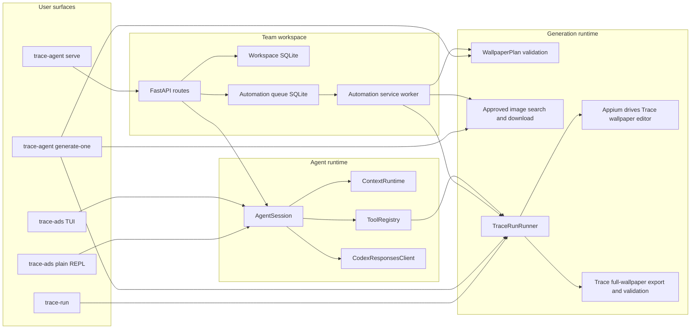

# System Architecture

Status: Draft
Last reviewed: 2026-08-26

## Purpose

This document describes the architecture implemented by the `ads-booster` distribution candidate.
Product behavior is established in a fresh installed `trace-agent` environment; worktree source is
implementation evidence, not proof that a first-time installation exposes the same behavior. This
document records runtime entry points, persisted state, and external-system boundaries. It does not
define product requirements, development workflow, or future architecture.

User-facing setup and operation belong in [README](../../README.md). Development and Git conventions
belong in [AGENTS.md](../../AGENTS.md) and `docs/conventions/`. When this document and the code
disagree, treat the code as the current behavior and update this document in the same change.

Package ownership, dependency direction, composition roots, and code placement belong in
`docs/architecture/code.md`.

## System summary

`ads-booster` is a local-first Python package for operating a Trace marketing agent and producing
Trace-rendered lock-screen wallpaper PNGs. It exposes three primary product surfaces:

- a standalone agent through the `trace-ads` TUI or plain REPL;
- a local team workspace through `trace-agent serve` and its FastAPI browser/API surface;
- a deterministic full-wallpaper generation pipeline through `trace-agent generate-one`.

`trace-run` remains an installed legacy component-capture and composition CLI, not part of the
primary generation surface.

The optional Cloudflare deployment adds a fourth surface: one login-free hosted candidate workspace
served from the control-plane Worker root. It contains switchable logical account silos and is
intentionally a public team review surface rather than a replacement for member-private local
sessions. Account selection scopes data; it does not authorize a visitor.

The surfaces share model-provider, tool, generation, capture, composition, and contract code, but
they do not share one process lifecycle. Starting the Web service does not start the standalone
TUI. The service process hosts both FastAPI and its explicitly attached automation worker.

The runtime does not launch a Codex process. It owns its agent loop and connects directly to the
ChatGPT/Codex-compatible Responses transport through its OAuth credential boundary.



## Runtime entry points

The installed commands are declared in `pyproject.toml`.

| Command | Composition root | Responsibility |
| --- | --- | --- |
| `trace-ads` | `src/ads_booster/cli/agent.py` | Start the Textual TUI or plain REPL, authenticate, select the model, and compose the agent session. |
| `trace-agent` | `src/ads_booster/cli/agent.py` | Compatibility alias for `trace-ads`; also owns `generate-one`, `serve`, `workspace`, and `service` subcommands. |
| `trace-capture` | `src/ads_booster/cli/capture.py` | Legacy: execute a typed native component-capture job. |
| `trace-compose` | `src/ads_booster/cli/compose.py` | Legacy: compose validated background, Trace component, and iPhone system-UI layers. |
| `trace-run` | `src/ads_booster/cli/trace_run.py` | Legacy: execute or resume the component capture, staging, and composition state machine. |

CLI modules parse input and compose dependencies. Business transitions and artifact validation
belong in `runtime/`, `automation/`, `capture/`, and `composition/`, not in Typer callbacks.

## Code structure

Package ownership, dependency direction, composition roots, and placement rules are defined in
[Code Architecture](./code.md). This document refers to those packages only to explain
runtime behavior.

## Standalone agent flow

`trace-ads` builds one `AgentSession` with a provider client, tool registry, tool context, context
runtime, memory store, and approval implementation.

1. The TUI or REPL sends a user prompt to `AgentSession.ask()`.
2. `ContextRuntime` creates a request-local projection of canonical history. It prunes large tool
   outputs and compacts old turns when configured limits are reached.
3. `CodexResponsesClient` sends the projection, the stable tool descriptor list, and the selected
   request model as tagged runtime metadata in the provider instructions. This lets the agent answer
   model-identity questions from the same model selection that builds the request; it does not claim
   to observe opaque provider-side routing beyond that requested model.
4. If the provider returns function calls, `ToolRegistry` executes them through `ToolContext` and
   appends typed call results to canonical history. Text tools return string outputs; `image_view`
   returns an approved, validated Responses content array containing image pixels.
5. The loop continues until the provider returns a final text response. Provider context overflow
   is handled by the one explicit compaction retry described below.
6. The TUI or REPL persists the canonical session history through `JsonSessionStore`.

Compaction changes the provider projection, not the canonical session history. Compaction
summaries are appended to the JSONL memory store. A provider context-overflow response permits one
forced-compaction retry for the current turn.

The default tool registry exposes filesystem, local-image viewing, shell, browser, Web search,
image search, and TraceRun capabilities. Mutating filesystem, local-image viewing, shell, browser,
and TraceRun operations cross explicit approval boundaries. Filesystem and command paths must remain
inside the selected agent workspace. `image_view` also accepts an explicitly supplied absolute path;
it validates PNG, JPEG, or WebP bytes and size before sending them to the selected model.

The default model instruction makes environment preparation agent-owned: when Trace capture, image
generation, or visual QA needs an installed but inactive local dependency, the agent inspects it,
starts it through the existing tool boundary, verifies readiness, and continues. This policy does
not authorize software installation or unrelated service startup.

The standalone TUI owns a thread-safe `TuiApproval` boundary. Its default permission mode is
`yolo`, which automatically grants the boundary for the current TUI session. `/permission ask`
switches to per-operation confirmation with keyboard- and mouse-selectable Approve/Deny controls;
`/permission yolo` switches back, and `/permission` reports the current mode. The plain REPL and
Web session factory use the same command contract. The `/api/chat/approval` routes carry the
equivalent approval request for a Web member, and the decision is resolved against that member's
live agent state; the current two-tab browser surface does not render those controls.

## Generation and TraceRun flow

CLI and scheduled campaign generation submit one `AgentGoal` with a frozen
`MarketingContextBundle` to the durable Agent run store. The run selects connector identity
`trace-marketing` at exact version `1.0.0` from `connectors/trace/v1` and exposes only its allowed
semantic capability.

1. `AgentRuntime` loads the goal, connector version, tool policy, canonical history, latest memory,
   and structured persona/promotion/reference context into one `AgentSession`.
2. The model calls `trace_generate_marketing_image` with a complete strict `WallpaperPlan`: one
   explicit IANA time zone, background query, supplied reference IDs, row layouts, component titles,
   colored calendar events, and supported Trace visual style values. Events are either all-day or
   have unambiguous UTC start and end times. Agent code does not select those creative values from
   persona-specific tables.
3. The Trace connector verifies request ownership, source references, event coverage, native layout
   constraints, and the scheduled run's side-effect authority. For every timed event, it converts
   UTC only through `WallpaperPlan.time_zone` and requires the promotion `trace_item` to be that
   local `HH:MM` plus the event's clean title. This rejects a wrong UTC conversion or time repeated
   inside the title before Trace renders it.
4. The search adapter restricts results to approved public-source domains, downloads a readable
   background, normalizes it to PNG, and records URL and digest provenance.
5. `GenerateOneRunner.run_plan` creates a request-bound wallpaper capture contract without
   rewriting the model-authored plan.
6. The capture adapter clears a prior export, imports the normalized background with `simctl`
   Photos, and opens Trace with export binding metadata only. No card, row, title, time, all-day,
   or event-color payload is passed in launch arguments. Repeated Simulator captures reuse the
   installed WebDriverAgent instead of forcing an Xcode rebuild before every UI session; the Appium
   session and all later UI commands remain bounded by the capture deadline.
7. Appium uses Trace's real calendar, event, and `LockScreenWallpaperSheet` controls to create the
   request-owned data and set every visual value from the plan. Calendar/event content, including
   the explicit plan time zone, is entered through the UI; neither Trace nor Python may fall back
   to the Mac or Simulator time zone.
8. Save invokes Trace's `renderWallpaper` path, which writes `trace_wallpaper.png` and its native
   binding manifest into the App Group.
9. The collector copies the full wallpaper to the run output and validates opaque PNG bytes,
   SHA-256, request digest, nonce, device binding, dimensions, and manifest before accepting it.
10. `outputs/final.png` is that verified Trace export. `TraceRunResult` uses
    `trace.run-result.v2` and moves the Agent run to `awaiting_approval` for human review.

Agent runs persist goal, connector/tool policy, history, observations, revision, and lifecycle
in `agent-runs.sqlite3`. TraceRun records mechanical transitions in an append-only JSONL journal.
A newly constructed workspace process requeues Agent runs inherited in `running` with a durable
`service_restart` failure observation before it accepts requests. This recovers work interrupted by
the previous process while same-process duplicate requests still receive a conflict. The nested
TraceRun journal remains authoritative for external side effects and still resolves an interrupted
capability as `unknown_side_effect` instead of invoking it again.
A resumed TraceRun journal that stopped while
awaiting an external tool moves to `unknown_side_effect` instead of repeating an operation whose
effect cannot be proven. Run identity, idempotency key, paths, digests, and state transitions are
validated before completion is reported.

The primary pipeline captures a fresh full Trace wallpaper export for each run. It does not call an
image-generation model, set a physical iPhone wallpaper, or claim an iOS lock-screen screenshot.
`trace-capture`, `trace-run`, and `trace-compose` retain their separate legacy component-export and
offline-composition contracts; they are not part of `generate-one`.

## Team workspace and Web flow

The native installer only installs the CLI. `trace-agent workspace start` (or the lower-level
`service install`/`serve` commands) explicitly starts the workspace lifecycle. `trace-agent serve`
prepares a loopback listener, bootstraps a workspace when needed, requests a
cloudflared quick tunnel by default, and starts a Uvicorn process with the FastAPI application and
an explicitly attached automation worker. Readiness requires the loopback service to answer
`/health` and cloudflared to emit a public URL; it does not perform a second public DNS probe from
the same host. During launchd replacement, the service waits for the previous job to finish
unloading before bootstrapping the new plist. `--tunnel none` opts out of public access.

On first start:

1. `SqliteWorkspaceStore` creates one workspace and one owner member.
2. Plaintext workspace and member codes are returned once to the foreground CLI.
3. Only scrypt hashes and code versions are stored in SQLite.
4. `service.json` stores identifiers and service configuration, not plaintext access codes.

The first owner member recorded in `service.json` is the authenticated Web administrator. The owner
can use `POST /api/members/invite` from the browser to create a regular member and receive a
three-part member access ID once. A regular member can redeem that ID through
`POST /api/auth/member-login`; the existing four-part owner access ID and `/api/auth/login` contract
remain unchanged. `trace-agent workspace add-member --name <name>` remains a local fallback.

`workspace access` emits one copyable `%`-separated browser login ID containing the workspace ID,
member ID, workspace code, and member code. The browser parses that value at the entry boundary and
submits the existing four-field payload to the auth route. Successful login creates an HMAC-signed
cookie containing workspace/member IDs, code versions, and expiry. The signing secret is process-local
by default, so a service restart invalidates existing browser sessions. Code rotation also invalidates
sessions whose embedded versions are stale.

The browser surface is two tabs, 후보 and 캡션·주제 승인, both backed by `/api/candidates`. The
context, asset, campaign, queue, and chat routes described below still run inside the same process
and keep their tests, but no browser tab renders them; they are reachable only as API endpoints.

Shared context is workspace-scoped. Private conversation history is scoped by workspace, member,
and session. A chat request loads shared context as a read-only developer prefix, runs a fresh
request-local `AgentSession` built by the same factory as the TUI, and persists only the resulting
private history. The Web adapter dispatches `/auth`, `/model`, `/permission`, `/new`, `/clear`,
`/session`, and `/help` through the existing TUI command contract. Live model, reasoning, permission,
and approval state is isolated by authenticated member while the provider OAuth credential remains
host-owned. Optimistic revisions reject concurrent writes with a conflict instead of silently
overwriting a newer session.

Reference assets are workspace-scoped. The authenticated upload route accepts JPEG, PNG, or WebP
data, verifies the decoded image, writes a protected file below `TRACE_AGENT_HOME/assets/`, and
records its normalized path, digest, size, and optional context binding. Campaign creation verifies
the path, bytes, and digest again before freezing the reference into generation input.

Post candidates are workspace-scoped rows in the same workspace database. A candidate carries the
topic, caption, hypothesis, references, applied principles, the free-form Appium prompt stored in
`shooting_order`, and the machine `image_inputs` the image stage needs: one to eight lock-screen
schedule items, an `HH:MM` device time, a background subject drawn from a fixed vocabulary, a short
background mood, and the content language. A candidate enters at `awaiting_review`. Topic and
caption are reviewed together as one decision, so the first gate has a single approve/reject pair.
`/api/candidates` creates manual candidates and lists a workspace newest-first.

A candidate travels three approval stages, and both browser surfaces render that journey so its
position is visible. Stages one and two are implemented:

```text
awaiting_review --approve--> caption_approved --generate image--> image_awaiting_review --approve--> submitted
       |                            ^                                     |
       +----reject--------> rejected +---------------reject---------------+
```

`/api/candidates/{candidate_id}/review` is the first gate and moves one candidate to
`caption_approved` or `rejected` with an optional note. `/api/candidates/{candidate_id}/generate-image`
is the second: it composes one lock-screen image and moves the candidate to
`image_awaiting_review`, and `/api/candidates/{candidate_id}/review-image` either submits the
candidate or returns it to `caption_approved` with the note so a new image can be composed. Every
transition requires the current revision and the expected source status, so a stale or repeated
decision fails with a conflict instead of overwriting the first one. Publishing a submitted post
stays a human action outside this runtime.

### Candidate wallpaper generation

The image stage synchronously submits the approved candidate to the same durable Agent and
Trace v1 connector used by campaign generation. Its primary artifact comes from:

| Input or artifact | Source | Verified by |
| --- | --- | --- |
| Background | `search/image/` fetches one image from the Pexels/Unsplash/Pixabay allowlist | Approved source host, decodable bytes, minimum edge, recorded digest |
| Calendar/event content | Request-owned automation input | Explicit IANA time zone; strict UTC/all-day, event-color, and local `HH:MM` plus clean-title source validation |
| Visual configuration | Real `LockScreenWallpaperSheet` Appium interaction | Required editor accessibility controls and plan values |
| Final wallpaper | Request-bound `trace_wallpaper.png` rendered by Trace | PNG bytes, native manifest, request digest, nonce, device binding, and artifact digest |

The connector receives only facts present in the candidate snapshot. Missing persona attributes
remain absent instead of being filled with creative defaults. The Agent authors the wallpaper plan;
the connector validates it and delegates mechanical background import, editor interaction, and
opaque native-export verification. The Web route confines `outputs/final.png` beneath the Agent run
root and checks its SHA-256 before moving the candidate to image review. Any environment,
generation, provenance, path, or digest failure leaves the candidate at `caption_approved`.

Opening the workspace database runs two idempotent candidate migrations: rows written under the
earlier single-stage `accepted` status are rewritten to `caption_approved`, which carries the same
meaning on the journey, and rows stored before `topic` became a required reviewable field gain the
column with the placeholder value `(주제 미기록)`.

## Automatic candidate generation

`POST /api/candidates/generate` is the second candidate entrance. `candidate_generation/` admits a
durable Agent goal and uses the Trace v1 connector:

1. Resolve the context directory from `TRACE_AGENT_CONTEXT_DIR`, or `<serve workspace>/context`.
2. Discover every readable Markdown document below the selected context directory. A new domain can
   add its own directory without changing Python constants; an absent directory, unreadable file,
   symlink, or empty document fails before any provider call and names what is unusable.
3. Snapshot the discovered documents, workspace scope, and optional control-plane context into
   `AgentGoal.context`.
4. The connector injects the read-only documents as projection context and exposes only
   `trace_propose_marketing_candidates` for this run.
5. The model authors the complete typed candidates, including country, posting slot, background
   intent, and Appium direction. Invalid fields or duplicate topics return as tool observations, and
   the normal completion-driven loop can revise them without a fixed retry count.
6. A successful tool call returns the validated batch, the application stores it as `source=auto`,
   `status=awaiting_review`, and the Agent run completes durably.

The run has no publishing or filesystem-writing capability. It is a synchronous request handled in
the FastAPI threadpool, so the browser waits for it. Failure modes are typed and mapped to a status
with an operator-facing Korean message: missing context or a missing provider credential answer
`409`, and a provider failure answers `502`.

## Automation queue

The campaign route creates a durable finite or continuous campaign from one stored persona,
one stored promotion, optional stored references, a reference date, and a device. `CampaignProducer`
keeps at most one outstanding queue item per campaign, assigns a monotonic variation index, and
continues after service restart. A finite campaign becomes `completed` after its requested count;
an operator can move an active campaign to `stopped`. A known production-generation exception is
converted to a failed run result, and a failed current queue item stops its campaign before another
variation is enqueued. The lower-level Web API can still submit an
immediate typed `MarketingContextBundle` or a UTC-due queue item directly.

```text
submitted -> claimed -> running -> review -> accepted
                                      |
                                      +-------> rejected
             |           |
             +-----------+---------> failed
```

- `(workspace_id, idempotency_key)` is unique.
- Repeating the same idempotency key and payload returns the existing record.
- Reusing the key with a different payload fails closed.
- SQLite permits only one `claimed` or `running` record at a time.
- Claims use bounded leases and optimistic revisions.
- `GenerateOneWorker` verifies run identity, idempotency key, artifact location, and artifact digest
  before moving a result to `review`.
- Human approval completes both the queue record and linked Agent run. Rejection invalidates the
  artifact, records feedback on the same Agent run, and requeues the same goal for replanning.

`AutomationServiceWorker` first lets the campaign producer supply the next safe variation, then
polls the durable queue inside the service lifespan. It uses `QueueScheduler` to claim one due
record and runs `GenerateOneWorker` in a worker thread so the
event loop can continue serving HTTP requests. The production worker builds the same
Agent + Trace connector composition used by the one-shot CLI, with service-owned run,
artifact, journal, and capture roots below `TRACE_AGENT_HOME`. Service shutdown cancels the polling
task.

## Local state and artifacts

`TRACE_AGENT_HOME` is the local service and agent state root. It defaults to `~/.trace-agent`.

| Path | Owner | Contents |
| --- | --- | --- |
| `$TRACE_AGENT_HOME/workspace.sqlite3` | `workspace/` | Workspaces, members, hashed code versions, shared contexts, asset metadata, post candidates with their review state, and member-private sessions |
| `$TRACE_AGENT_HOME/automation.sqlite3` | `automation/` | Campaign inputs/state, queue payloads, leases, run references, artifact digests and review state |
| `$TRACE_AGENT_HOME/service.json` | `service/` | Bootstrap identifiers, loopback host/port, tunnel selection, and last emitted public URL |
| `$TRACE_AGENT_HOME/auth.json` | `auth/` | OAuth credential data, protected with file mode `0600` |
| `$TRACE_AGENT_HOME/sessions/` | `agent/` | Standalone TUI and REPL canonical histories, one protected JSON file per session |
| `$TRACE_AGENT_HOME/memory.jsonl` | `agent/` | Append-only context-compaction summaries |
| `$TRACE_AGENT_HOME/core-agent/agent-runs.sqlite3` | `agent/` | Durable goals, exact connector identity/version, tool policy, canonical history, observations, revisions, and lifecycle state |
| `$TRACE_AGENT_HOME/core-agent/memory.jsonl` | `agent/` | Durable-run context-compaction summaries; the path name remains compatible with existing installations |
| `$TRACE_AGENT_HOME/web-memory/*.jsonl` | `web/`, `agent/` | Private-chat compaction summaries scoped by a hash of workspace and member IDs |
| `$TRACE_AGENT_HOME/marketing-bridge/marketing-bridge.sqlite3` | `marketing/` | Durable remote-task inbox, callback outbox, run/candidate review linkage, and approval outbox |
| `$TRACE_AGENT_HOME/marketing-bridge/service.json` | `marketing/` | Non-secret bridge endpoint, Queue ID, executor, and polling configuration |
| `$TRACE_AGENT_HOME/marketing-bridge/artifacts/` | `marketing/` | Digest-backed simulation artifacts or adapter-owned task artifacts |
| `$TRACE_AGENT_HOME/marketing-simulation/` | `marketing/` | Local control-plane proof, with one separate SQLite memory file per account |
| `$TRACE_AGENT_HOME/logs/` | `service/`, `tunnel/` | Protected workspace and tunnel logs |
| `TRACE_AGENT_CONTEXT_DIR`, `<serve workspace>/context/`, or packaged `assets/context/` | `candidate_generation/` | Recursively discovered workspace or starter Markdown context for any marketing domain, read only |

Generation artifacts are separate from service metadata. By default, standalone `generate-one`
writes its request-owned background input, `outputs/final.png`, and wallpaper manifest below
`.trace-agent/generated/` relative to the invoking workspace. The service worker uses
`$TRACE_AGENT_HOME/generated/`. The legacy `trace-run` CLI retains separate state and capture roots
for its component-composition job journal.

## External boundaries

| External dependency | Adapter or boundary | Contract |
| --- | --- | --- |
| ChatGPT/Codex-compatible Responses service | `auth/`, `providers/`, `transport/` | OAuth credential, model responses, completion-driven tool calls, and provider-reported usage |
| Appium 3 and XCUITest | `capture/` | Validated server URL, Simulator/Appium readiness, Photos import, real Trace wallpaper-editor controls, request-bound full export, and captured artifact provenance |
| Trace iOS debug app | `capture/` | Installed `com.corca.Trace` build with request-bound wallpaper export and `LockScreenWallpaperSheet` accessibility controls |
| Browser automation | `tools/browser.py` | External `agent-browser` command with approval for mutating actions |
| Web and image search | `tools/`, `search/` provider adapters | Normalized source results; generation downloads only approved image-source domains and stores provenance |
| cloudflared | `tunnel/` | Default live `trycloudflare.com` URL request; failure leaves the loopback service available |
| Worker supervisor and secret manager | `marketing/service.py` | Portable bridge config plus environment or argv-safe external credential command; no OS-specific store is required |
| Cloudflare D1, Workflows, Durable Objects, Queues, and R2 | `cloudflare/`, `marketing/` | Dynamic account registry, durable loop, isolated account memory, outbound worker task pull, and context artifacts |
| Cloudflare Workers AI and Static Assets | `cloudflare/` | Public workspace assets plus context-grounded candidate generation; no local OAuth credential crosses this boundary |

## Dynamic marketing account loop

The optional hosted control plane is defined under `cloudflare/`. D1 owns versioned shared
instructions, account configuration, schedules, runs, events, and task indexes. A named Durable
Object selected by `account_id` owns private learned memory for exactly one marketing account.
Cloudflare Workflows owns the durable run and two human-approval waits: candidate/caption selection
before image capture, then image/publication approval before the channel boundary. A Cron Trigger
checks D1 every minute and claims accounts whose data-driven `next_run_at` is due. A partial unique
D1 index permits only one non-terminal run per account, so a long approval wait cannot accumulate
overlapping Cron runs. Approval or task callback expiry moves the D1 run to `failed` with a stable
timeout code instead of leaving a permanently waiting row.

The same Worker root serves a static copy of the candidate and two-stage review UI. `/api/*` on this
hosted surface is intentionally login-free; it must not be confused with the token-protected `/v1/*`
control-plane and callback APIs. `X-Trace-Account-ID` or `account_id` selects an enabled logical silo,
but every visitor may list and select those accounts. D1 owns hosted account settings, candidates,
account-scoped country/persona profiles, optimistic revisions, immutable candidate context snapshots,
structured feedback events, and a per-account generation cooldown. Each account owns its country,
locale, timezone, morning/evening slots, generation switch, and next generation time. The UI exposes
account switching and settings, current context, pipeline counts, candidate status filters, and the
account-scoped feedback summary. Workers AI receives the selected profile, matching packaged country
context, current account instruction, and repeated account/persona feedback rules. It must return
four schema-shaped candidates in one batch: two morning and two evening. The Cron Trigger claims due
enabled accounts and invokes the same generator; failures move that account's retry time 15 minutes
forward without changing another silo. A manifest maps packaged global and country documents to
starter profile files, so a new country does not require a Worker source edit. It carries three
groups per country: `documents` are injected into every generation in full, `assets` only have to
resolve and stay non-blank, and `reference_bodies` are keyed by their frontmatter id so a generation
inlines only the records the selected persona names, capped at five records and 24,000 bytes. The
build fails when a country's documents exceed 48,000 bytes rather than letting the Worker truncate a
table mid-row. Missing country documents fail closed with `409`.
Missing or incomplete Appium prompt text is rebuilt from the validated image inputs.
Caption approval creates a revision-scoped hosted capture task in D1 and Cloudflare Queue. The
portable bridge recognizes that task contract, discovers a booted or available iPhone Simulator at
execution time, runs the production Appium/XCUITest capture and deterministic composition path, and
returns the final PNG in its durable callback outbox. The Worker verifies task/run/account/candidate
scope, callback ID, byte limit, and SHA-256 before storing the PNG in R2. A duplicate identical
callback is accepted; a changed or stale callback cannot advance the candidate. Offline workers leave
`capture_state=queued`; verified failures use `capture_state=failed` and remain retryable.
Image approval ends at `submitted` and performs no outbound publication action. A hosted candidate
can be edited or deleted from any state with its current optimistic revision. Editing invalidates the
old review and image, returns the candidate to `awaiting_review`, and removes the old R2 object;
deletion removes the D1 record and its R2 object. Profile deletion is a soft hide and never changes a
candidate's stored context snapshot. Approval records a 5-point event. Rejection requires a 1–3
rating and a taxonomy tag; three matching tag events for one account/persona become a generation
rule candidate. The packaged context is no longer uniform starter material: `core/` holds the team's
collected and verified principle, element, voice, and shooting documents for KR, JP, and TW copied
byte-identically from the marketing context archive, and KR additionally carries the 41-record
reference corpus, while US, DE, FR, and BR remain unverified hypothesis markets.
`assets/context/ORIGIN.md` states that split and the archive commit each document came from. The 16
profiles are still generic starter material. Existing Appium persona JSON files are
test/demo fixtures, not production team context, and the earlier generator's `context/` contract
pointed to operator-owned local files that were not committed to this repository. Team-owned evidence
enters through D1 profile CRUD or reviewed manifest data rather than being inferred from those
fixtures.

For a simulation account without a local `workspace_id`, the Workflow executes each task in
Cloudflare, stores a labeled digest-backed task artifact in R2, and records the result in D1. This
keeps the first durable loop hosted while preserving both human approval waits. When an account has
a `workspace_id`, the Workflow instead emits versioned tasks to Cloudflare Queue. An enrolled worker runs
`trace-marketing bridge`, pulls over the Cloudflare REST API, commits each task to a protected SQLite
inbox, and only then acknowledges the queue lease. Task completion and its callback are committed to
a local outbox so a process restart cannot lose the control-plane notification. Candidate-task
completion also records the run/workspace/candidate linkage. The bridge polls workspace review
states and, after every candidate at a gate has a human decision, inserts an approval event into a
second local outbox before delivery. D1 records the event ID before sending the buffered Workflow
event and treats an identical delivered retry as a duplicate. `trace-marketing bridge-configure`
persists only portable non-secret routing, while a supervisor injects environment credentials or an
external secret command on any enrolled worker. The bridge initiates every connection; the quick
`trycloudflare.com` tunnel is not part of this
transport. Queue bodies use JSON text for HTTP pull compatibility, task completion events include the
task ID, and duplicate callbacks replay the same event only after the stored callback ID and result
match. Pull, acknowledgement, callback, and approval transport failures do not block already-durable
local work.

The login-free hosted workspace uses the same Queue independently of the Workflow account mode for
native image work. Its task payload contains the immutable candidate/context snapshot but no bridge
secret. The Mac bridge is outbound-only and stores credentials through the existing environment or
external-command provider, never macOS Keychain. `TRACE_AGENT_DEVICE_UDID` is an optional override;
without it the worker chooses a compatible Simulator dynamically.

Cloudflare production delivery is owned by `.github/workflows/deploy-cloudflare.yml`. A Pull Request
that changes the Worker, canonical workspace UI, or packaged context runs an unprivileged Worker
check. A qualifying merge to `main` then installs the locked Worker dependencies, reuses that check
as a deployment prerequisite, renders the environment-specific Wrangler config from GitHub
variables, applies D1 migrations, deploys the Worker and static assets, and requires successful
public `/health`, root workspace, and public-session readbacks, including a non-empty default context
profile after D1 migration and reads back the `workspace.borca.ai` custom domain. The deployment job
is concurrency-serialized and never cancels an in-flight migration/deploy. Runtime control-plane and
callback secrets stay attached to the Worker in Cloudflare; GitHub receives only the scoped deploy
credential required by Wrangler.

The bridge defaults to an explicitly labeled simulation executor. Its opt-in `candidate-pipeline`
executor maps an account's opaque local `workspace_id` to the existing provider candidate generator
and the search/full-wallpaper image runner. Generated candidates remain in the existing workspace
review journey: captions must reach `caption_approved` before capture, and generated wallpaper images must reach
`submitted` before the publication task can cross the adapter boundary. Research, publication, and
metrics still use the simulation executor in this mode. Live Threads publication remains
capability-gated and is not enabled or claimed. See
[Dynamic Cloudflare Marketing Loop Contract](../contracts/cloudflare-marketing-loop.md).

The base CLI, TUI, Web shell, and legacy offline composition do not require native capture dependencies.
Full-wallpaper generation requires full Xcode, an available Simulator, the Trace
debug build, Appium, and the XCUITest driver. The agent starts installed but inactive Simulator and
Appium processes, but does not install the missing Trace build or driver.

## Architectural invariants

- The agent runtime is independent of a Codex CLI process.
- `trace-agent` remains a compatibility alias for `trace-ads`.
- Canonical conversation history is preserved; compaction changes only the provider projection.
- Shared workspace context is read-only inside private chat requests.
- Private sessions are scoped by workspace, member, and session identifiers.
- Access codes and OAuth credentials are not written to ordinary logs.
- Service binding remains loopback-only unless an explicit tunnel adapter reports a live URL.
- The hosted Cloudflare workspace is intentionally public and account-scoped; token-protected
  control-plane and worker callback APIs never inherit that public access.
- External side effects require an approval boundary or a dedicated worker boundary; the standalone
  TUI's explicit `yolo` mode is the user-selected automatic decision at that boundary.
- Capture, staging, and composition artifacts remain inside their configured roots and retain digest
  provenance.
- Unknown external side effects fail closed and are not retried blindly.
- Account-private marketing memory is addressed by account ID and is never assembled into another
  account's context snapshot.
- Simulation accounts without `workspace_id` complete task execution in Cloudflare and retain R2
  digest provenance; workspace-backed accounts cross the explicit Queue-to-worker boundary.
- Queue messages are acknowledged only after durable local insertion; callbacks use an independent
  durable outbox.
- One account can own only one non-terminal hosted run; observation offsets are interpreted as
  absolute minutes since publication and converted to relative Workflow sleeps.
- A normal Cloudflare code merge is deploy-complete only when the serialized GitHub Actions job has
  applied migrations, deployed the same merged revision, and read back `/health` successfully.
- Hosted marketing runs cannot bypass either the caption/candidate approval gate or the final image
  approval gate when using the installed candidate pipeline.
- A generated artifact is not ready for delivery until its path and digest are verified and a human
  accepts the review record.
- No current live adapter publishes to Notion, Threads, or another external marketing channel.

## Current exclusions

The implemented architecture does not currently provide:

- a verified production round trip through the hosted Queue pull bridge;
- a capability-proven live Threads publication adapter;
- real channel metrics and production feedback learning;
- real custom-wallpaper capture from the Simulator.

These are current product boundaries, not commitments about future design.

## Document maintenance

Update this document when a runtime entry point, process composition, execution flow, persisted
state, external dependency, security boundary, or architectural invariant changes. Update
`docs/architecture/code.md` when package ownership, dependency direction, composition roots, or code
placement changes.
