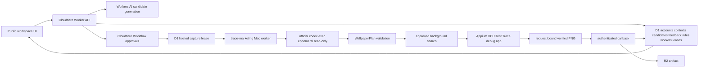

# System Architecture

Status: Active
Last reviewed: 2026-08-27

## Purpose

This document describes the deployed Cloudflare workspace and installed Mac worker. Product
behavior is established with a fresh-installed `trace-marketing` command plus the deployed
`workspace.borca.ai` surface; worktree execution is implementation evidence only.

Deployment note (2026-08-27): the feedback provenance/learning, generated-batch validator,
immediate image-retry guidance, and zero-worker fail-fast described in Hosted candidate flow are
candidate implementation only. They are not deployed behavior until migration, Worker deployment,
hosted readback, and the first Mac canary complete.

## Process topology

The Cloudflare Worker owns public UI/API delivery, account silos, context profiles, candidate state,
schedules, task assignment, worker health, approval waits, and R2 callbacks. Each Mac is a replaceable
machine identity and claims one compatible task through a D1 lease.

The Mac worker uses the official Codex CLI as the model harness. It does not instantiate the former
in-package AgentSession, OAuth store, Responses client, memory, or tool loop. Every task invokes a new
`codex exec --ephemeral --sandbox read-only` turn with a strict output schema. Codex authentication
is resolved normally for the same macOS user that owns the per-user LaunchAgent.

The installed product is a versioned release tree, not a mutable checkout or in-place uv tool.
`com.corca.trace-marketing-worker` always enters through the atomic `current` symlink. A separate
`com.corca.trace-marketing-updater` LaunchAgent pulls only a stable immutable GitHub Release,
verifies its tag, commit and asset digests, installs it offline into staging, and requests a local
drain. The worker then stops remote claims while finishing durable local work and callbacks. Only an
empty inbox/outbox plus no ambiguous Codex execution marker permits the updater to unload the
worker, switch `current`, and require launchd, doctor, and exact-version accepted-heartbeat proof.
Failure restores and re-verifies the previous last-known-good release.

## Installed commands

Commands are declared in `pyproject.toml`.

| Command | Composition root | Responsibility |
| --- | --- | --- |
| `trace-marketing` | `cli/marketing.py` | Worker enrollment, doctor, foreground/service lifecycle, drain/revoke, simulation and compatibility bridge |
| `trace-capture` | `cli/capture.py` | Legacy typed native component capture |
| `trace-compose` | `cli/compose.py` | Legacy validated offline composition |
| `trace-run` | `cli/trace_run.py` | Legacy resumable capture/composition state machine |

`trace-agent` and `trace-ads` are not installed entry points. Their old source modules may remain
temporarily for source compatibility tests, but no production Mac or installer path invokes them.

## Hosted candidate flow

1. The browser loads the login-free hosted workspace and selects a logical account. Account scope
   separates contexts, profiles, candidates, runs, feedback, and learned memory; it is not visitor
   authentication.
2. Cloudflare Workers AI generates context-grounded candidates using `WORKSPACE_AI_MODEL`. D1
   stores prompt version/digest, model, selected profile snapshot, and active controlled feedback
   rules. A deterministic batch validator rejects duplicate topics/captions/schedules, invalid
   references or principles, and non-`HH:MM 제목` Trace items before persistence.
3. A teammate may edit or delete submitted candidates. Candidate approval creates a version-bound
   capture task only if at least one non-revoked broker worker is registered; otherwise it returns
   `503` without queueing. Worker eligibility, task insertion, and candidate revision advance share
   one conditional D1 batch. Manual edits clear generation provenance and invalidate earlier approval.
4. D1 assigns one lease to an active worker whose heartbeat doctor is ready. Offline, degraded,
   draining, and revoked workers receive no new task. Learned design/policy rules snapshotted on the
   candidate are appended to the Mac creative direction. A rejected image's controlled stage-valid
   tags also guide the same candidate's immediate retry; its free-form note does not.
5. Caption and image review events retain the reviewed candidate revision, bounded snapshot/digest,
   generation provenance, stage, rating, tags, and note. A server-owned instruction activates only
   after rating 1–2 evidence for the same stage/tag from three distinct revisions. Notes are never
   injected into model context automatically. Review evidence and its candidate transition commit
   in one D1 batch, preventing a decision without provenance or provenance without a decision.
6. The Workflow waits for the callback and then for human image approval. Approval reaches
   `submitted`; Threads publication remains outside the runtime.

## Mac planning and capture flow

1. `marketing/worker_broker.py` accepts the lease into the local durable inbox before acknowledging
   remote ownership.
2. `service/worker.py` composes `connectors/trace/v1/codex_runtime.py`.
3. The immutable hosted caption, hypothesis, full topic, reference IDs, creative direction, background
   intent, profile and Trace items are mapped into `MarketingContextBundle`. Hosted textual reference
   IDs are deterministic plan authority even when no binary `reference_images` are attached.
4. `providers/codex_cli.py` passes the context through stdin and requests the Pydantic-generated
   `WallpaperPlan` JSON schema. Optional reference images are validated and attached with `--image`.
5. Domain code revalidates request ID, IANA time zone, every promotion-owned event and its plan-zone
   local `HH:MM`, reference IDs, layouts, colors, and style values.
6. Immediately before Appium, the worker first records `execution_started_at` in D1, which removes
   the expiring lease from automatic reassignment, and then writes the local execution marker. A
   crash after either barrier requires the original Mac callback or explicit operator revocation; it
   cannot silently run on a replacement Mac.
7. `GenerateOneRunner` downloads an approved background with provenance, then Appium drives the Trace
   wallpaper editor. Capture code validates the export nonce, request digest, bundle ID, device,
   artifact role, dimensions, and PNG digest.
8. The worker's local outbox delivers the authenticated callback. After payload validation,
   Cloudflare atomically reserves the callback ID plus normalized result digest against the current
   worker and lease before writing R2 or changing candidate state. An identical partial retry may
   continue; changed content is rejected, and revocation waits until the reservation completes.

## Authentication and secrets

There are three separate identities:

- the Cloudflare administrator token, used only to manage workers;
- a revocable per-machine worker credential stored in a mode-`0600` file;
- the current macOS user's Codex login, managed by the official CLI in its normal cache or Keychain.

The worker and updater LaunchAgent plists contain no token. They store managed executable/state
paths, the resolved `codex` path, `TRACE_AGENT_HOME`, `PATH`, and only documented allowlisted
non-secret worker overrides, and run in `gui/<uid>`. The worker never copies Codex auth into its
state, D1, task payloads, logs, updater state, or plist.

## Local state

`TRACE_AGENT_HOME` defaults to `~/.trace-agent`.

| Path | Owner | Contents |
| --- | --- | --- |
| `marketing-worker/config.json` | `marketing/` | Non-secret worker identity, pool, origin and poll interval |
| `marketing-worker/credential.json` | `marketing/` | Revocable worker token, mode `0600` |
| `marketing-worker/runtime/` | `marketing/` | Durable inbox and callback outbox |
| `codex-runs/<request-id>/input.sha256` | Trace Codex runtime | Immutable input identity |
| `codex-runs/<request-id>/plan.json` | Trace Codex runtime | Validated structured plan only |
| `codex-runs/<request-id>/executing` | Trace Codex runtime | Native side-effect uncertainty barrier |
| `codex-runs/<request-id>/result.json` | Trace Codex runtime | Terminal typed result |
| `generated/<request-id>/` | `runtime/`, `capture/` | Background provenance and verified full-wallpaper PNG |
| `logs/` | LaunchAgent | Protected stdout and stderr |

Prompts, raw Codex responses, Codex threads, auth tokens, and auth-cache files are not stored below
`TRACE_AGENT_HOME` by this runtime.

The separate managed product root defaults to `~/.local/share/trace-marketing`:

| Path | Owner | Contents |
| --- | --- | --- |
| `releases/<version>/` | updater | Complete immutable virtual environment and verified release receipt |
| `staging/<attempt>/` | updater | Candidate bundle extraction and offline install only |
| `current` | updater | Atomically replaced symlink to one release |
| `update-state.json` | updater | Non-secret current, candidate and last-known-good status |

Enrollment, inbox/outbox, `codex-runs`, generated artifacts and official Codex login never move into
the managed product root.

## External boundaries

| Dependency | Boundary |
| --- | --- |
| Official Codex CLI | Ephemeral, read-only, schema-constrained subprocess; inherits same-user auth |
| Appium 3 / XCUITest | Simulator control and Trace accessibility interaction |
| Trace debug app | `com.corca.Trace` request-bound wallpaper export |
| Approved image sources | Search/download plus recorded source and digest provenance |
| Cloudflare Worker / D1 / Workflow / R2 | Hosted accounts, candidates, leases, approvals and artifacts |
| Workers AI | Hosted candidate generation only; its model is independent of Mac Codex planning |

## Invariants

- Canonical hosted account state remains siloed by account ID.
- A worker is a replaceable machine identity, never a committed person or Simulator UDID.
- An unhealthy worker cannot claim a new task; a stale or revoked worker cannot complete a lost lease.
- Model output cannot invoke Appium until it passes the deterministic `WallpaperPlan` checks.
- Generated images require native provenance and human review.
- Automatic feedback learning accepts only server-owned instructions backed by stage-specific,
  distinct-revision evidence; it never injects free-form notes or silently mutates a profile.
- A D1 execution barrier prevents lease expiry from reassigning work after Appium begins; a second
  D1 callback reservation binds result content and linearizes callback application against explicit
  revocation/replacement.
- Unknown external side effects are not retried automatically.
- Mutable, draft, prerelease, digest-incomplete, or commit-mismatched releases cannot enter staging.
- Last-known-good changes only after the exact candidate version is accepted in a new heartbeat.
- No runtime path publishes to Threads or another marketing channel.
