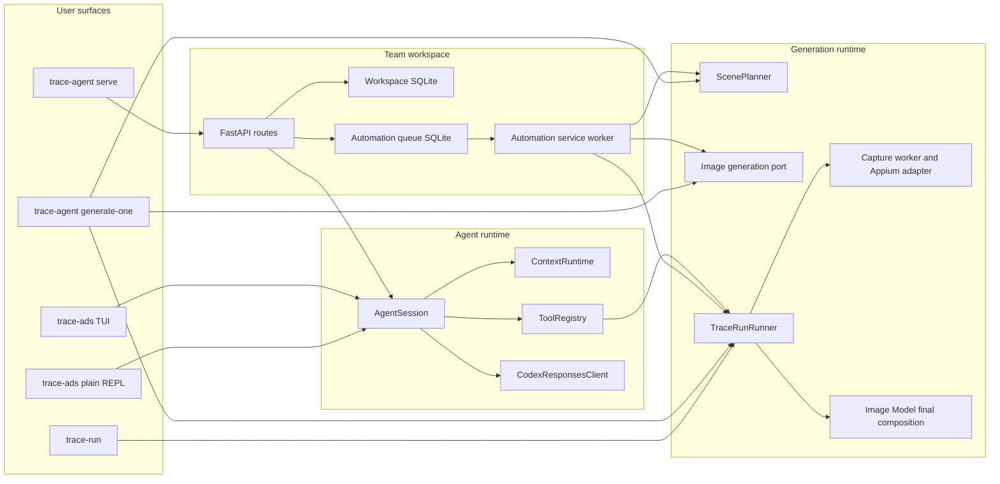

# System Architecture

Status: Draft
Last reviewed: 2026-08-25

## Purpose

This document describes the architecture implemented by the `ads-booster` distribution candidate.
Product behavior is established in a fresh installed `trace-agent` environment; worktree source is
implementation evidence, not proof that a first-time installation exposes the same behavior. This
document records runtime entry points, persisted state, and external-system boundaries. It does not
define product requirements, development workflow, or future architecture.

User-facing setup and operation belong in [README](../../README.md). Development and Git conventions
belong in [AGENTS.md](../../AGENTS.md) and `docs/conventions/`. When this document and the code
disagree, treat the code as the current behavior and update this document in the same change.

Package ownership, dependency direction, composition roots, and code placement belong in
`docs/architecture/code.md`.

## System summary

`ads-booster` is a local-first Python package for operating a Trace marketing agent and producing
layered Trace lock-screen marketing images. It exposes three primary product surfaces:

- a standalone agent through the `trace-ads` TUI or plain REPL;
- a local team workspace through `trace-agent serve` and its FastAPI browser/API surface;
- a deterministic generation pipeline through `trace-agent generate-one` and `trace-run`.

The surfaces share model-provider, tool, generation, capture, composition, and contract code, but
they do not share one process lifecycle. Starting the Web service does not start the standalone
TUI. The service process hosts both FastAPI and its explicitly attached automation worker.

The runtime does not launch a Codex process. It owns its agent loop and connects directly to the
ChatGPT/Codex-compatible Responses transport through its OAuth credential boundary.



## Runtime entry points

The installed commands are declared in `pyproject.toml`.

| Command | Composition root | Responsibility |
| --- | --- | --- |
| `trace-ads` | `src/trace_capture/cli/agent.py` | Start the Textual TUI or plain REPL, authenticate, select the model, and compose the agent session. |
| `trace-agent` | `src/trace_capture/cli/agent.py` | Compatibility alias for `trace-ads`; also owns `generate-one`, `serve`, `workspace`, and `service` subcommands. |
| `trace-capture` | `src/trace_capture/cli/capture.py` | Execute a typed native component-capture job. |
| `trace-compose` | `src/trace_capture/cli/compose.py` | Compose validated background, Trace component, and iPhone system-UI layers. |
| `trace-run` | `src/trace_capture/cli/trace_run.py` | Execute or resume the durable capture, staging, and composition state machine. |

CLI modules parse input and compose dependencies. Business transitions and artifact validation
belong in `runtime/`, `automation/`, `capture/`, and `composition/`, not in Typer callbacks.

## Code structure

Package ownership, dependency direction, composition roots, and placement rules are defined in
[Code Architecture](./code.md). This document refers to those packages only to explain
runtime behavior.

## Standalone agent flow

`trace-ads` builds one `AgentSession` with a provider client, tool registry, tool context, context
runtime, memory store, and approval implementation.

1. The TUI or REPL sends a user prompt to `AgentSession.ask()`.
2. `ContextRuntime` creates a request-local projection of canonical history. It prunes large tool
   outputs and compacts old turns when configured limits are reached.
3. `CodexResponsesClient` sends the projection, the stable tool descriptor list, and the selected
   request model as tagged runtime metadata in the provider instructions. This lets the agent answer
   model-identity questions from the same model selection that builds the request; it does not claim
   to observe opaque provider-side routing beyond that requested model.
4. If the provider returns function calls, `ToolRegistry` executes them through `ToolContext` and
   appends typed call results to canonical history.
5. The loop continues until the provider returns a final text response. Provider context overflow
   is handled by the one explicit compaction retry described below.
6. The TUI or REPL persists the canonical session history through `JsonSessionStore`.

Compaction changes the provider projection, not the canonical session history. Compaction
summaries are appended to the JSONL memory store. A provider context-overflow response permits one
forced-compaction retry for the current turn.

The default tool registry exposes filesystem, shell, browser, Web search, image search, and
TraceRun capabilities. Mutating filesystem, shell, browser, and TraceRun operations cross explicit
approval boundaries. Tool paths must remain inside the selected agent workspace.

The default model instruction makes environment preparation agent-owned: when Trace capture, image
generation, or visual QA needs an installed but inactive local dependency, the agent inspects it,
starts it through the existing tool boundary, verifies readiness, and continues. This policy does
not authorize software installation or unrelated service startup.

The standalone TUI owns a thread-safe `TuiApproval` boundary. Its default permission mode is
`yolo`, which automatically grants the boundary for the current TUI session. `/permission ask`
switches to per-operation confirmation with keyboard- and mouse-selectable Approve/Deny controls;
`/permission yolo` switches back, and `/permission` reports the current mode. The plain REPL and
Web session factory use the same command contract. Web members receive the equivalent approval
request in their browser, and the decision is resolved against that member's live agent state.

## Generation and TraceRun flow

`GenerateOneRunner` turns one `MarketingContextBundle` into one versioned `TraceRunRequest`.

1. `ScenePlanner` derives a locale, reference date, Trace items, variation direction, and image
   prompt from the persona and promotion material. Promotion-owned `trace_items` take precedence
   over compatibility scene defaults.
2. The runner resolves frozen reference-image paths inside the configured reference root.
3. The image-generation adapter verifies each context reference digest and generates the external
   background from the scene prompt.
4. The runner stages the configured iPhone system-UI seed. The Appium session overwrites that path
   with a fresh device screenshot during capture.
5. The runner creates versioned capture and composition contracts.
6. `TraceRunRunner` executes the fixed capability sequence:
   `capture -> stage_components -> compose`.
7. The capture port invokes the native capture worker and Appium adapter.
8. The staging step verifies the captured artifact and its SHA-256 digest before copying it into
   the composition job.
9. The final Image Model composition port verifies the background, fresh Trace component export, and
   Appium iPhone UI screenshot, sends all three as high-fidelity `input_image` references, and writes
   the expected final output path.

TraceRun records transitions in an append-only JSONL journal. A resumed journal that stopped while
awaiting an external tool moves to `unknown_side_effect` instead of repeating an operation whose
effect cannot be proven. Run identity, idempotency key, paths, digests, and state transitions are
validated before completion is reported.

The pipeline captures a fresh Trace component export and a fresh Appium iPhone UI screenshot for
each run. It does not set a custom Simulator wallpaper or require a physical iPhone. The existing
deterministic compositor remains available to the lower-level offline `trace-compose` command; the
context-driven `generate-one` path uses the final Image Model composition boundary.

## Team workspace and Web flow

The native installer only installs the CLI. `trace-agent workspace start` (or the lower-level
`service install`/`serve` commands) explicitly starts the workspace lifecycle. `trace-agent serve`
prepares a loopback listener, bootstraps a workspace when needed, requests a
cloudflared quick tunnel by default, and starts a Uvicorn process with the FastAPI application and
an explicitly attached automation worker. Readiness requires the loopback service to answer
`/health` and cloudflared to emit a public URL; it does not perform a second public DNS probe from
the same host. `--tunnel none` opts out of public access.

On first start:

1. `SqliteWorkspaceStore` creates one workspace and one owner member.
2. Plaintext workspace and member codes are returned once to the foreground CLI.
3. Only scrypt hashes and code versions are stored in SQLite.
4. `service.json` stores identifiers and service configuration, not plaintext access codes.

After bootstrap, a local operator can run `trace-agent workspace add-member --name <name>` to
provision another member. The command is a local administration boundary and prints the invite code
once; the Web API does not pretend that any authenticated member is an administrator.

`workspace access` emits one copyable `%`-separated browser login ID containing the workspace ID,
member ID, workspace code, and member code. The browser parses that value at the entry boundary and
submits the existing four-field payload to the auth route. Successful login creates an HMAC-signed
cookie containing workspace/member IDs, code versions, and expiry. The signing secret is process-local
by default, so a service restart invalidates existing browser sessions. Code rotation also invalidates
sessions whose embedded versions are stale.

Shared context is workspace-scoped. Private conversation history is scoped by workspace, member,
and session. A Web chat request loads shared context as a read-only developer prefix, runs a fresh
request-local `AgentSession` built by the same factory as the TUI, and persists only the resulting
private history. The Web adapter dispatches `/auth`, `/model`, `/permission`, `/new`, `/clear`,
`/session`, and `/help` through the existing TUI command contract. Live model, reasoning, permission,
and approval state is isolated by authenticated member while the provider OAuth credential remains
host-owned. Optimistic revisions reject concurrent writes with a conflict instead of silently
overwriting a newer session.

Reference assets are workspace-scoped. The authenticated upload route accepts JPEG, PNG, or WebP
data, verifies the decoded image, writes a protected file below `TRACE_AGENT_HOME/assets/`, and
records its normalized path, digest, size, and optional context binding. Campaign creation verifies
the path, bytes, and digest again before freezing the reference into generation input.

## Automation queue

The standard browser route creates a durable finite or continuous campaign from one stored persona,
one stored promotion, optional stored references, a reference date, and a device. `CampaignProducer`
keeps at most one outstanding queue item per campaign, assigns a monotonic variation index, and
continues after service restart. A finite campaign becomes `completed` after its requested count;
an operator can move an active campaign to `stopped`. A known production-generation exception is
converted to a failed run result, and a failed current queue item stops its campaign before another
variation is enqueued. The lower-level Web API can still submit an
immediate typed `MarketingContextBundle` or a UTC-due queue item directly.

```text
submitted -> claimed -> running -> review -> accepted
                                      |
                                      +-------> rejected
             |           |
             +-----------+---------> failed
```

- `(workspace_id, idempotency_key)` is unique.
- Repeating the same idempotency key and payload returns the existing record.
- Reusing the key with a different payload fails closed.
- SQLite permits only one `claimed` or `running` record at a time.
- Claims use bounded leases and optimistic revisions.
- `GenerateOneWorker` verifies run identity, idempotency key, artifact location, and artifact digest
  before moving a result to `review`.
- Human review moves a record to `accepted` or `rejected`.

`AutomationServiceWorker` first lets the campaign producer supply the next safe variation, then
polls the durable queue inside the service lifespan. It uses `QueueScheduler` to claim one due
record and runs `GenerateOneWorker` in a worker thread so the
event loop can continue serving HTTP requests. The production worker builds the same
`GenerateOneRunner` used by the one-shot CLI, with service-owned artifact, journal, and capture
roots below `TRACE_AGENT_HOME`. Service shutdown cancels the polling task.

## Local state and artifacts

`TRACE_AGENT_HOME` is the local service and agent state root. It defaults to `~/.trace-agent`.

| Path | Owner | Contents |
| --- | --- | --- |
| `$TRACE_AGENT_HOME/workspace.sqlite3` | `workspace/` | Workspaces, members, hashed code versions, shared contexts, asset metadata and member-private sessions |
| `$TRACE_AGENT_HOME/automation.sqlite3` | `automation/` | Campaign inputs/state, queue payloads, leases, run references, artifact digests and review state |
| `$TRACE_AGENT_HOME/service.json` | `service/` | Bootstrap identifiers, loopback host/port, tunnel selection, and last emitted public URL |
| `$TRACE_AGENT_HOME/auth.json` | `auth/` | OAuth credential data, protected with file mode `0600` |
| `$TRACE_AGENT_HOME/sessions/` | `agent/` | Standalone TUI and REPL canonical histories, one protected JSON file per session |
| `$TRACE_AGENT_HOME/memory.jsonl` | `agent/` | Append-only context-compaction summaries |
| `$TRACE_AGENT_HOME/logs/` | `service/`, `tunnel/` | Protected service and optional tunnel logs |

Generation artifacts are separate from service metadata. By default, the standalone
`generate-one` command writes the job tree, TraceRun journal, and capture output below
`.trace-agent/generated/`, `.trace-agent/state/`, and `.trace-agent/capture/` relative to the
invoking workspace. The service worker uses `$TRACE_AGENT_HOME/generated/`,
`$TRACE_AGENT_HOME/state/`, and `$TRACE_AGENT_HOME/capture/`. `trace-run` also accepts explicit
state and capture roots.

## External boundaries

| External dependency | Adapter or boundary | Contract |
| --- | --- | --- |
| ChatGPT/Codex-compatible Responses service | `auth/`, `providers/`, `transport/` | OAuth credential, model responses, tool calls, three-layer image-generation output and provider-reported usage |
| Appium 3 and XCUITest | `capture/` | Validated server URL, Simulator/Appium readiness, fresh iPhone UI screenshot, Trace component-export request and captured artifact provenance |
| Trace iOS debug app | `capture/` | Installed `com.corca.Trace` build with the request-bound component-export trigger |
| Browser automation | `tools/browser.py` | External `agent-browser` command with approval for mutating actions |
| Web and image search | `tools/`, `search/` provider adapters | Read-only normalized results with source provenance |
| cloudflared | `tunnel/` | Default live `trycloudflare.com` URL request; failure leaves the loopback service available |
| launchd | `service/launchd.py` | Per-user service plist and protected log paths |

The base CLI, TUI, Web shell, and offline composition do not require native capture dependencies.
Generation that includes Trace component capture requires Xcode, an available Simulator, the Trace
debug build, Appium, and the XCUITest driver. The agent starts installed but inactive Simulator and
Appium processes, but does not install the missing Trace build or driver.

## Architectural invariants

- The agent runtime is independent of a Codex CLI process.
- `trace-agent` remains a compatibility alias for `trace-ads`.
- Canonical conversation history is preserved; compaction changes only the provider projection.
- Shared workspace context is read-only inside private chat requests.
- Private sessions are scoped by workspace, member, and session identifiers.
- Access codes and OAuth credentials are not written to ordinary logs.
- Service binding remains loopback-only unless an explicit tunnel adapter reports a live URL.
- External side effects require an approval boundary or a dedicated worker boundary; the standalone
  TUI's explicit `yolo` mode is the user-selected automatic decision at that boundary.
- Capture, staging, and composition artifacts remain inside their configured roots and retain digest
  provenance.
- Unknown external side effects fail closed and are not retried blindly.
- A generated artifact is not ready for delivery until its path and digest are verified and a human
  accepts the review record.
- No current runtime publishes to Notion, Threads, or another external marketing channel.

## Current exclusions

The implemented architecture does not currently provide:

- a hosted control plane or remote database;
- automatic external publication;
- Web provisioning or authenticated administrator roles for additional workspace members;
- automatic campaign-feedback learning;
- real custom-wallpaper capture from the Simulator.

These are current product boundaries, not commitments about future design.

## Document maintenance

Update this document when a runtime entry point, process composition, execution flow, persisted
state, external dependency, security boundary, or architectural invariant changes. Update
`docs/architecture/code.md` when package ownership, dependency direction, composition roots, or code
placement changes.
