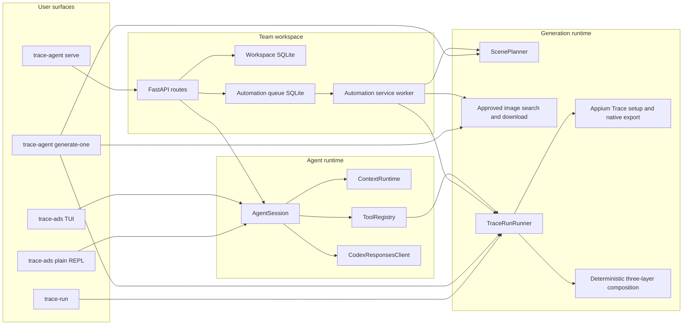

# System Architecture

Status: Draft
Last reviewed: 2026-08-25

## Purpose

This document describes the architecture implemented by the `ads-booster` distribution candidate.
Product behavior is established in a fresh installed `trace-agent` environment; worktree source is
implementation evidence, not proof that a first-time installation exposes the same behavior. This
document records runtime entry points, persisted state, and external-system boundaries. It does not
define product requirements, development workflow, or future architecture.

User-facing setup and operation belong in [README](../../README.md). Development and Git conventions
belong in [AGENTS.md](../../AGENTS.md) and `docs/conventions/`. When this document and the code
disagree, treat the code as the current behavior and update this document in the same change.

Package ownership, dependency direction, composition roots, and code placement belong in
`docs/architecture/code.md`.

## System summary

`ads-booster` is a local-first Python package for operating a Trace marketing agent and producing
layered Trace lock-screen marketing images. It exposes three primary product surfaces:

- a standalone agent through the `trace-ads` TUI or plain REPL;
- a local team workspace through `trace-agent serve` and its FastAPI browser/API surface;
- a deterministic generation pipeline through `trace-agent generate-one` and `trace-run`.

The surfaces share model-provider, tool, generation, capture, composition, and contract code, but
they do not share one process lifecycle. Starting the Web service does not start the standalone
TUI. The service process hosts both FastAPI and its explicitly attached automation worker.

The runtime does not launch a Codex process. It owns its agent loop and connects directly to the
ChatGPT/Codex-compatible Responses transport through its OAuth credential boundary.



## Runtime entry points

The installed commands are declared in `pyproject.toml`.

| Command | Composition root | Responsibility |
| --- | --- | --- |
| `trace-ads` | `src/trace_capture/cli/agent.py` | Start the Textual TUI or plain REPL, authenticate, select the model, and compose the agent session. |
| `trace-agent` | `src/trace_capture/cli/agent.py` | Compatibility alias for `trace-ads`; also owns `generate-one`, `serve`, `workspace`, and `service` subcommands. |
| `trace-capture` | `src/trace_capture/cli/capture.py` | Execute a typed native component-capture job. |
| `trace-compose` | `src/trace_capture/cli/compose.py` | Compose validated background, Trace component, and iPhone system-UI layers. |
| `trace-run` | `src/trace_capture/cli/trace_run.py` | Execute or resume the durable capture, staging, and composition state machine. |

CLI modules parse input and compose dependencies. Business transitions and artifact validation
belong in `runtime/`, `automation/`, `capture/`, and `composition/`, not in Typer callbacks.

## Code structure

Package ownership, dependency direction, composition roots, and placement rules are defined in
[Code Architecture](./code.md). This document refers to those packages only to explain
runtime behavior.

## Standalone agent flow

`trace-ads` builds one `AgentSession` with a provider client, tool registry, tool context, context
runtime, memory store, and approval implementation.

1. The TUI or REPL sends a user prompt to `AgentSession.ask()`.
2. `ContextRuntime` creates a request-local projection of canonical history. It prunes large tool
   outputs and compacts old turns when configured limits are reached.
3. `CodexResponsesClient` sends the projection, the stable tool descriptor list, and the selected
   request model as tagged runtime metadata in the provider instructions. This lets the agent answer
   model-identity questions from the same model selection that builds the request; it does not claim
   to observe opaque provider-side routing beyond that requested model.
4. If the provider returns function calls, `ToolRegistry` executes them through `ToolContext` and
   appends typed call results to canonical history.
5. The loop continues until the provider returns a final text response. Provider context overflow
   is handled by the one explicit compaction retry described below.
6. The TUI or REPL persists the canonical session history through `JsonSessionStore`.

Compaction changes the provider projection, not the canonical session history. Compaction
summaries are appended to the JSONL memory store. A provider context-overflow response permits one
forced-compaction retry for the current turn.

The default tool registry exposes filesystem, shell, browser, Web search, image search, and
TraceRun capabilities. Mutating filesystem, shell, browser, and TraceRun operations cross explicit
approval boundaries. Tool paths must remain inside the selected agent workspace.

The default model instruction makes environment preparation agent-owned: when Trace capture, image
generation, or visual QA needs an installed but inactive local dependency, the agent inspects it,
starts it through the existing tool boundary, verifies readiness, and continues. This policy does
not authorize software installation or unrelated service startup.

The standalone TUI owns a thread-safe `TuiApproval` boundary. Its default permission mode is
`yolo`, which automatically grants the boundary for the current TUI session. `/permission ask`
switches to per-operation confirmation with keyboard- and mouse-selectable Approve/Deny controls;
`/permission yolo` switches back, and `/permission` reports the current mode. The plain REPL and
Web session factory use the same command contract. The `/api/chat/approval` routes carry the
equivalent approval request for a Web member, and the decision is resolved against that member's
live agent state; the current two-tab browser surface does not render those controls.

## Generation and TraceRun flow

`GenerateOneRunner` turns one `MarketingContextBundle` into one versioned `TraceRunRequest`.

1. `ScenePlanner` derives a locale, reference date, Trace items, variation direction, and image
   search query from the persona and promotion material. Promotion-owned `trace_items` take precedence
   over compatibility scene defaults.
2. The search adapter restricts results to approved public-source domains, downloads a readable
   background, normalizes it to PNG, and records URL and digest provenance.
3. The runner creates versioned capture and composition contracts.
4. `TraceRunRunner` executes the fixed capability sequence:
   `capture -> stage_components -> compose`.
5. The capture port opens a Trace setup session, enters the three planned titles through Appium,
   saves the native configuration, then opens a request-bound export session.
6. The staging step verifies the captured artifact and its SHA-256 digest before copying it into
   the composition job.
7. The runner stages the packaged clean iPhone system-UI asset beside the searched background.
8. The deterministic compositor writes the declared final canvas from the searched background,
   fresh transparent Trace component export, and sanitized system UI.

TraceRun records transitions in an append-only JSONL journal. A resumed journal that stopped while
awaiting an external tool moves to `unknown_side_effect` instead of repeating an operation whose
effect cannot be proven. Run identity, idempotency key, paths, digests, and state transitions are
validated before completion is reported.

The pipeline captures a fresh Trace component export for each run. It does not set a custom
Simulator wallpaper, call an image-generation model, add Trace branding to the system layer, or
require a physical iPhone. The deterministic compositor serves both `generate-one` and the
lower-level offline `trace-compose` command.

## Team workspace and Web flow

The native installer only installs the CLI. `trace-agent workspace start` (or the lower-level
`service install`/`serve` commands) explicitly starts the workspace lifecycle. `trace-agent serve`
prepares a loopback listener, bootstraps a workspace when needed, requests a
cloudflared quick tunnel by default, and starts a Uvicorn process with the FastAPI application and
an explicitly attached automation worker. Readiness requires the loopback service to answer
`/health` and cloudflared to emit a public URL; it does not perform a second public DNS probe from
the same host. During launchd replacement, the service waits for the previous job to finish
unloading before bootstrapping the new plist. `--tunnel none` opts out of public access.

On first start:

1. `SqliteWorkspaceStore` creates one workspace and one owner member.
2. Plaintext workspace and member codes are returned once to the foreground CLI.
3. Only scrypt hashes and code versions are stored in SQLite.
4. `service.json` stores identifiers and service configuration, not plaintext access codes.

The first owner member recorded in `service.json` is the authenticated Web administrator. The owner
can use `POST /api/members/invite` from the browser to create a regular member and receive a
three-part member access ID once. A regular member can redeem that ID through
`POST /api/auth/member-login`; the existing four-part owner access ID and `/api/auth/login` contract
remain unchanged. `trace-agent workspace add-member --name <name>` remains a local fallback.

`workspace access` emits one copyable `%`-separated browser login ID containing the workspace ID,
member ID, workspace code, and member code. The browser parses that value at the entry boundary and
submits the existing four-field payload to the auth route. Successful login creates an HMAC-signed
cookie containing workspace/member IDs, code versions, and expiry. The signing secret is process-local
by default, so a service restart invalidates existing browser sessions. Code rotation also invalidates
sessions whose embedded versions are stale.

The browser surface is two tabs, 후보 and 캡션·주제 승인, both backed by `/api/candidates`. The
context, asset, campaign, queue, and chat routes described below still run inside the same process
and keep their tests, but no browser tab renders them; they are reachable only as API endpoints.

Shared context is workspace-scoped. Private conversation history is scoped by workspace, member,
and session. A chat request loads shared context as a read-only developer prefix, runs a fresh
request-local `AgentSession` built by the same factory as the TUI, and persists only the resulting
private history. The Web adapter dispatches `/auth`, `/model`, `/permission`, `/new`, `/clear`,
`/session`, and `/help` through the existing TUI command contract. Live model, reasoning, permission,
and approval state is isolated by authenticated member while the provider OAuth credential remains
host-owned. Optimistic revisions reject concurrent writes with a conflict instead of silently
overwriting a newer session.

Reference assets are workspace-scoped. The authenticated upload route accepts JPEG, PNG, or WebP
data, verifies the decoded image, writes a protected file below `TRACE_AGENT_HOME/assets/`, and
records its normalized path, digest, size, and optional context binding. Campaign creation verifies
the path, bytes, and digest again before freezing the reference into generation input.

Post candidates are workspace-scoped rows in the same workspace database. A candidate carries the
topic, caption, hypothesis, references, applied principles, the free-form Appium prompt stored in
`shooting_order`, and the machine `image_inputs` the image stage needs: one to eight lock-screen
schedule items, an `HH:MM` device time, a background subject drawn from a fixed vocabulary, a short
background mood, and the content language. A candidate enters at `awaiting_review`. Topic and
caption are reviewed together as one decision, so the first gate has a single approve/reject pair.
`/api/candidates` creates manual candidates and lists a workspace newest-first.

A candidate travels three approval stages, and both browser surfaces render that journey so its
position is visible. Stages one and two are implemented:

```text
awaiting_review --approve--> caption_approved --generate image--> image_awaiting_review --approve--> submitted
       |                            ^                                     |
       +----reject--------> rejected +---------------reject---------------+
```

`/api/candidates/{candidate_id}/review` is the first gate and moves one candidate to
`caption_approved` or `rejected` with an optional note. `/api/candidates/{candidate_id}/generate-image`
is the second: it composes one lock-screen image and moves the candidate to
`image_awaiting_review`, and `/api/candidates/{candidate_id}/review-image` either submits the
candidate or returns it to `caption_approved` with the note so a new image can be composed. Every
transition requires the current revision and the expected source status, so a stale or repeated
decision fails with a conflict instead of overwriting the first one. Publishing a submitted post
stays a human action outside this runtime.

### Candidate image composition

The image stage runs synchronously inside the web process and never drives a device. Its three
layers come from:

| Layer | Source | Verified by |
| --- | --- | --- |
| Background | `search/image/` fetches one image from the Pexels/Unsplash/Pixabay allowlist | Approved source host, decodable bytes, minimum edge, recorded digest |
| Trace components | The packaged offline fixture `trace_capture/assets/trace-components.png` | Read as a local artifact through `LocalArtifactCapturePort` |
| iPhone UI | The packaged `trace_capture/assets/iphone-ui.png` | Normalized and required to leave transparent canvas |

Both local layers are packaged assets resolved through `importlib.resources`, so the stage never
depends on the directory the service was started from; `TRACE_AGENT_TRACE_COMPONENTS` and
`TRACE_AGENT_IPHONE_UI` override them for a local experiment.

`LocalComposePort` merges them with the same deterministic composer the native path uses, and the
run writes `inputs/background-source.json` next to the background so the searched provider, source
URL, and artifact digest stay auditable. The composed image and its SHA-256 are recorded on the
candidate and served by `/api/candidates/{candidate_id}/image` to the owning workspace only.

Because the Trace component layer is a fixture rather than a native export, the candidate's own
schedule items and device time are recorded on the run request but are **not** rendered into the
image; the fixture's own calendar and clock appear instead. Rendering the candidate's schedule
needs the native Appium capture path, which this stage does not use. A failed run leaves the
candidate at `caption_approved` with a Korean message and writes no image.

Opening the workspace database runs two idempotent candidate migrations: rows written under the
earlier single-stage `accepted` status are rewritten to `caption_approved`, which carries the same
meaning on the journey, and rows stored before `topic` became a required reviewable field gain the
column with the placeholder value `(주제 미기록)`.

## Automatic candidate generation

`POST /api/candidates/generate` is the second candidate entrance. `candidate_generation/` runs it as
script assembly rather than an agent loop:

1. Resolve the context directory from `TRACE_AGENT_CONTEXT_DIR`, or `<serve workspace>/context`.
2. Read a fixed Korean document set — `core/PRINCIPLES-GLOBAL.md`, `core/PRINCIPLES-KR.md`,
   `core/ELEMENTS-KR.md`, `core/VOICE-KR.md`, `core/FACTS.md`, and `references/KR/INDEX.md`. An
   absent directory, or any absent or blank document, fails the run before any provider call and
   names what is missing.
3. Assemble one instruction from those documents, the hard rules, and the strict output contract.
4. Make one non-streaming Responses call through the same `auth/`, `providers/`, and `transport/`
   boundary the chat surface uses, with its read timeout widened to
   `TRACE_AGENT_CANDIDATE_TIMEOUT_SECONDS`.
5. Parse the response as a JSON array of exactly three candidates, tolerating a markdown code fence.
   One failed validation is retried once with the validation error appended; a second failure ends
   the run.
6. Write all three candidates as `source=auto`, `status=awaiting_review`, or write nothing.

The run has no tools, no web search, and no file writes; the context documents are read-only inputs.
It is a synchronous request handled in the FastAPI threadpool, so the browser waits for it. Failure
modes are typed and mapped to a status with an operator-facing Korean message: missing context or a
missing provider credential answer `409`, and a provider or format failure answers `502`. Only
Korean candidates are produced in this version.

## Automation queue

The campaign route creates a durable finite or continuous campaign from one stored persona,
one stored promotion, optional stored references, a reference date, and a device. `CampaignProducer`
keeps at most one outstanding queue item per campaign, assigns a monotonic variation index, and
continues after service restart. A finite campaign becomes `completed` after its requested count;
an operator can move an active campaign to `stopped`. A known production-generation exception is
converted to a failed run result, and a failed current queue item stops its campaign before another
variation is enqueued. The lower-level Web API can still submit an
immediate typed `MarketingContextBundle` or a UTC-due queue item directly.

```text
submitted -> claimed -> running -> review -> accepted
                                      |
                                      +-------> rejected
             |           |
             +-----------+---------> failed
```

- `(workspace_id, idempotency_key)` is unique.
- Repeating the same idempotency key and payload returns the existing record.
- Reusing the key with a different payload fails closed.
- SQLite permits only one `claimed` or `running` record at a time.
- Claims use bounded leases and optimistic revisions.
- `GenerateOneWorker` verifies run identity, idempotency key, artifact location, and artifact digest
  before moving a result to `review`.
- Human review moves a record to `accepted` or `rejected`.

`AutomationServiceWorker` first lets the campaign producer supply the next safe variation, then
polls the durable queue inside the service lifespan. It uses `QueueScheduler` to claim one due
record and runs `GenerateOneWorker` in a worker thread so the
event loop can continue serving HTTP requests. The production worker builds the same
`GenerateOneRunner` used by the one-shot CLI, with service-owned artifact, journal, and capture
roots below `TRACE_AGENT_HOME`. Service shutdown cancels the polling task.

## Local state and artifacts

`TRACE_AGENT_HOME` is the local service and agent state root. It defaults to `~/.trace-agent`.

| Path | Owner | Contents |
| --- | --- | --- |
| `$TRACE_AGENT_HOME/workspace.sqlite3` | `workspace/` | Workspaces, members, hashed code versions, shared contexts, asset metadata, post candidates with their review state, and member-private sessions |
| `$TRACE_AGENT_HOME/automation.sqlite3` | `automation/` | Campaign inputs/state, queue payloads, leases, run references, artifact digests and review state |
| `$TRACE_AGENT_HOME/service.json` | `service/` | Bootstrap identifiers, loopback host/port, tunnel selection, and last emitted public URL |
| `$TRACE_AGENT_HOME/auth.json` | `auth/` | OAuth credential data, protected with file mode `0600` |
| `$TRACE_AGENT_HOME/sessions/` | `agent/` | Standalone TUI and REPL canonical histories, one protected JSON file per session |
| `$TRACE_AGENT_HOME/memory.jsonl` | `agent/` | Append-only context-compaction summaries |
| `$TRACE_AGENT_HOME/marketing-bridge/marketing-bridge.sqlite3` | `marketing/` | Durable remote-task inbox, callback outbox, run/candidate review linkage, and approval outbox |
| `$TRACE_AGENT_HOME/marketing-bridge/service.json` | `marketing/` | Non-secret bridge endpoint, Queue ID, executor, and polling configuration |
| `$TRACE_AGENT_HOME/marketing-bridge/artifacts/` | `marketing/` | Digest-backed simulation artifacts or adapter-owned task artifacts |
| `$TRACE_AGENT_HOME/marketing-simulation/` | `marketing/` | Local control-plane proof, with one separate SQLite memory file per account |
| `$TRACE_AGENT_HOME/logs/` | `service/`, `tunnel/` | Protected workspace and tunnel logs |
| `<serve workspace>/context/` | `candidate_generation/` | Operator-owned Korean principle, element, voice, fact, and reference documents, read only |

Generation artifacts are separate from service metadata. By default, the standalone
`generate-one` command writes the job tree, TraceRun journal, and capture output below
`.trace-agent/generated/`, `.trace-agent/state/`, and `.trace-agent/capture/` relative to the
invoking workspace. The service worker uses `$TRACE_AGENT_HOME/generated/`,
`$TRACE_AGENT_HOME/state/`, and `$TRACE_AGENT_HOME/capture/`. `trace-run` also accepts explicit
state and capture roots.

## External boundaries

| External dependency | Adapter or boundary | Contract |
| --- | --- | --- |
| ChatGPT/Codex-compatible Responses service | `auth/`, `providers/`, `transport/` | OAuth credential, model responses, tool calls, one-call candidate generation, and provider-reported usage |
| Appium 3 and XCUITest | `capture/` | Validated server URL, Simulator/Appium readiness, Trace UI component setup, request-bound export, and captured artifact provenance |
| Trace iOS debug app | `capture/` | Installed `com.corca.Trace` build with the request-bound component-export trigger |
| Browser automation | `tools/browser.py` | External `agent-browser` command with approval for mutating actions |
| Web and image search | `tools/`, `search/` provider adapters | Normalized source results; generation downloads only approved image-source domains and stores provenance |
| cloudflared | `tunnel/` | Default live `trycloudflare.com` URL request; failure leaves the loopback service available |
| Worker supervisor and secret manager | `marketing/service.py` | Portable bridge config plus environment or argv-safe external credential command; no OS-specific store is required |
| Cloudflare D1, Workflows, Durable Objects, Queues, and R2 | `cloudflare/`, `marketing/` | Dynamic account registry, durable loop, isolated account memory, outbound worker task pull, and context artifacts |

## Dynamic marketing account loop

The optional hosted control plane is defined under `cloudflare/`. D1 owns versioned shared
instructions, account configuration, schedules, runs, events, and task indexes. A named Durable
Object selected by `account_id` owns private learned memory for exactly one marketing account.
Cloudflare Workflows owns the durable run and two human-approval waits: candidate/caption selection
before image capture, then image/publication approval before the channel boundary. A Cron Trigger
checks D1 every minute and claims accounts whose data-driven `next_run_at` is due. A partial unique
D1 index permits only one non-terminal run per account, so a long approval wait cannot accumulate
overlapping Cron runs. Approval or task callback expiry moves the D1 run to `failed` with a stable
timeout code instead of leaving a permanently waiting row.

For a simulation account without a local `workspace_id`, the Workflow executes each task in
Cloudflare, stores a labeled digest-backed task artifact in R2, and records the result in D1. This
keeps the first durable loop hosted while preserving both human approval waits. When an account has
a `workspace_id`, the Workflow instead emits versioned tasks to Cloudflare Queue. An enrolled worker runs
`trace-marketing bridge`, pulls over the Cloudflare REST API, commits each task to a protected SQLite
inbox, and only then acknowledges the queue lease. Task completion and its callback are committed to
a local outbox so a process restart cannot lose the control-plane notification. Candidate-task
completion also records the run/workspace/candidate linkage. The bridge polls workspace review
states and, after every candidate at a gate has a human decision, inserts an approval event into a
second local outbox before delivery. D1 records the event ID before sending the buffered Workflow
event and treats an identical delivered retry as a duplicate. `trace-marketing bridge-configure`
persists only portable non-secret routing, while a supervisor injects environment credentials or an
external secret command on any enrolled worker. The bridge initiates every connection; the quick
`trycloudflare.com` tunnel is not part of this
transport. Queue bodies use JSON text for HTTP pull compatibility, task completion events include the
task ID, and duplicate callbacks replay the same event only after the stored callback ID and result
match. Pull, acknowledgement, callback, and approval transport failures do not block already-durable
local work.

Cloudflare production delivery is owned by `.github/workflows/deploy-cloudflare.yml`. A qualifying
Pull Request runs an unprivileged Worker check. A qualifying merge to `main` then installs the
locked Worker dependencies, reuses that check as a deployment prerequisite, renders the
environment-specific Wrangler config from GitHub variables, applies D1 migrations, deploys the
Worker, and requires a successful public `/health` readback. The deployment job
is concurrency-serialized and never cancels an in-flight migration/deploy. Runtime control-plane and
callback secrets stay attached to the Worker in Cloudflare; GitHub receives only the scoped deploy
credential required by Wrangler.

The bridge defaults to an explicitly labeled simulation executor. Its opt-in `candidate-pipeline`
executor maps an account's opaque local `workspace_id` to the existing provider candidate generator
and PR #22 search/composition image runner. Generated candidates remain in the existing workspace
review journey: captions must reach `caption_approved` before capture, and composed images must reach
`submitted` before the publication task can cross the adapter boundary. Research, publication, and
metrics still use the simulation executor in this mode. Live Threads publication remains
capability-gated and is not enabled or claimed. See
[Dynamic Cloudflare Marketing Loop Contract](../contracts/cloudflare-marketing-loop.md).

The base CLI, TUI, Web shell, and offline composition do not require native capture dependencies.
Generation that includes Trace component capture requires Xcode, an available Simulator, the Trace
debug build, Appium, and the XCUITest driver. The agent starts installed but inactive Simulator and
Appium processes, but does not install the missing Trace build or driver.

## Architectural invariants

- The agent runtime is independent of a Codex CLI process.
- `trace-agent` remains a compatibility alias for `trace-ads`.
- Canonical conversation history is preserved; compaction changes only the provider projection.
- Shared workspace context is read-only inside private chat requests.
- Private sessions are scoped by workspace, member, and session identifiers.
- Access codes and OAuth credentials are not written to ordinary logs.
- Service binding remains loopback-only unless an explicit tunnel adapter reports a live URL.
- External side effects require an approval boundary or a dedicated worker boundary; the standalone
  TUI's explicit `yolo` mode is the user-selected automatic decision at that boundary.
- Capture, staging, and composition artifacts remain inside their configured roots and retain digest
  provenance.
- Unknown external side effects fail closed and are not retried blindly.
- Account-private marketing memory is addressed by account ID and is never assembled into another
  account's context snapshot.
- Simulation accounts without `workspace_id` complete task execution in Cloudflare and retain R2
  digest provenance; workspace-backed accounts cross the explicit Queue-to-worker boundary.
- Queue messages are acknowledged only after durable local insertion; callbacks use an independent
  durable outbox.
- One account can own only one non-terminal hosted run; observation offsets are interpreted as
  absolute minutes since publication and converted to relative Workflow sleeps.
- A normal Cloudflare code merge is deploy-complete only when the serialized GitHub Actions job has
  applied migrations, deployed the same merged revision, and read back `/health` successfully.
- Hosted marketing runs cannot bypass either the caption/candidate approval gate or the final image
  approval gate when using the installed candidate pipeline.
- A generated artifact is not ready for delivery until its path and digest are verified and a human
  accepts the review record.
- No current live adapter publishes to Notion, Threads, or another external marketing channel.

## Current exclusions

The implemented architecture does not currently provide:

- a verified production round trip through the hosted Queue pull bridge;
- a capability-proven live Threads publication adapter;
- real channel metrics and production feedback learning;
- real custom-wallpaper capture from the Simulator.

These are current product boundaries, not commitments about future design.

## Document maintenance

Update this document when a runtime entry point, process composition, execution flow, persisted
state, external dependency, security boundary, or architectural invariant changes. Update
`docs/architecture/code.md` when package ownership, dependency direction, composition roots, or code
placement changes.
